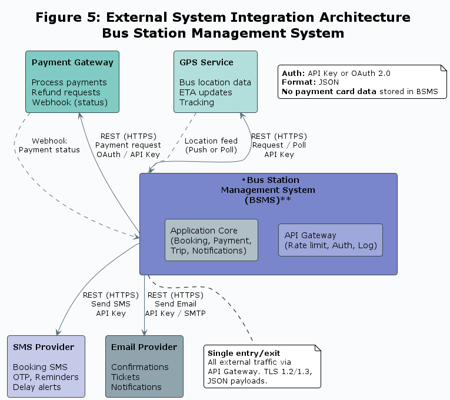

Course Title: IST607 - Information Systems Analysis and Design  
Course Instructor: Dr. Nyamsi  
ANALYSIS AND DESIGN OF A BUS STATION  
MANAGEMENT SYSTEM.  
SYSTEM DESIGN  
Group 3 Members:  
1. [Tabot Charles Bessong] - [SC25P089]  
2. [Elonge Provindence] - [SC25P100]  
3. [Oben Wilson  Ewube] - [SC21A570]  
February, 2026.

## 3. SYSTEM DESIGN

### 3.1 Introduction

#### 3.1.1 Purpose of the Design

This chapter translates the requirements and analysis of the Bus Station Management System (BSMS) into concrete technical specifications. The design defines the architecture, data structures, user and system interfaces, security controls, and integration mechanisms that will govern the implementation of the system. It builds directly on the outcomes of the feasibility study, requirements specifications, structured analysis, data flow diagrams, and entity-relationship diagram produced for the BSMS.

#### 3.1.2 Scope of the Design

The design covers all functional modules identified during analysis: user management (passenger and staff registration, authentication, profile management), booking management (creation, modification, cancellation, ticket generation), payment processing (transactions and refunds), trip management (creation, scheduling, tracking, completion), bus and route management (bus registration, route management, maintenance scheduling), and reporting and analytics. It encompasses both hardware and software components deployed across station counters, central office, mobile devices (drivers, passengers), and external services (payment gateway, GPS, communication providers).

#### 3.1.3 Design Objectives

The design aims to: (1) deliver a scalable, layered architecture supporting concurrent bookings and trip operations across multiple stations and routes; (2) ensure high availability of the booking and ticketing services through appropriate redundancy and failover; (3) enforce data security and role-based access control at every layer; (4) enable seamless integration with external payment, GPS, and communication services via secured APIs; and (5) provide intuitive interfaces for passengers (web and mobile), staff (web and counter), and management (dashboards and reports).

---

### 3.2 Overall System Architecture

#### 3.2.1 Architectural Style and Justification

The BSMS adopts a **Layered (3-Tier) Architecture** with an optional evolution path toward **modular services** (e.g., user service, booking service, payment service, trip management service, notification service, reporting service). The three tiers are: **Presentation** (web and mobile clients), **Business Logic** (application/API server), and **Data** (database and file storage). This is justified by the need for clear separation of concerns, maintainability, and the ability to scale the application and database tiers independently. For larger deployments, a **microservices** or **modular monolith** approach can be adopted so that booking, payment, and trip modules can be scaled or updated with minimal impact on others. Event-driven patterns (e.g., message queue for notifications or payment callbacks) can be introduced for asynchronous processing and integration.

#### 3.2.2 High-Level Architecture Diagram

*Figure 1: High-Level System Architecture – Bus Station Management System*

The architecture is represented in four horizontal layers:

- **Presentation Layer:** Passenger web portal, passenger mobile app, staff web portal (ticketing, trip management, bus/route management), driver mobile app, and management/reporting dashboard. All consume the same backend API where applicable.
- **Application Layer:** API Gateway (or reverse proxy), core application server(s) hosting business logic (user management, booking, payment, trip, bus/route, reporting), and optional message queue for events (e.g., booking confirmed, payment completed, trip status changed).
- **Data Layer:** Relational database (e.g., PostgreSQL or MySQL) for structured data; cache (e.g., Redis) for sessions and frequently accessed reference data; file/object storage for documents and generated reports.
- **Integration Layer:** Adapters or connectors to Payment Gateway, GPS Service, and Communication Service (SMS/Email). These sit at the boundary of the application layer and communicate with external systems over HTTPS/REST.

Data flows from clients to the API, then to business logic and database; external systems are invoked by the application layer for payments, tracking, and notifications.

#### 3.2.3 Component Description

- **Presentation Layer:** Web and mobile clients provide the user interface. Passenger interfaces support registration, login, search (routes/trips), booking, payment, ticket retrieval, and trip tracking. Staff interfaces support booking creation/modification/cancellation, trip creation and assignment, bus and route management, and report access. Driver interfaces show assigned trips, allow status updates, and may send location data. Management dashboards show KPIs, operational and financial reports.
- **Application Layer:** The core server implements user management, booking lifecycle, payment processing (including gateway calls), trip and schedule management, bus and route management, maintenance tracking, and reporting. It enforces business rules (e.g., seat availability, refund policy) and coordinates with the database and external services.
- **Data Layer:** The relational database stores passengers, staff, roles, buses, routes, stations, route stops, trips, bookings, tickets, payments, refunds, maintenance records, and related reference data. Cache is used for session tokens, route/schedule lookups, and other hot data to reduce database load.
- **Integration Layer:** Payment Gateway integration processes payments and refunds; GPS integration receives bus location and supports ETA and tracking; Communication Service sends SMS and email (booking confirmations, reminders, delay notifications, OTP).

#### 3.2.4 Deployment Structure

The system can be deployed in **on-premise**, **cloud**, or **hybrid** mode. A typical deployment places the application server(s) and database in a central or regional data center; station counters and office users access the system over the organization network (or VPN). Mobile apps (passengers, drivers) connect over the internet to the same API. For high availability, application servers can be behind a load balancer and the database can use primary-replica replication. Backup and reporting workloads can be offloaded to read replicas or a separate reporting instance. Edge or local caching at busy stations can reduce latency for route and schedule queries.

---

### 3.3 Network Design

#### 3.3.1 Network Topology

The BSMS network employs a **hierarchical star topology**. A central office (or data center) acts as the hub hosting the application and database servers. Station locations (ticketing counters, kiosks) and remote staff connect to the center via dedicated links or VPN over the internet. Mobile devices (drivers, passengers) connect over cellular or Wi-Fi to the same central API. This topology simplifies central management, policy enforcement, and backup; failures at one station do not bring down the core system.

*Figure 2: BSMS Network Topology (Central hub, stations and users as spokes)*

#### 3.3.2 Communication Infrastructure

| Tier | Technology | Use Case | Fallback |
|------|------------|----------|----------|
| Primary | Fiber / Broadband / Wi-Fi | Station counters, office, central server | — |
| Secondary | 4G / LTE | Mobile apps, drivers, remote staff | Auto-switch if primary fails |
| Fallback | 3G / GPRS | Low-bandwidth operations (e.g., status only) | Reduced functionality |
| External | HTTPS (TLS) | Payment, GPS, SMS/Email APIs | Retry and queue |

#### 3.3.3 Secure Communication Mechanisms

All client-to-server and server-to-external communication use **TLS 1.2 or 1.3** (HTTPS). API access is authenticated (e.g., JWT or session tokens). Station and office access can be over a **site-to-site or client VPN** where required. Internal network segmentation (e.g., VLANs) can separate user-facing, application, and database segments. Firewall rules restrict inbound access to the API and necessary management ports; outbound access to payment, GPS, and communication providers is explicitly allowed. No payment card data is stored; all payment data is transmitted directly to the payment gateway over TLS.

---

### 3.4 Database Design

#### 3.4.1 Entity Relationship Diagram (ERD)

The data model is documented in the project’s Entity Relationship Diagram. Major entities include: **Passenger**, **Staff**, **Role**, **Department**, **Bus**, **BusType**, **Route**, **Station**, **RouteStop**, **Trip**, **Booking**, **Ticket**, **Payment**, **Refund**, **Maintenance**, and **Schedule**. Relationships include: Passenger–Booking (1:N), Booking–Ticket (1:N), Booking–Payment (1:N or 1:1), Trip–Booking (1:N), Route–Trip (1:N), Bus–Trip (1:N), Staff–Trip as Driver (1:N), Bus–Maintenance (1:N), Route–RouteStop (1:N), Station–RouteStop (1:N), and Staff–Role / Bus–BusType (N:1). The ERD should be consulted as the authoritative visual (see *08-Entity-Relationship-Diagram.md* and related ERD artifacts).

*Figure 3: Entity Relationship Diagram – Bus Station Management System*

#### 3.4.2 Entity and Table Structures

| Entity | Primary Key | Key Attributes |
|--------|-------------|----------------|
| PASSENGER | passenger_id (UUID or INT) | full_name, email, phone_number, address, password_hash, account_status, created_date |
| STAFF | staff_id (UUID or INT) | full_name, email, role_id (FK), department_id (FK), password_hash, account_status, employment_date |
| ROLE | role_id | role_name, description, permissions |
| BUS | bus_id | license_plate (unique), model, capacity, bus_type_id (FK), status, registration_date, insurance_number |
| ROUTE | route_id | route_name, route_code, origin_station_id (FK), destination_station_id (FK), distance, estimated_travel_time, base_fare, status |
| STATION | station_id | station_name, station_code, address, city, latitude, longitude, status |
| TRIP | trip_id | route_id (FK), bus_id (FK), driver_id (FK), departure_date, departure_time, status, available_seats |
| BOOKING | booking_id | passenger_id (FK), trip_id (FK), booking_date, total_fare, payment_status, booking_status, booking_reference (unique) |
| TICKET | ticket_id | booking_id (FK), trip_id (FK), seat_number, ticket_number (unique), qr_code, status |
| PAYMENT | payment_id | booking_id (FK), payment_method, amount, transaction_id, payment_date, payment_status |
| MAINTENANCE | maintenance_id | bus_id (FK), maintenance_type, scheduled_date, completed_date, cost, status |

#### 3.4.3 Data Dictionary

| Field | Table | Type | Nullable | Description |
|-------|--------|------|----------|-------------|
| passenger_id | PASSENGER | UUID/INT | No | Unique identifier for each passenger |
| email | PASSENGER | VARCHAR(255) | No | Unique; used for login and notifications |
| account_status | PASSENGER | ENUM | No | ACTIVE, SUSPENDED, INACTIVE |
| role_id | STAFF | INT (FK) | No | References ROLE; determines permissions |
| license_plate | BUS | VARCHAR(20) | No | Unique identifier for the bus |
| status | BUS | ENUM | No | ACTIVE, MAINTENANCE, RETIRED, OUT_OF_SERVICE |
| route_code | ROUTE | VARCHAR(20) | No | Unique short code for the route |
| booking_reference | BOOKING | VARCHAR(30) | No | Unique reference for customer and support |
| payment_status | BOOKING | ENUM | No | PENDING, PAID, FAILED, REFUNDED |
| booking_status | BOOKING | ENUM | No | CONFIRMED, CANCELLED, COMPLETED, NO_SHOW |
| payment_method | PAYMENT | ENUM | No | CARD, MOBILE_MONEY, CASH, BANK_TRANSFER |
| transaction_id | PAYMENT | VARCHAR(100) | Yes | Gateway-provided transaction identifier |

#### 3.4.4 Data Storage and Retention Strategy

Structured data (passengers, staff, buses, routes, trips, bookings, tickets, payments, maintenance) is stored in the relational database with regular backups (e.g., daily full, incremental or WAL archiving). Retention policy: booking and ticket data retained for at least **seven years** for accounting and dispute resolution; audit logs retained for **five years** or as required by regulation. Payment card data is **not** stored; only payment status and gateway transaction references are kept. Generated reports and exported files can be stored in object or file storage with a defined retention period. Backup strategy should define RTO (e.g., 4 hours) and RPO (e.g., 1 hour) and include off-site or replicated backups.

---

### 3.5 Interface Design

#### 3.5.1 Input Design

System inputs are sourced through: (1) **Passenger input** — web and mobile forms for registration, login, route/trip search, booking (route, date, time, seats, passenger details), and payment method selection; (2) **Staff input** — web forms for creating or modifying bookings, managing trips (assign bus/driver, set status), bus and route registration, maintenance scheduling, and user/role management; (3) **Driver input** — mobile app for trip status updates (start, delay, complete) and optional location reporting; (4) **Automated input** — payment gateway callbacks (payment success/failure), GPS location feeds from buses, and scheduled jobs (e.g., trip status automation). All inputs are validated on both client and server (required fields, format, business rules such as seat availability and refund windows). Mandatory fields are marked; dropdowns and date/time pickers are used to reduce errors.

#### 3.5.2 Output Design (Dashboards and Reports)

**Passenger outputs:** Booking confirmation (on-screen and email/SMS), e-ticket (with QR code and trip details), booking history, and trip tracking (map, ETA, delay alerts).

**Staff outputs:** Booking list and booking detail views, trip schedule and status boards, bus and route lists, maintenance calendar, and daily operational summaries.

**Management dashboards:** KPIs such as bookings per day/week, occupancy rate, revenue, cancellations; operational reports (trips by route, bus utilization, driver assignments); financial reports (revenue by route/period, refunds); and trend charts (bookings over time, peak hours). Reports are exportable (PDF, CSV) and filterable by date range, route, station, and status.

**Driver outputs:** Assigned trip details, route and schedule, navigation support, and simple status confirmation screens.

All outputs are designed for the target device (responsive web, mobile-optimized) with clear labels and minimal clutter.

---

### 3.6 Security Design

*Figure 4: Security Design – Layered Defense Model*

#### 3.6.1 Authentication and Authorization

**Authentication:** Passengers and staff authenticate with email (or username) and password. Passwords are hashed (e.g., bcrypt or Argon2) and never stored in plain text. Optional **multi-factor authentication (MFA)** (SMS OTP or TOTP) can be required for staff and for sensitive passenger actions. Session tokens (e.g., JWT) are used for API and web sessions with configurable expiry (e.g., 30 minutes inactivity). Password reset is via time-limited links sent to registered email.

**Authorization:** **Role-Based Access Control (RBAC)** is used. Roles include: Passenger (own bookings and profile only), Ticketing Staff (create/modify/cancel bookings, view trips), Driver (view assigned trips, update trip status), Operations Manager (trips, buses, routes, schedules), Admin (user management, roles, system configuration), and possibly a read-only Reporter role. Permissions are enforced at the API and UI layers; each endpoint checks the caller’s role and, where applicable, resource ownership (e.g., passenger can only access own bookings).

#### 3.6.2 Data Protection Mechanisms

**Data at rest:** Database encryption (e.g., TDE or volume-level encryption) is recommended. Sensitive fields (e.g., ID numbers) can be encrypted at the application level if required by policy. Backups are encrypted.

**Data in transit:** All traffic between clients and server and between server and external systems uses **TLS 1.2/1.3**. No payment card data is stored; payment is handled by the gateway over HTTPS.

**Data handling:** Personal data (passenger and staff) is treated in line with data protection regulations; access is logged and limited to authorized roles. Passwords and tokens are never logged.

#### 3.6.3 Personnel and Physical Security

Access to servers and database is restricted to authorized IT and operations personnel. Principle of least privilege applies to database and server accounts. Workstation and mobile device use can be governed by policies (screen lock, encrypted storage). Physical access to server rooms or cloud accounts is controlled and logged. Staff with access to payment or sensitive personal data should be subject to appropriate vetting and training.

#### 3.6.4 Audit and Monitoring

User actions (login, logout, booking creation/cancellation, payment actions, trip status changes, user/role changes) are recorded in an **audit log** with timestamp, user identifier, action, and resource (e.g., booking_id). Logs are immutable and not modifiable by normal users. Monitoring and alerting are set up for failed logins, unusual access patterns, and system errors. Logs are retained according to the data retention policy and used for compliance and incident investigation.

---

### 3.7 Integration Design

#### 3.7.1 External System Integration

The BSMS integrates with:

- **Payment Gateway:** To process payments and refunds for bookings. The system sends payment requests (amount, reference, callback URL) and receives success/failure callbacks. No card details are passed through the BSMS.
- **GPS Service:** To receive bus location data for real-time tracking and ETA calculation. The system may also send trip identifiers to the GPS provider for association with vehicles.
- **Communication Service (SMS/Email):** To send booking confirmations, tickets, reminders, delay notifications, and OTPs. The system calls the provider’s API with recipient and message content.

Integration is **one-way or request–response**: the BSMS initiates requests and receives responses or webhooks; external systems do not directly query the BSMS database. Access to external APIs is restricted by API keys or OAuth and stored securely (e.g., in configuration or secrets manager).

*Figure 5: External System Integration – Payment, GPS, Communication*

#### 3.7.2 API and Data Exchange Mechanisms

All external integrations use **REST over HTTPS** with **TLS 1.2/1.3**. Authentication with external providers uses API keys or OAuth 2.0 (client credentials or similar) as required by each provider. Data format is **JSON** for request and response bodies. Payment callbacks (webhooks) are validated using signatures or tokens provided by the gateway. The BSMS exposes its own **REST API** for web and mobile clients; the same API is used by the organization’s front-end applications. Rate limiting and request logging can be applied at an API gateway or reverse proxy. Internal service-to-service calls (if the system is split into modules) also use HTTPS and authenticated calls.

| External System | Direction | Auth | Data Format |
|-----------------|-----------|------|-------------|
| Payment Gateway | Out (request), In (webhook) | API key / signature | JSON |
| GPS Service | In (push or poll) / Out (request) | API key / token | JSON |
| SMS/Email Provider | Out | API key / OAuth | JSON |

---

### 3.8 Conclusion

The System Design chapter has translated the requirements and analysis of the Bus Station Management System into a concrete technical blueprint. A layered (3-tier) architecture with a clear separation between presentation, business logic, and data supports maintainability and scaling. The network design uses a hierarchical star topology with secure communication (TLS, VPN where needed) and defined communication tiers. The relational database schema, aligned with the project ERD and data dictionary, supports all core entities (passengers, staff, buses, routes, trips, bookings, tickets, payments, maintenance) and is backed by a clear storage and retention strategy. Interface design addresses inputs and outputs for passengers, staff, drivers, and management. Security design covers authentication, authorization (RBAC), data protection, and audit. Integration design specifies how the BSMS connects to payment, GPS, and communication services via REST and TLS. This design provides a complete and implementable foundation for the development phase of the Bus Station Management System.

