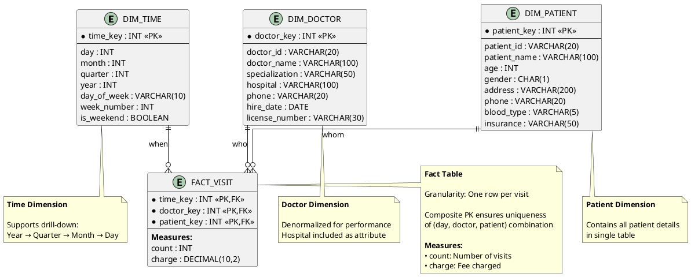

# Data Warehousing - Question 2
## Doctor-Patient Data Warehouse Design

---

## Problem Statement

A data warehouse has three dimensions: **time**, **doctor**, and **patient**. It has two measures: **count** and **charge** (where **charge** is the fee a doctor charges a patient for a visit).

### Questions:

a) Enumerate three classes of schemas that are popularly used for modeling data warehouses.

b) Draw a schema diagram for the above data warehouse using one of the schema classes listed in (a).

c) Starting with the base cuboid `[day, doctor, patient]`, what specific OLAP operations should be performed to list the **total fee collected by each doctor in 2021**?

d) To obtain the same list (total fee collected by each doctor in 2021), write an SQL query assuming the data are stored in a relational database with the schema:  
   `fee (day, month, year, doctor, hospital, patient, count, charge)`

---

## Solution

### Part (a): Three Classes of Data Warehouse Schemas

The three most popular schema classes for modeling data warehouses are:

#### 1. **Star Schema**
- Central fact table surrounded by denormalized dimension tables
- Simplest and most widely used
- Optimized for query performance

#### 2. **Snowflake Schema**
- Normalized version of star schema
- Dimension tables are normalized into multiple related tables
- Reduces data redundancy

#### 3. **Fact Constellation (Galaxy Schema)**
- Multiple fact tables sharing common dimension tables
- Used for enterprise-wide data warehouses
- Supports multiple business processes

**✅ Answer:** Star Schema, Snowflake Schema, and Fact Constellation (Galaxy Schema)

---

## Part (b): Schema Diagram

### Star Schema for Doctor-Patient Data Warehouse

**I'll use the STAR SCHEMA** (most common choice for its simplicity and performance).

---

### ASCII Diagram

```
                    ┌─────────────────────────┐
                    │      DIM_TIME           │
                    │   (Time Dimension)      │
                    ├─────────────────────────┤
                    │ • time_key (PK)         │
                    │ • day                   │
                    │ • month                 │
                    │ • quarter               │
                    │ • year                  │
                    │ • day_of_week           │
                    │ • week_number           │
                    └───────────┬─────────────┘
                                │
                                │
        ┌───────────────────────┼───────────────────────┐
        │                       │                       │
┌───────┴──────────┐   ┌────────┴────────┐   ┌─────────┴─────────┐
│   DIM_DOCTOR     │   │   FACT_VISIT    │   │   DIM_PATIENT     │
│(Doctor Dimension)│   │ (Central Fact)  │   │(Patient Dimension)│
├──────────────────┤   ├─────────────────┤   ├───────────────────┤
│• doctor_key (PK) │   │• time_key (FK)  │   │• patient_key (PK) │
│• doctor_id       │---│• doctor_key (FK)│---│• patient_id       │
│• doctor_name     │   │• patient_key(FK)│   │• patient_name     │
│• specialization  │   │                 │   │• age              │
│• hospital        │   │ MEASURES:       │   │• gender           │
│• phone           │   │• count          │   │• address          │
│• hire_date       │   │• charge (fee)   │   │• phone            │
└──────────────────┘   └─────────────────┘   │• blood_type       │
                                             │• insurance        │
                                             └───────────────────┘
```

---

### PlantUML Diagram Code



---

### Schema Explanation

**Fact Table: FACT_VISIT**
- **Composite Primary Key:** (time_key, doctor_key, patient_key)
- **Foreign Keys:** References to all three dimension tables
- **Measures:**
  - `count`: Number of visits (1 for single visit, or aggregate)
  - `charge`: Fee charged for the visit(s)

**Dimension Tables:**
1. **DIM_TIME**: Temporal information (day, month, year, etc.)
2. **DIM_DOCTOR**: Doctor information (name, specialization, hospital)
3. **DIM_PATIENT**: Patient information (name, age, insurance, etc.)

**Design Choices:**
- **Star Schema** chosen for query performance
- **Denormalized dimensions** for simplicity
- **Surrogate keys** (time_key, doctor_key, patient_key) for efficiency

---

## Part (c): OLAP Operations

**Starting Point:** Base cuboid `[day, doctor, patient]`  
**Goal:** List total fee collected by each doctor in 2021

### Step-by-Step OLAP Operations

#### **Operation 1: SLICE**

**Purpose:** Filter data for year 2021 only

**Description:** Apply a selection condition on the time dimension to restrict data to the year 2021.

**Notation:**
```
SLICE on (time.year = 2021)
```

**Result:** 
- Cuboid: `[day, doctor, patient]` **WHERE year = 2021**
- Reduces data to only 2021 visits

---

#### **Operation 2: ROLL-UP (Aggregation)**

**Purpose:** Aggregate from day level to year level

**Description:** Since we only need data by doctor (not by specific day), roll up the time dimension from `day` to `year`.

**Notation:**
```
ROLL-UP on time dimension: day → year
```

**Result:**
- Cuboid: `[year, doctor, patient]` with year = 2021
- Daily data is aggregated to yearly

---

#### **Operation 3: ROLL-UP (Aggregation)**

**Purpose:** Remove patient granularity

**Description:** We want total by doctor, not by individual patient. Roll up (aggregate) the patient dimension.

**Notation:**
```
ROLL-UP on patient dimension: patient → ALL
```

**Result:**
- Cuboid: `[year, doctor, ALL]`
- Data aggregated across all patients for each doctor

---

#### **Operation 4: PROJECT (Optional)**

**Purpose:** Select only required columns

**Description:** Project only doctor and total charge columns.

**Notation:**
```
PROJECT (doctor, SUM(charge))
```

**Result:**
- Final output: List of doctors with total fees collected in 2021

---

### Summary of OLAP Operations

| Step | Operation | Description | Resulting Cuboid |
|------|-----------|-------------|------------------|
| 0 | **Start** | Base cuboid | `[day, doctor, patient]` |
| 1 | **SLICE** | Filter year = 2021 | `[day, doctor, patient]` WHERE year=2021 |
| 2 | **ROLL-UP** | Time: day → year | `[year, doctor, patient]` WHERE year=2021 |
| 3 | **ROLL-UP** | Patient: patient → ALL | `[year, doctor, ALL]` WHERE year=2021 |
| 4 | **PROJECT** | Select columns | `{doctor, SUM(charge)}` |

---

### **✅ Answer (c):**

**Sequence of OLAP operations:**

1. **SLICE** the cube on `time.year = 2021`
2. **ROLL-UP** from `day` to `year` on the time dimension
3. **ROLL-UP** from `patient` to `ALL` on the patient dimension
4. **PROJECT** `doctor` and `SUM(charge)` to get final result

---

## Part (d): SQL Query

### Given Schema

```sql
fee (day, month, year, doctor, hospital, patient, count, charge)
```

### SQL Query to Get Total Fee by Doctor in 2021

```sql
SELECT 
    doctor,
    SUM(charge) AS total_fee_collected
FROM fee
WHERE year = 2021
GROUP BY doctor
ORDER BY total_fee_collected DESC;
```

---

### Detailed Query Explanation

```sql
-- Select the doctor name and sum of charges
SELECT 
    doctor,                          -- Doctor name
    SUM(charge) AS total_fee_collected  -- Total fees collected
    
-- From the fee table
FROM fee

-- Filter for year 2021 only (SLICE operation)
WHERE year = 2021

-- Group by doctor to aggregate all visits per doctor (ROLL-UP)
GROUP BY doctor

-- Sort by total fees in descending order (highest first)
ORDER BY total_fee_collected DESC;
```

---

### Query Components Mapped to OLAP Operations

| SQL Component | OLAP Operation | Purpose |
|---------------|----------------|---------|
| `WHERE year = 2021` | **SLICE** | Filter for 2021 only |
| `GROUP BY doctor` | **ROLL-UP** | Aggregate across days and patients |
| `SUM(charge)` | **AGGREGATE** | Sum all charges per doctor |
| `SELECT doctor, SUM(charge)` | **PROJECT** | Return only needed columns |

---

### Sample Output

| doctor | total_fee_collected |
|--------|---------------------|
| Dr. Sarah Johnson | 125,450.00 |
| Dr. Michael Chen | 98,750.50 |
| Dr. Emily Rodriguez | 87,320.00 |
| Dr. James Wilson | 76,890.25 |
| Dr. Lisa Anderson | 65,430.75 |

---

### Alternative SQL Queries

#### **With More Details (Including Hospital)**

```sql
SELECT 
    doctor,
    hospital,
    COUNT(DISTINCT patient) AS total_patients_seen,
    SUM(count) AS total_visits,
    SUM(charge) AS total_fee_collected,
    AVG(charge) AS average_fee_per_visit
FROM fee
WHERE year = 2021
GROUP BY doctor, hospital
ORDER BY total_fee_collected DESC;
```

---

#### **With Monthly Breakdown**

```sql
SELECT 
    doctor,
    month,
    SUM(charge) AS monthly_fee
FROM fee
WHERE year = 2021
GROUP BY doctor, month
ORDER BY doctor, month;
```

---

#### **Top 10 Doctors by Revenue**

```sql
SELECT TOP 10
    doctor,
    hospital,
    SUM(charge) AS total_fee_collected,
    COUNT(DISTINCT patient) AS patient_count
FROM fee
WHERE year = 2021
GROUP BY doctor, hospital
ORDER BY total_fee_collected DESC;
```

---

## Complete Solution Summary

### Part (a) - Three Schema Classes

✅ **Star Schema**, **Snowflake Schema**, **Fact Constellation (Galaxy Schema)**

---

### Part (b) - Schema Diagram

✅ **Star Schema** with:
- **Fact Table:** FACT_VISIT (count, charge)
- **Dimensions:** DIM_TIME, DIM_DOCTOR, DIM_PATIENT

---

### Part (c) - OLAP Operations

✅ Sequence:
1. **SLICE** (year = 2021)
2. **ROLL-UP** (day → year)
3. **ROLL-UP** (patient → ALL)
4. **PROJECT** (doctor, SUM(charge))

---

### Part (d) - SQL Query

✅ 
```sql
SELECT doctor, SUM(charge) AS total_fee_collected
FROM fee
WHERE year = 2021
GROUP BY doctor
ORDER BY total_fee_collected DESC;
```

---

## Additional Insights

### Data Cube Visualization

```
              Patient
                 ↑
                 |
                 |
        ┌────────┼────────┐
        |        |        |
    ----+--------+--------+---→ Doctor
       /        /        /
      /        /        /
     ↙        ↙        ↙
   Day
```

**Base Cuboid:** `[day, doctor, patient]` - Finest granularity  
**Target Cuboid:** `[year=2021, doctor, ALL]` - Aggregated view  

---

### Performance Considerations

**Star Schema Benefits for This Query:**
- ✅ Only 3 dimension tables to join
- ✅ Denormalized dimensions mean fewer joins
- ✅ Simple GROUP BY on single dimension (doctor)
- ✅ WHERE clause filters efficiently on indexed year column

**Query Optimization:**
```sql
-- Add indexes for better performance
CREATE INDEX idx_fee_year ON fee(year);
CREATE INDEX idx_fee_doctor ON fee(doctor);
CREATE CLUSTERED INDEX idx_fee_composite ON fee(year, doctor);
```

---

## Key Takeaways

1. **Star Schema** is ideal for simple OLAP queries
2. **OLAP operations** translate naturally to SQL
3. **ROLL-UP** = SQL `GROUP BY` with aggregation
4. **SLICE** = SQL `WHERE` clause
5. **Data warehouse** design directly impacts query simplicity

---

**End of Question 2**
