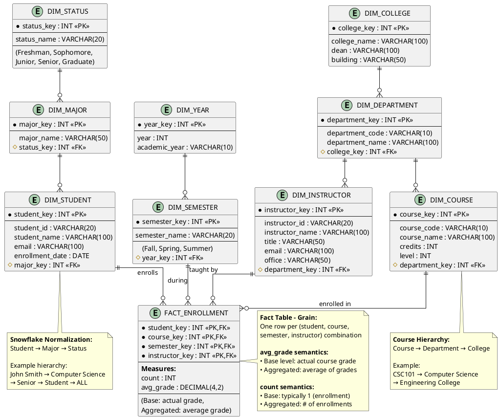

# Data Warehousing - Question 3
## Big University Data Warehouse Design

---

## Problem Statement

A data warehouse for **Big University** has four dimensions: **student**, **course**, **semester**, and **instructor**. There are two measures: **count** and **avg_grade**.

At the lowest conceptual level (e.g., for a particular student, course, semester, and instructor combination), the avg_grade measure stores the actual course grade of the student. At higher conceptual levels, **avg_grade** stores the average grade for the given combination.

### Questions:

a) Draw a **snowflake schema** diagram for the data warehouse.

b) Starting with the base cuboid `[student, course, semester, instructor]`, what specific OLAP operations (e.g., roll-up from semester to year) should one perform in order to list the **average grade of CSC courses for each Big University student**?

c) If each dimension has **five levels** (including ALL), such as `"student < major < status < university < all"`, how many **cuboids** will this cube contain (including the base and apex cuboids)?

---

## Solution Part (a): Snowflake Schema Diagram

### Snowflake Schema Characteristics

Unlike a star schema, a **snowflake schema** normalizes the dimension tables into multiple related tables, creating a snowflake-like structure.

---

### ASCII Diagram

```
┌─────────────┐        ┌──────────────┐
│ DIM_STATUS  │        │ DIM_COLLEGE  │
│ (Normalized)│        │ (Normalized) │
├─────────────┤        ├──────────────┤
│• status_key │        │• college_key │
│• status_name│        │• college_name│
│  (Fresh/Soph│        │• dean        │
│   Jun/Senior│        └──────┬───────┘
└──────┬──────┘               │
       │                      │
┌──────┴────────┐    ┌────────┴──────────┐
│  DIM_MAJOR    │    │ DIM_DEPARTMENT    │
│  (Normalized) │    │  (Normalized)     │
├───────────────┤    ├───────────────────┤
│• major_key    │    │• department_key   │
│• major_name   │    │• department_name  │
│• status_key FK│    │• college_key FK   │
└──────┬────────┘    └────────┬──────────┘
       │                      │
┌──────┴────────┐    ┌────────┴──────────┐       ┌───────────────┐
│  DIM_STUDENT  │    │   DIM_COURSE      │       │  DIM_YEAR     │
│   (Dimension) │    │    (Dimension)    │       │  (Normalized) │
├───────────────┤    ├───────────────────┤       ├───────────────┤
│• student_key  │    │• course_key       │       │• year_key     │
│• student_id   │    │• course_code      │       │• year         │
│• student_name │    │• course_name      │       └───────┬───────┘
│• email        │    │• credits          │               │
│• major_key FK │    │• dept_key FK      │       ┌───────┴────────┐
└──────┬────────┘    └────────┬──────────┘       │ DIM_SEMESTER   │
       │                      │                  │  (Dimension)   │
       │                      │                  ├────────────────┤
       │              ┌───────┴─────────────┐    │• semester_key  │
       │              │                     │    │• semester_name │
       │              │                     │    │  (Fall/Spring) │
       └──────────────┼─────────┬───────────┼────│• year_key FK   │
                      │         │           │    └────────┬───────┘
                ┌─────┴─────────┴───────────┴─────────┐  │
                │                                      │  │
                │        FACT_ENROLLMENT               │  │
                │         (Central Fact)               │──┘
                ├──────────────────────────────────────┤
                │ • student_key (PK, FK)               │
                │ • course_key (PK, FK)                │
                │ • semester_key (PK, FK)              │
                │ • instructor_key (PK, FK)            │
                │                                      │
                │ MEASURES:                            │
                │ • count (enrollments)                │
                │ • avg_grade                          │
                └──────────────────┬───────────────────┘
                                   │
                        ┌──────────┴──────────┐
                        │  DIM_INSTRUCTOR     │
                        │    (Dimension)      │
                        ├─────────────────────┤
                        │• instructor_key     │
                        │• instructor_id      │
                        │• instructor_name    │
                        │• department_key FK  │
                        │• title              │
                        │• office             │
                        └─────────────────────┘
```

---

### PlantUML Snowflake Schema Code



---

### Snowflake Schema Hierarchies

#### **1. Student Dimension Hierarchy (5 levels)**
```
ALL
 ↑
University (Big University)
 ↑
Status (Freshman, Sophomore, Junior, Senior, Graduate)
 ↑
Major (Computer Science, Mathematics, Biology, etc.)
 ↑
Student (Individual students)
```

#### **2. Course Dimension Hierarchy (5 levels)**
```
ALL
 ↑
University
 ↑
College (Engineering, Arts, Sciences, etc.)
 ↑
Department (CSC, Math, Biology, etc.)
 ↑
Course (CSC101, MATH201, BIO301, etc.)
```

#### **3. Semester Dimension Hierarchy (5 levels)**
```
ALL
 ↑
University
 ↑
Year (2020, 2021, 2022, etc.)
 ↑
Semester (Fall, Spring, Summer)
 ↑
Day (specific enrollment date - if tracked)
```

#### **4. Instructor Dimension Hierarchy (5 levels)**
```
ALL
 ↑
University
 ↑
College
 ↑
Department
 ↑
Instructor (Individual instructors)
```

---

## Solution Part (b): OLAP Operations

**Starting Point:** Base cuboid `[student, course, semester, instructor]`  
**Goal:** List average grade of **CSC courses** for each **Big University student**

---

### Step-by-Step OLAP Operations

#### **Operation 1: SLICE on Course**

**Purpose:** Filter to only CSC (Computer Science) courses

**Description:** Apply selection condition to restrict data to courses in the CSC department

**Notation:**
```
SLICE on (course.department = 'CSC')
-- or alternatively --
SLICE on (course.course_code LIKE 'CSC%')
```

**Result:**
- Cuboid: `[student, course, semester, instructor]` WHERE course is CSC
- Only Computer Science courses remain

---

#### **Operation 2: ROLL-UP on Semester**

**Purpose:** Aggregate across all semesters

**Description:** We want grades across all semesters, not semester-by-semester. Roll up semester dimension to ALL.

**Notation:**
```
ROLL-UP semester: semester → year → ALL
```

**Result:**
- Cuboid: `[student, course, ALL(semester), instructor]` WHERE course is CSC
- Grades aggregated across all semesters

---

#### **Operation 3: ROLL-UP on Instructor**

**Purpose:** Aggregate across all instructors

**Description:** We want average grade regardless of instructor. Roll up instructor dimension to ALL.

**Notation:**
```
ROLL-UP instructor: instructor → department → ALL
```

**Result:**
- Cuboid: `[student, course, ALL(semester), ALL(instructor)]` WHERE course is CSC
- Grades aggregated across all instructors

---

#### **Operation 4: ROLL-UP on Course**

**Purpose:** Aggregate from individual courses to department level

**Description:** We want average across all CSC courses, not by individual course. Roll up course to department level.

**Notation:**
```
ROLL-UP course: course → department (CSC)
```

**Result:**
- Cuboid: `[student, department(CSC), ALL(semester), ALL(instructor)]`
- Average grade across all CSC courses per student

---

#### **Operation 5: PROJECT**

**Purpose:** Select only required attributes

**Description:** Project student and avg_grade columns only.

**Notation:**
```
PROJECT (student, AVG(avg_grade))
```

**Result:**
- Final output: List of students with their average grade in CSC courses

---

### Summary Table of OLAP Operations

| Step | Operation | Dimension | From → To | Result |
|------|-----------|-----------|-----------|--------|
| 0 | **START** | - | Base cuboid | `[student, course, semester, instructor]` |
| 1 | **SLICE** | Course | Filter | WHERE department = 'CSC' |
| 2 | **ROLL-UP** | Semester | semester → ALL | Remove semester granularity |
| 3 | **ROLL-UP** | Instructor | instructor → ALL | Remove instructor granularity |
| 4 | **ROLL-UP** | Course | course → dept | Aggregate to CSC department |
| 5 | **PROJECT** | - | Select columns | `{student, AVG(grade)}` |

---

### **✅ Answer (b):**

**Sequence of OLAP operations:**

1. **SLICE** on course department = 'CSC'
2. **ROLL-UP** semester to ALL
3. **ROLL-UP** instructor to ALL
4. **ROLL-UP** course to department level (CSC)
5. **PROJECT** student and AVG(avg_grade)

---

## Solution Part (c): Number of Cuboids

### Given Information

- **4 dimensions:** student, course, semester, instructor
- **Each dimension has 5 levels** (including ALL)

Example hierarchy for student dimension:
```
student < major < status < university < ALL
```

---

### Formula for Number of Cuboids

For a data cube with **d** dimensions, where each dimension **i** has **Li** levels:

```
Total number of cuboids = ∏(Li) for i = 1 to d
                        = L1 × L2 × L3 × ... × Ld
```

**Explanation:** Each cuboid represents a unique combination of aggregation levels across all dimensions.

---

### Calculation

Given:
- **d = 4** dimensions (student, course, semester, instructor)
- **L₁ = L₂ = L₃ = L₄ = 5** levels per dimension

```
Total cuboids = L₁ × L₂ × L₃ × L₄
              = 5 × 5 × 5 × 5
              = 5⁴
              = 625
```

---

### **✅ Answer (c):** 

**625 cuboids** (including base and apex cuboids)

---

### Understanding Cuboid Levels

#### **Level 0 (Base Cuboid) - 1 cuboid**
```
[student, course, semester, instructor]
```
Most detailed granularity - actual grades

---

#### **Level 1 (3-D Cuboids) - 4 cuboids**
One dimension rolled up to next level:
```
[major, course, semester, instructor]
[student, department, semester, instructor]
[student, course, year, instructor]
[student, course, semester, department]
```

---

#### **Level 2 (2-D Cuboids) - Multiple combinations**
Two dimensions rolled up:
```
[major, department, semester, instructor]
[student, course, year, ALL]
...and many more...
```

---

#### **Level 4 (Apex Cuboid) - 1 cuboid**
```
[ALL, ALL, ALL, ALL]
```
Most aggregated - overall average grade across everything

---

### Breakdown by Aggregation Level

| # Dimensions Rolled Up | # Cuboids | Example |
|------------------------|-----------|---------|
| 0 (Base) | 1 | `[student, course, semester, instructor]` |
| 1 | 4 × 4 = 16 | Roll up one dimension by one level |
| 2 | Variable | Roll up two dimensions |
| 3 | Variable | Roll up three dimensions |
| 4 (Apex) | 1 | `[ALL, ALL, ALL, ALL]` |
| **Total** | **625** | All possible combinations |

---

### Detailed Calculation Verification

For each dimension with 5 levels, we have 5 choices:
- **Level 1:** Base level (e.g., student)
- **Level 2:** First roll-up (e.g., major)
- **Level 3:** Second roll-up (e.g., status)
- **Level 4:** Third roll-up (e.g., university)
- **Level 5:** ALL

Since we have **4 independent dimensions**, each with **5 choices**:

```
Total combinations = 5 × 5 × 5 × 5 = 625 cuboids
```

This includes:
- **1 base cuboid** (finest granularity)
- **623 intermediate cuboids** (various aggregation levels)
- **1 apex cuboid** (highest aggregation - ALL, ALL, ALL, ALL)

---

## Complete Solution Summary

### Part (a) - Snowflake Schema

✅ **Snowflake schema diagram** provided with:
- **Fact Table:** FACT_ENROLLMENT (count, avg_grade)
- **Normalized Dimensions:**
  - Student → Major → Status
  - Course → Department → College
  - Semester → Year
  - Instructor → Department

---

### Part (b) - OLAP Operations

✅ **Operations to get avg grade of CSC courses per student:**
1. **SLICE** (department = 'CSC')
2. **ROLL-UP** semester to ALL
3. **ROLL-UP** instructor to ALL
4. **ROLL-UP** course to department level
5. **PROJECT** (student, AVG(avg_grade))

---

### Part (c) - Number of Cuboids

✅ **625 cuboids**
- Formula: 5⁴ = 625
- Includes base, apex, and all intermediate cuboids

---

## Additional Analysis

### SQL Query for Part (b)

```sql
-- Get average grade of CSC courses for each student
SELECT 
    s.student_name,
    AVG(f.avg_grade) AS avg_csc_grade
FROM FACT_ENROLLMENT f
JOIN DIM_STUDENT s ON f.student_key = s.student_key
JOIN DIM_COURSE c ON f.course_key = c.course_key
JOIN DIM_DEPARTMENT d ON c.department_key = d.department_key
WHERE d.department_code = 'CSC'
GROUP BY s.student_key, s.student_name
ORDER BY avg_csc_grade DESC;
```

---

### Performance Implications

**Snowflake Schema:**
- ✅ Less storage (normalized)
- ❌ More joins required (slower queries)
- ✅ Easier to maintain hierarchies

**625 Cuboids:**
- ❌ Massive storage if all pre-computed
- ✅ Fast queries if materialized
- **Solution:** Partial materialization (compute frequently used cuboids only)

---

## Key Takeaways

1. **Snowflake schema** normalizes dimensions to reduce redundancy
2. **OLAP operations** (SLICE, ROLL-UP, PROJECT) transform cuboids
3. **Number of cuboids** grows exponentially with dimensions and levels
4. **avg_grade semantics** change based on aggregation level
5. **Partial materialization** is essential for large data cubes

---

**End of Question 3**
