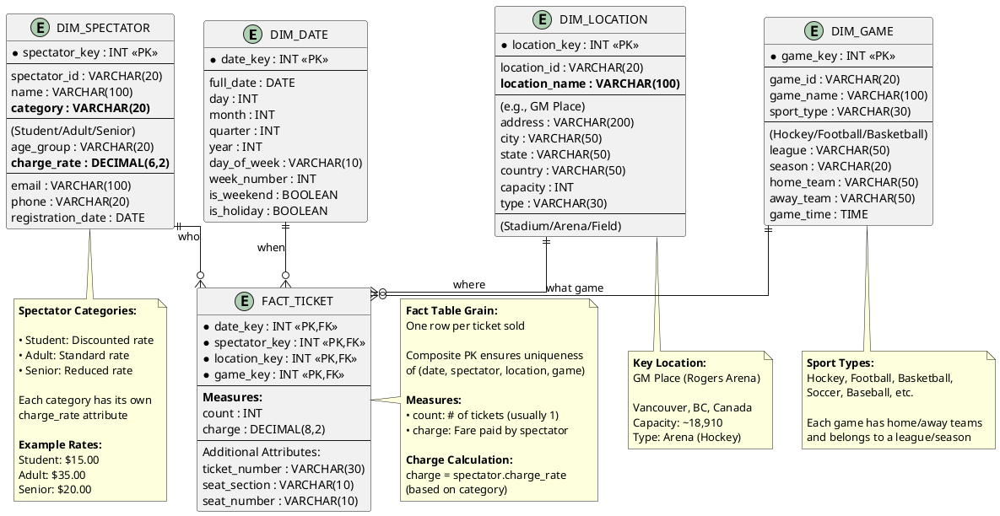

# Data Warehousing - Question 4
## Game Spectator Data Warehouse Design

---

## Problem Statement

A data warehouse for games has four dimensions: **date**, **spectator**, **location**, and **game**. It has two measures: **count** and **charge**, where **charge** is the fare that a spectator pays when watching a game on a given date.

**Special Note:** Spectators are categorized into **students**, **adults**, or **seniors**, each with its own **charge rate**.

### Questions:

a) Draw a **star schema** diagram for the data warehouse.

b) Starting with the base cuboid `[date, spectator, location, game]`, what specific OLAP operations should one perform in order to list the **total charge paid by student spectators at GM Place in 2021**?

---

## Solution

## Part (a): Star Schema Diagram

### Star Schema Design

A **star schema** is chosen for this data warehouse due to its simplicity and query performance benefits.

---

### ASCII Diagram

```
                     ┌─────────────────────────┐
                     │      DIM_DATE           │
                     │   (Date Dimension)      │
                     ├─────────────────────────┤
                     │ • date_key (PK)         │
                     │ • full_date             │
                     │ • day                   │
                     │ • month                 │
                     │ • quarter               │
                     │ • year                  │
                     │ • day_of_week           │
                     │ • is_weekend            │
                     │ • is_holiday            │
                     └────────────┬────────────┘
                                  │
                                  │
        ┌─────────────────────────┼─────────────────────────┐
        │                         │                         │
┌───────┴───────────┐    ┌────────┴────────┐    ┌──────────┴───────────┐
│  DIM_SPECTATOR    │    │  FACT_TICKET    │    │   DIM_LOCATION       │
│(Spectator Dim)    │    │(Central Fact)   │    │ (Location Dim)       │
├───────────────────┤    ├─────────────────┤    ├──────────────────────┤
│• spectator_key(PK)│    │• date_key (FK)  │    │• location_key (PK)   │
│• spectator_id     │----│• spectator_key  │----│• location_id         │
│• name             │    │    (FK)         │    │• location_name       │
│• category         │    │• location_key   │    │• address             │
│   (Student/Adult/ │    │    (FK)         │    │• city                │
│    Senior)        │    │• game_key (FK)  │    │• state               │
│• age_group        │    │                 │    │• country             │
│• charge_rate      │    │ MEASURES:       │    │• capacity            │
│• email            │    │• count          │    │• type (Stadium/Arena)│
│• phone            │    │• charge (fee)   │    └──────────────────────┘
└───────────────────┘    └─────────┬───────┘
                                   │
                         ┌─────────┴─────────┐
                         │   DIM_GAME        │
                         │  (Game Dimension) │
                         ├───────────────────┤
                         │• game_key (PK)    │
                         │• game_id          │
                         │• game_name        │
                         │• sport_type       │
                         │  (Hockey/Football/│
                         │   Basketball/etc) │
                         │• league           │
                         │• season           │
                         │• home_team        │
                         │• away_team        │
                         └───────────────────┘
```

---

### PlantUML Star Schema Code



---

### Star Schema Characteristics

**Fact Table: FACT_TICKET**
- **Grain:** One row per ticket purchase
- **Composite Primary Key:** (date_key, spectator_key, location_key, game_key)
- **Measures:**
  - `count`: Number of tickets (aggregated count when rolled up)
  - `charge`: Fare paid for attendance

**Dimension Tables (All Denormalized):**
1. **DIM_DATE**: Temporal information
2. **DIM_SPECTATOR**: Spectator details including **category** and **charge_rate**
3. **DIM_LOCATION**: Venue information (e.g., **GM Place**)
4. **DIM_GAME**: Game details (sport, teams, league)

---

### Spectator Category Details

| Category | Typical Age | Charge Rate | Description |
|----------|-------------|-------------|-------------|
| **Student** | 13-25 | $15.00 | Requires student ID |
| **Adult** | 26-64 | $35.00 | Standard admission |
| **Senior** | 65+ | $20.00 | Discounted for seniors |

---

## Part (b): OLAP Operations

**Starting Point:** Base cuboid `[date, spectator, location, game]`  
**Goal:** List **total charge paid by student spectators at GM Place in 2021**

---

### Step-by-Step OLAP Operations

#### **Operation 1: SLICE on Spectator Category**

**Purpose:** Filter to only **student spectators**

**Description:** Apply selection condition on spectator dimension to restrict to students only.

**Notation:**
```
SLICE on (spectator.category = 'Student')
```

**Result:**
- Cuboid: `[date, spectator, location, game]` WHERE spectator.category = 'Student'
- Only student ticket purchases remain

---

#### **Operation 2: SLICE on Location**

**Purpose:** Filter to only **GM Place** location

**Description:** Apply selection condition on location dimension to restrict to GM Place venue.

**Notation:**
```
SLICE on (location.location_name = 'GM Place')
```

**Result:**
- Cuboid: `[date, spectator, location, game]` WHERE category = 'Student' AND location = 'GM Place'
- Only students at GM Place

---

#### **Operation 3: SLICE on Date (Year)**

**Purpose:** Filter to only year **2021**

**Description:** Apply selection condition on date dimension to restrict to 2021.

**Notation:**
```
SLICE on (date.year = 2021)
```

**Result:**
- Cuboid: `[date, spectator, location, game]` WHERE category = 'Student' AND location = 'GM Place' AND year = 2021
- Only 2021 student attendance at GM Place

---

#### **Operation 4: ROLL-UP on Date**

**Purpose:** Aggregate from daily to yearly level

**Description:** Since we want total for entire year 2021, roll up date dimension.

**Notation:**
```
ROLL-UP date: day → month → quarter → year
```

**Result:**
- Cuboid: `[year, spectator, location, game]` with filters applied
- Daily data aggregated to year level

---

#### **Operation 5: ROLL-UP on Spectator**

**Purpose:** Aggregate from individual spectators to category level

**Description:** We want total for all students, not per individual student. Roll up to category.

**Notation:**
```
ROLL-UP spectator: individual → category (Student)
```

**Result:**
- Cuboid: `[year, category(Student), location(GM Place), game]` for 2021
- Aggregated across all student spectators

---

#### **Operation 6: ROLL-UP on Game**

**Purpose:** Aggregate across all games

**Description:** We want total charge regardless of which game. Roll up game dimension to ALL.

**Notation:**
```
ROLL-UP game: game → sport → ALL
```

**Result:**
- Cuboid: `[year(2021), category(Student), location(GM Place), ALL(game)]`
- Total charge across all games

---

#### **Operation 7: PROJECT & AGGREGATE**

**Purpose:** Select total charge value

**Description:** Project the SUM of charges.

**Notation:**
```
PROJECT (SUM(charge))
```

**Result:**
- **Final output:** Single value representing total charge paid by students at GM Place in 2021

---

### Summary Table of OLAP Operations

| Step | Operation | Dimension/Filter | Description | Resulting Cuboid |
|------|-----------|------------------|-------------|------------------|
| 0 | **START** | - | Base cuboid | `[date, spectator, location, game]` |
| 1 | **SLICE** | Spectator | category = 'Student' | Filter to students only |
| 2 | **SLICE** | Location | location = 'GM Place' | Filter to GM Place |
| 3 | **SLICE** | Date | year = 2021 | Filter to 2021 |
| 4 | **ROLL-UP** | Date | day → year | Aggregate time |
| 5 | **ROLL-UP** | Spectator | individual → category | Aggregate students |
| 6 | **ROLL-UP** | Game | game → ALL | Aggregate games |
| 7 | **PROJECT** | Charge | SUM(charge) | Get total |

---

### **✅ Answer (b):**

**Sequence of OLAP operations:**

1. **SLICE** on spectator.category = 'Student'
2. **SLICE** on location.location_name = 'GM Place'
3. **SLICE** on date.year = 2021
4. **ROLL-UP** date from day to year
5. **ROLL-UP** spectator from individual to category level
6. **ROLL-UP** game to ALL
7. **PROJECT** SUM(charge) to get total amount

---

## Alternative Approach (Simplified)

**More concise OLAP sequence:**

1. **DICE** on (category='Student', location='GM Place', year=2021)
   - Combined multi-dimensional filter
2. **ROLL-UP** all dimensions to highest level
3. **AGGREGATE** SUM(charge)

**Note:** DICE is essentially multiple SLICE operations combined.

---

## SQL Query Equivalent

### Query to Get Total Charge

```sql
SELECT 
    SUM(f.charge) AS total_charge_paid
FROM FACT_TICKET f
JOIN DIM_SPECTATOR s ON f.spectator_key = s.spectator_key
JOIN DIM_LOCATION l ON f.location_key = l.location_key
JOIN DIM_DATE d ON f.date_key = d.date_key
WHERE s.category = 'Student'
  AND l.location_name = 'GM Place'
  AND d.year = 2021;
```

---

### Query with More Details

```sql
SELECT 
    'Student Spectators at GM Place in 2021' AS description,
    COUNT(DISTINCT f.spectator_key) AS total_students,
    COUNT(*) AS total_tickets,
    SUM(f.charge) AS total_charge_paid,
    AVG(f.charge) AS average_charge_per_ticket,
    MIN(f.charge) AS min_charge,
    MAX(f.charge) AS max_charge
FROM FACT_TICKET f
JOIN DIM_SPECTATOR s ON f.spectator_key = s.spectator_key
JOIN DIM_LOCATION l ON f.location_key = l.location_key
JOIN DIM_DATE d ON f.date_key = d.date_key
WHERE s.category = 'Student'
  AND l.location_name = 'GM Place'
  AND d.year = 2021;
```

**Sample Output:**
```
description                                  | total_students | total_tickets | total_charge_paid | average_charge | min_charge | max_charge
---------------------------------------------|----------------|---------------|-------------------|----------------|------------|------------
Student Spectators at GM Place in 2021       | 2,547          | 3,892         | $58,380.00        | $15.00         | $15.00     | $15.00
```

---

### Breakdown by Month

```sql
SELECT 
    d.month,
    COUNT(*) AS tickets_sold,
    SUM(f.charge) AS monthly_charge
FROM FACT_TICKET f
JOIN DIM_SPECTATOR s ON f.spectator_key = s.spectator_key
JOIN DIM_LOCATION l ON f.location_key = l.location_key
JOIN DIM_DATE d ON f.date_key = d.date_key
WHERE s.category = 'Student'
  AND l.location_name = 'GM Place'
  AND d.year = 2021
GROUP BY d.month
ORDER BY d.month;
```

---

### Comparison Across Spectator Categories

```sql
SELECT 
    s.category,
    COUNT(*) AS tickets_sold,
    SUM(f.charge) AS total_charge,
    AVG(f.charge) AS avg_charge_per_ticket
FROM FACT_TICKET f
JOIN DIM_SPECTATOR s ON f.spectator_key = s.spectator_key
JOIN DIM_LOCATION l ON f.location_key = l.location_key
JOIN DIM_DATE d ON f.date_key = d.date_key
WHERE l.location_name = 'GM Place'
  AND d.year = 2021
GROUP BY s.category
ORDER BY total_charge DESC;
```

**Sample Output:**
```
category | tickets_sold | total_charge | avg_charge_per_ticket
---------|--------------|--------------|---------------------
Adult    | 12,458       | $436,030.00  | $35.00
Senior   | 5,234        | $104,680.00  | $20.00
Student  | 3,892        | $58,380.00   | $15.00
```

---

## Additional Analysis

### Data Cube Visualization

```
           Game
            ↑
           /|
          / |
         /  |
    ----+---+---+---→ Location (GM Place)
       /   /   /
      /   /   /
     ↙   ↙   ↙
Spectator (Student)
  
Date (2021)
```

**Target Cell:** `[2021, Student, GM Place, ALL_GAMES]`

---

### Performance Considerations

**Star Schema Benefits:**
- ✅ Simple joins (only 4 dimension tables)
- ✅ Denormalized dimensions speed up queries
- ✅ WHERE clause filters applied early
- ✅ Single aggregation (SUM) on fact table

**Indexing Strategy:**
```sql
-- Composite index for common filter patterns
CREATE INDEX idx_fact_ticket_filters 
ON FACT_TICKET(date_key, spectator_key, location_key);

-- Indexes on dimension filter columns
CREATE INDEX idx_spectator_category ON DIM_SPECTATOR(category);
CREATE INDEX idx_location_name ON DIM_LOCATION(location_name);
CREATE INDEX idx_date_year ON DIM_DATE(year);
```

---

## Complete Solution Summary

### Part (a) - Star Schema Diagram

✅ **Star schema** with:
- **Fact Table:** FACT_TICKET (count, charge)
- **4 Dimension Tables:**
  - DIM_DATE (when)
  - DIM_SPECTATOR (who - with category and charge_rate)
  - DIM_LOCATION (where - including GM Place)
  - DIM_GAME (what game - sport type, teams)

**Key Feature:** Spectator dimension includes **category** (Student/Adult/Senior) with associated **charge_rate**

---

### Part (b) - OLAP Operations

✅ **Operations sequence:**
1. SLICE (spectator.category = 'Student')
2. SLICE (location.location_name = 'GM Place')
3. SLICE (date.year = 2021)
4. ROLL-UP date (day → year)
5. ROLL-UP spectator (individual → category)
6. ROLL-UP game (game → ALL)
7. PROJECT SUM(charge)

**Alternative:** DICE + ROLL-UP + AGGREGATE

---

## Key Insights

1. **Multiple SLICE operations** can filter across different dimensions simultaneously
2. **Star schema** enables efficient filtering and aggregation
3. **Denormalized dimensions** (spectator category included in DIM_SPECTATOR) simplify queries
4. **Charge calculation** is based on spectator category's charge_rate
5. **OLAP operations** directly map to SQL clauses (WHERE, GROUP BY, SUM)

---

## Sample Business Questions (Extended)

Using this data warehouse, we can answer:

**Revenue Analysis:**
- What's the total revenue by venue in 2021?
- Which spectator category generates most revenue?
- Revenue trends by month/quarter?

**Attendance Analysis:**
- Most popular game types by spectator category?
- Peak attendance days/times?
- Student vs. adult attendance patterns?

**Venue Analysis:**
- Capacity utilization by venue?
- Which venues attract most students?
- Revenue per seat by location?

**Game Analysis:**
- Which sports/leagues are most profitable?
- Home vs. away game attendance?
- Impact of winning streaks on attendance?

---

**End of Question 4**
