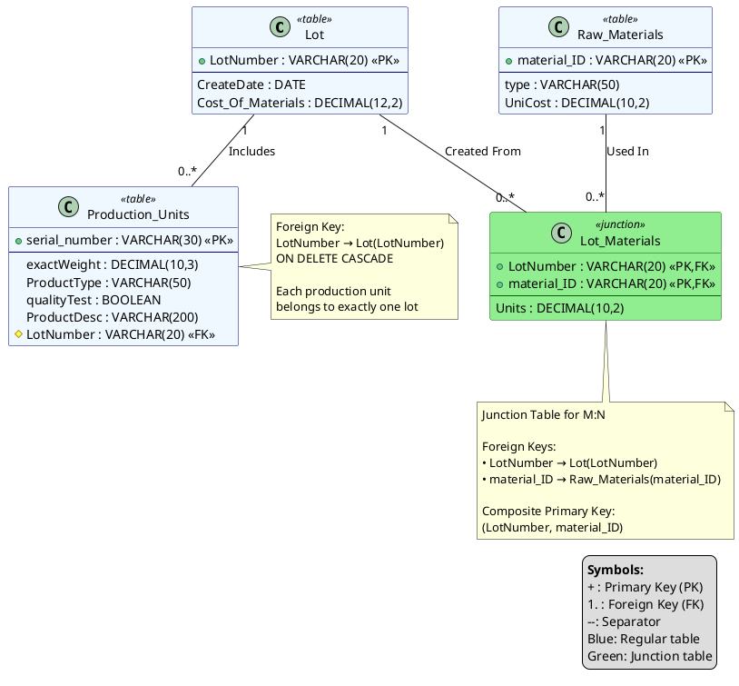
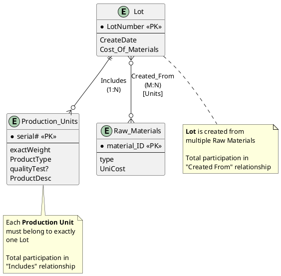
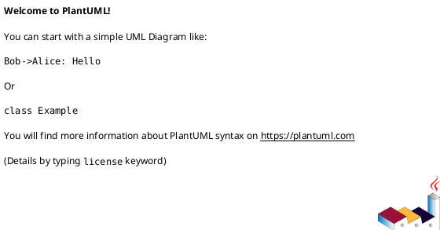

# Question 2: Manufacturing Database ER Diagram Analysis
## IST601 - Database Management
**Total Marks: 10 marks**

---

## Problem Statement

For the ER diagram showing a manufacturing/production system:

### Entity Sets and Attributes:

**1. Lot**
- `LotNumber` (Primary Key)
- `CreateDate`
- `Cost-Of-Materials`

**2. Production Units**
- `serial#` (Primary Key)
- `exactWeight`
- `ProductType`
- `qualityTest?`
- `ProductDesc`

**3. Raw Materials**
- `material-ID` (Primary Key)
- `type`
- `UniCost` (Unit Cost)

### Relationship Sets:

**1. Includes** (between Lot and Production Units)
- Lot → Includes: Single line, cardinality 'H'
- Production Units → Includes: Single line, cardinality 'H'

**2. Created From** (between Lot and Raw Materials)
- Lot → Created From: Single line (with "Units" label)
- Raw Materials → Created From: Single line

### Required Tasks:
a) Redraw the diagram using Chen notation for cardinalities  
b) Derive the relational model  
c) Identify relations with foreign keys, state each foreign key and its parent relation

---

## Part (a): Redraw Using Chen Notation

### Understanding Notations:

**Original Diagram (appears to use Crow's Feet/Min-Max notation):**
- Uses single lines for relationships
- Cardinality labels 'H' (unclear what H represents - possibly "High" or placeholder)
- "Units" label on Created From relationship

**Chen Notation:**
- Uses **1**, **N**, **M** for cardinalities
- Diamond shapes for relationships
- Attributes shown as ovals
- Primary keys underlined

---

### Analyzing Relationships:

**Relationship 1: Includes (Lot to Production Units)**

**Business Logic:**
- A lot represents a production batch
- A lot includes/produces multiple production units
- Each production unit belongs to one lot

**Interpretation:**
- Cardinality: **1:N** (one lot to many production units)
- Lot side: 1
- Production Units side: N

**Relationship 2: Created From (Lot to Raw Materials)**

**Business Logic:**
- A lot is created from multiple raw materials
- A raw material can be used in multiple lots
- "Units" likely refers to quantity attribute on the relationship

**Interpretation:**
- Cardinality: **M:N** (many lots to many raw materials)
- Lot side: M
- Raw Materials side: N
- Relationship attribute: Units (quantity of material used)

---

### Chen Notation ER Diagram

**Legend:**
- Single line (───): Partial participation (optional)
- Double line (═══): Total participation (mandatory)
- Diamond: Relationship
- Oval: Attribute
- Underlined: Primary key

```
                                    ┌─────────────┐
                                    │  CreateDate │
                                    └──────┬──────┘
                                           │
     ┌──────────────┐              ┌──────┴──────┐              ┌──────────────┐
     │  LotNumber   │              │             │              │Cost-Of-      │
     │  (PK)        │──────────────│     Lot     │──────────────│Materials     │
     └──────────────┘              │             │              └──────────────┘
                                   └──────┬──────┘
                                          │
                                          ║ (double line = total participation)
                          ┌───────────────┼───────────────┐
                          │               ║               │
                          │ 1             ║ M             │
                          │ (partial)     ║ (total)       │
                    ┌─────▼─────┐         ║         ┌─────▼─────┐
                    │           │         ║         │           │
                    │ Includes  │         ║         │ Created   │
                    │           │         ║         │  From     │
                    │    (1:N)  │         ║         │  (M:N)    │
                    └─────┬─────┘         ║         └─────┬─────┘
                          ║               ║               │
                          ║ N (total)     ║               │ N (partial)
                          ║               ║               │
                    ┌═════▼═════┐         ║         ┌─────▼─────┐
          ┌─────────┤           │         ║         │           │
          │         │Production │         ║         │    Raw    │
          │         │   Units   │         ║         │ Materials │
          │         │           │         ║         │           │
          │         └─────┬─────┘         ║         └─────┬─────┘
          │               │               ║               │
          │               │               ║               │
    ┌─────┴──────┐  ┌─────┴──────┐       ║      ┌────────┴────────┐
    │  serial#   │  │exactWeight │       ║      │   material-ID   │
    │   (PK)     │  └────────────┘       ║      │      (PK)       │
    └────────────┘                        ║      └─────────────────┘
                                          ║
    ┌──────────────┐  ┌──────────────┐   ║      ┌─────────────┐
    │ ProductType  │  │ qualityTest? │   ║      │    type     │
    └──────────────┘  └──────────────┘   ║      └─────────────┘
                                          ║
    ┌──────────────┐                      ║      ┌─────────────┐
    │ ProductDesc  │                      ║      │   UniCost   │
    └──────────────┘                      ║      └─────────────┘
                                          ║
                                    ┌═════╩═════┐
                                    │   Units   │ (relationship attribute)
                                    │ (quantity)│
                                    └───────────┘
```

**Participation Constraints:**

**Includes Relationship:**
- Lot → Includes: **Single line (partial)** - A lot may or may not have production units yet
- Production Units → Includes: **Double line (total)** - Every production unit MUST belong to exactly one lot

**Created From Relationship:**
- Lot → Created From: **Double line (total)** - Every lot MUST be created from at least one raw material
- Raw Materials → Created From: **Single line (partial)** - A raw material may not be used in any lot yet

---

### Chen Notation - Textual Representation

**Entities:**

```
┌─────────────────────────────────────┐
│              Lot                    │
├─────────────────────────────────────┤
│ LotNumber (PK)                      │
│ CreateDate                          │
│ Cost-Of-Materials                   │
└─────────────────────────────────────┘

┌─────────────────────────────────────┐
│        Production Units             │
├─────────────────────────────────────┤
│ serial# (PK)                        │
│ exactWeight                         │
│ ProductType                         │
│ qualityTest?                        │
│ ProductDesc                         │
└─────────────────────────────────────┘

┌─────────────────────────────────────┐
│         Raw Materials               │
├─────────────────────────────────────┤
│ material-ID (PK)                    │
│ type                                │
│ UniCost                             │
└─────────────────────────────────────┘
```

**Relationships (Chen Notation with Participation):**

```
        Lot (1, partial) ───< Includes >═══ (N, total) Production Units
            single line                     double line
            
        Lot (M, total) ═══< Created From >─── (N, partial) Raw Materials
           double line        [Units]          single line
```

**Cardinality and Participation Explanation:**

**1. Includes Relationship (1:N)**
- **Lot side: 1, partial participation (single line)** 
  - A lot may have 0 or many production units
  - Newly created lot may not have units yet
- **Production Units side: N, total participation (double line)** 
  - Each production unit MUST be included in exactly one lot
  - Cannot exist without belonging to a lot
- **Meaning:** One-to-Many relationship with mandatory participation from Production Units

**2. Created From Relationship (M:N)**
- **Lot side: M, total participation (double line)** 
  - A lot MUST be created from at least one raw material
  - Cannot create a lot without materials
- **Raw Materials side: N, partial participation (single line)** 
  - A raw material may be used in 0 or many lots
  - Materials in inventory may not be used yet
- **Relationship Attribute: Units** - Quantity of raw material used in the lot
- **Meaning:** Many-to-Many relationship with mandatory participation from Lot with attribute

---

### Complete Chen Notation Diagram (Simplified with Participation)

```
                    ┌──────────┐
                    │   Lot    │
                    │ LotNumber│ (PK)
                    │CreateDate│
                    │Cost-Of-  │
                    │Materials │
                    └────┬─────┘
                         │
                         ║ (double line from Lot)
              ┌──────────┼──────────┐
              │ partial  ║  total   │
              │ (1)      ║  (M)     │
              │          ║          │
         ┌────▼────┐     ║     ┌════▼════════┐
         │Includes │     ║     │Created From │
         │         │     ║     │   [Units]   │
         └════╤════┘     ║     └────┬────────┘
              ║          ║          │ partial
              ║ N        ║          │ (N)
              ║ (total)  ║          │
      ┌═══════▼══════┐   ║   ┌──────▼──────┐
      │ Production   │   ║   │     Raw     │
      │   Units      │   ║   │  Materials  │
      │  serial# (PK)│   ║   │material-ID  │
      │  exactWeight │   ║   │    (PK)     │
      │ ProductType  │   ║   │   type      │
      │ qualityTest? │   ║   │  UniCost    │
      │ ProductDesc  │   ║   └─────────────┘
      └──────────────┘   ║

Legend:
─ (single line) = Partial participation
═ (double line) = Total participation
```

**Key Observations:**
1. **Production Units** has double line to **Includes** → Total participation (must belong to a lot)
2. **Lot** has double line to **Created From** → Total participation (must use materials)
3. **Lot** has single line to **Includes** → Partial participation (may not have units yet)
4. **Raw Materials** has single line to **Created From** → Partial participation (may not be used yet)

---

## Part (b): Derive the Relational Model

### Translation Rules Applied:

**Rule 1: Strong Entity → Relation**
- Each entity becomes a table
- Primary key remains

**Rule 2: 1:N Binary Relationship**
- Add foreign key to N-side table
- References primary key of 1-side table

**Rule 3: M:N Binary Relationship**
- Create junction/bridge table
- Composite primary key from both foreign keys
- Include relationship attributes

---

### Step 1: Translate Entities to Relations

**1. Lot Relation**

```
Lot (LotNumber, CreateDate, Cost_Of_Materials)
  Primary Key: LotNumber
```

**2. Production_Units Relation**

```
Production_Units (serial_number, exactWeight, ProductType, qualityTest, 
                  ProductDesc, LotNumber)
  Primary Key: serial_number
  Foreign Key: LotNumber REFERENCES Lot(LotNumber)
```

*Note: Added LotNumber as foreign key due to 1:N Includes relationship*

**3. Raw_Materials Relation**

```
Raw_Materials (material_ID, type, UniCost)
  Primary Key: material_ID
```

---

### Step 2: Translate Relationships

**Includes Relationship (1:N) - Already handled**
- Foreign key LotNumber added to Production_Units table
- No separate table needed for 1:N relationships

**Created_From Relationship (M:N) - Needs junction table**

**4. Lot_Materials Relation** (Junction table)

```
Lot_Materials (LotNumber, material_ID, Units)
  Primary Key: (LotNumber, material_ID)
  Foreign Key: LotNumber REFERENCES Lot(LotNumber)
  Foreign Key: material_ID REFERENCES Raw_Materials(material_ID)
```

*Note: Units attribute from relationship is included in junction table*

---

### Complete Relational Model

**Final Schema:**

**1. Lot**
```
Lot (LotNumber, CreateDate, Cost_Of_Materials)
  PK: LotNumber
```

**2. Production_Units**
```
Production_Units (serial_number, exactWeight, ProductType, qualityTest, 
                  ProductDesc, LotNumber)
  PK: serial_number
  FK: LotNumber → Lot(LotNumber)
```

**3. Raw_Materials**
```
Raw_Materials (material_ID, type, UniCost)
  PK: material_ID
```

**4. Lot_Materials**
```
Lot_Materials (LotNumber, material_ID, Units)
  PK: (LotNumber, material_ID)
  FK: LotNumber → Lot(LotNumber)
  FK: material_ID → Raw_Materials(material_ID)
```

---

### Relational Schema Diagram

```
┌─────────────────────┐
│        Lot          │
├─────────────────────┤
│ LotNumber (PK)      │
│ CreateDate          │
│ Cost_Of_Materials   │
└──────────┬──────────┘
           │
           │ 1
           │
      ┌────┴────────────────┬──────────────┐
      │                     │              │
      │ N                   │ M            │
      │                     │              │
┌─────▼────────────────┐    │    ┌─────────▼──────────┐
│  Production_Units    │    │    │   Lot_Materials    │
├──────────────────────┤    │    ├────────────────────┤
│ serial_number (PK)   │    │    │ LotNumber (PK,FK)  │
│ exactWeight          │    │    │ material_ID(PK,FK) │
│ ProductType          │    │    │ Units              │
│ qualityTest          │    │    └──────────┬─────────┘
│ ProductDesc          │    │               │
│ LotNumber (FK)       │    │               │ N
└──────────────────────┘    │               │
                            │         ┌─────▼────────────┐
                            │         │  Raw_Materials   │
                            │         ├──────────────────┤
                            │         │ material_ID (PK) │
                            │         │ type             │
                            │         │ UniCost          │
                            │         └──────────────────┘
```

---

### SQL DDL (Data Definition Language)

```sql
-- Create Lot table
CREATE TABLE Lot (
    LotNumber VARCHAR(20) PRIMARY KEY,
    CreateDate DATE NOT NULL,
    Cost_Of_Materials DECIMAL(12, 2)
);

-- Create Raw_Materials table
CREATE TABLE Raw_Materials (
    material_ID VARCHAR(20) PRIMARY KEY,
    type VARCHAR(50),
    UniCost DECIMAL(10, 2)
);

-- Create Production_Units table (with FK to Lot)
CREATE TABLE Production_Units (
    serial_number VARCHAR(30) PRIMARY KEY,
    exactWeight DECIMAL(10, 3),
    ProductType VARCHAR(50),
    qualityTest BOOLEAN,
    ProductDesc VARCHAR(200),
    LotNumber VARCHAR(20) NOT NULL,
    FOREIGN KEY (LotNumber) REFERENCES Lot(LotNumber)
        ON DELETE CASCADE
        ON UPDATE CASCADE
);

-- Create Lot_Materials junction table (M:N relationship)
CREATE TABLE Lot_Materials (
    LotNumber VARCHAR(20),
    material_ID VARCHAR(20),
    Units DECIMAL(10, 2) NOT NULL,
    PRIMARY KEY (LotNumber, material_ID),
    FOREIGN KEY (LotNumber) REFERENCES Lot(LotNumber)
        ON DELETE CASCADE
        ON UPDATE CASCADE,
    FOREIGN KEY (material_ID) REFERENCES Raw_Materials(material_ID)
        ON DELETE CASCADE
        ON UPDATE CASCADE
);
```

---

## Part (c): Foreign Keys and Parent Relations

### Foreign Key Identification

A **foreign key** is an attribute (or set of attributes) in a relation that references the primary key of another relation (the **parent/referenced relation**).

---

### Complete Foreign Key Analysis

**Relations with Foreign Keys:**

**1. Production_Units**

| Foreign Key | Parent Relation | Parent Primary Key | Constraint |
|-------------|-----------------|-------------------|------------|
| LotNumber | Lot | LotNumber | NOT NULL, ON DELETE CASCADE |

**Explanation:**
- **Child Relation:** Production_Units
- **Foreign Key:** LotNumber
- **Parent Relation:** Lot
- **Parent Primary Key:** LotNumber
- **Meaning:** Each production unit must belong to exactly one lot. If a lot is deleted, all its production units are also deleted (cascade).

---

**2. Lot_Materials**

**Foreign Key 1:**

| Foreign Key | Parent Relation | Parent Primary Key | Constraint |
|-------------|-----------------|-------------------|------------|
| LotNumber | Lot | LotNumber | Part of PK, ON DELETE CASCADE |

**Explanation:**
- **Child Relation:** Lot_Materials
- **Foreign Key:** LotNumber
- **Parent Relation:** Lot
- **Parent Primary Key:** LotNumber
- **Meaning:** Links a lot to the raw materials used in its creation. If a lot is deleted, all its material usage records are also deleted.

**Foreign Key 2:**

| Foreign Key | Parent Relation | Parent Primary Key | Constraint |
|-------------|-----------------|-------------------|------------|
| material_ID | Raw_Materials | material_ID | Part of PK, ON DELETE CASCADE |

**Explanation:**
- **Child Relation:** Lot_Materials
- **Foreign Key:** material_ID
- **Parent Relation:** Raw_Materials
- **Parent Primary Key:** material_ID
- **Meaning:** Links raw materials to the lots they're used in. If a raw material is deleted (from inventory system), all records of its usage in lots are also deleted.

---

**3. Relations WITHOUT Foreign Keys:**

**Lot Relation**
- No foreign keys
- Independent entity
- Parent to both Production_Units and Lot_Materials

**Raw_Materials Relation**
- No foreign keys
- Independent entity
- Parent to Lot_Materials

---

### Summary Table: All Foreign Keys

| # | Child Relation | Foreign Key | Parent Relation | Parent PK | Referential Action |
|---|----------------|-------------|-----------------|-----------|-------------------|
| 1 | Production_Units | LotNumber | Lot | LotNumber | ON DELETE CASCADE |
| 2 | Lot_Materials | LotNumber | Lot | LotNumber | ON DELETE CASCADE |
| 3 | Lot_Materials | material_ID | Raw_Materials | material_ID | ON DELETE CASCADE |

---

### Foreign Key Relationships Diagram

```
Parent Relations (No FK):
┌─────────────────┐              ┌──────────────────┐
│      Lot        │              │  Raw_Materials   │
│  LotNumber (PK) │              │ material_ID (PK) │
└────────┬────────┘              └─────────┬────────┘
         │                                 │
         │ Referenced by                   │ Referenced by
         │                                 │
         ├──────────────┬──────────────────┤
         │              │                  │
         ▼              ▼                  ▼
Child Relations (With FK):
┌─────────────────┐    ┌──────────────────────────┐
│Production_Units │    │    Lot_Materials         │
├─────────────────┤    ├──────────────────────────┤
│serial_number(PK)│    │LotNumber (PK,FK) ─────┐  │
│LotNumber (FK)───┼───>│material_ID (PK,FK)────┼─>│
│     ...         │    │Units                  │  │
└─────────────────┘    └───────────────────────┘  │
                            │                     │
                            │ References:         │
                            │ - Lot(LotNumber)    │
                            │ - Raw_Materials     │
                            │   (material_ID)     │
```

---

### Referential Integrity Constraints

**Constraint Type: ON DELETE CASCADE**

**Meaning:** When a parent row is deleted, automatically delete all child rows that reference it.

**Examples:**

1. **If Lot 'L001' is deleted:**
   - All Production_Units with LotNumber = 'L001' are deleted
   - All Lot_Materials rows with LotNumber = 'L001' are deleted

2. **If Raw_Material 'RM100' is deleted:**
   - All Lot_Materials rows with material_ID = 'RM100' are deleted

**Alternative Constraint: ON DELETE RESTRICT**

Would prevent deletion of parent if child rows exist:
```sql
FOREIGN KEY (LotNumber) REFERENCES Lot(LotNumber)
    ON DELETE RESTRICT
```

---

### Sample Data Example

**Sample Data:**

```sql
-- Insert Lots
INSERT INTO Lot VALUES ('L001', '2025-01-15', 5000.00);
INSERT INTO Lot VALUES ('L002', '2025-01-16', 7500.00);

-- Insert Raw Materials
INSERT INTO Raw_Materials VALUES ('RM001', 'Steel', 50.00);
INSERT INTO Raw_Materials VALUES ('RM002', 'Aluminum', 75.00);
INSERT INTO Raw_Materials VALUES ('RM003', 'Plastic', 25.00);

-- Insert Production Units (FK: LotNumber)
INSERT INTO Production_Units VALUES 
    ('SN001', 15.500, 'Widget-A', TRUE, 'Premium Widget', 'L001');
INSERT INTO Production_Units VALUES 
    ('SN002', 15.750, 'Widget-A', TRUE, 'Premium Widget', 'L001');
INSERT INTO Production_Units VALUES 
    ('SN003', 20.250, 'Widget-B', FALSE, 'Standard Widget', 'L002');

-- Insert Lot-Materials relationships (FKs: LotNumber, material_ID)
INSERT INTO Lot_Materials VALUES ('L001', 'RM001', 100.00); -- Lot L001 uses 100 units of Steel
INSERT INTO Lot_Materials VALUES ('L001', 'RM003', 50.00);  -- Lot L001 uses 50 units of Plastic
INSERT INTO Lot_Materials VALUES ('L002', 'RM002', 150.00); -- Lot L002 uses 150 units of Aluminum
INSERT INTO Lot_Materials VALUES ('L002', 'RM003', 75.00);  -- Lot L002 uses 75 units of Plastic
```

**Verification Queries:**

**1. Find all production units in a lot:**
```sql
SELECT pu.serial_number, pu.ProductType, pu.exactWeight
FROM Production_Units pu
WHERE pu.LotNumber = 'L001';
```

**2. Find all raw materials used in a lot:**
```sql
SELECT rm.material_ID, rm.type, rm.UniCost, lm.Units
FROM Raw_Materials rm
JOIN Lot_Materials lm ON rm.material_ID = lm.material_ID
WHERE lm.LotNumber = 'L001';
```

**3. Calculate total cost of materials for a lot:**
```sql
SELECT l.LotNumber, 
       SUM(rm.UniCost * lm.Units) AS Total_Material_Cost
FROM Lot l
JOIN Lot_Materials lm ON l.LotNumber = lm.LotNumber
JOIN Raw_Materials rm ON lm.material_ID = rm.material_ID
WHERE l.LotNumber = 'L001'
GROUP BY l.LotNumber;
```

**4. Find which lots use a specific raw material:**
```sql
SELECT l.LotNumber, l.CreateDate, lm.Units
FROM Lot l
JOIN Lot_Materials lm ON l.LotNumber = lm.LotNumber
WHERE lm.material_ID = 'RM001';
```

---

## PlantUML ER Diagram Code

### PlantUML Code for Chen Notation ER Diagram

You can use this code in any PlantUML editor (like [plantuml.com](https://www.plantuml.com/plantuml/uml/) or PlantUML plugins in IDEs):

```plantuml
@startuml Manufacturing_ER_Diagram_Chen

!define ENTITY class
!define RELATIONSHIP diamond

' Styling
skinparam class {
    BackgroundColor<<entity>> LightYellow
    BorderColor<<entity>> Black
    BackgroundColor<<relationship>> LightBlue
    BorderColor<<relationship>> Black
    BackgroundColor<<weak>> Wheat
    BorderColor<<weak>> Black
}

skinparam note {
    BackgroundColor LightGreen
    BorderColor DarkGreen
}

' Entities
class "Lot" <<entity>> {
    **LotNumber** (PK)
    --
    CreateDate
    Cost_Of_Materials
}

class "Production_Units" <<entity>> {
    **serial#** (PK)
    --
    exactWeight
    ProductType
    qualityTest?
    ProductDesc
}

class "Raw_Materials" <<entity>> {
    **material_ID** (PK)
    --
    type
    UniCost
}

' Relationships
diamond "Includes" <<relationship>> {
}

diamond "Created_From" <<relationship>> {
    Units (quantity)
}

' Connections with cardinality
' Includes: 1:N relationship
Lot "1" -- "Includes" : "partial\n(single line)"
"Includes" -- "N" Production_Units : "total\n(double line)"

' Created From: M:N relationship
Lot "M" == "Created_From" : "total\n(double line)"
"Created_From" -- "N" Raw_Materials : "partial\n(single line)"

note right of "Includes"
    1:N Relationship
    Production Unit must
    belong to exactly one Lot
end note

note bottom of "Created_From"
    M:N Relationship
    Lot must be created from
    at least one Raw Material
    
    Relationship attribute:
    Units (quantity used)
end note

legend right
    **Legend:**
    Single line (--): Partial participation
    Double line (==): Total participation
    Diamond: Relationship
    Rectangle: Entity
    **Underlined**: Primary Key
endlegend

@enduml
```

### PlantUML Code for Relational Model (Database Schema)



### PlantUML Code for Enhanced ER Diagram (Alternative Style)



### How to Use PlantUML:

**Option 1: Online Editor**
1. Go to [plantuml.com](https://www.plantuml.com/plantuml/uml/)
2. Copy and paste any of the code blocks above
3. Click "Submit" to generate the diagram
4. Download as PNG, SVG, or other formats

**Option 2: VS Code Extension**
1. Install "PlantUML" extension in VS Code
2. Create a `.puml` or `.plantuml` file
3. Paste the code
4. Press `Alt+D` to preview
5. Export using the export command

**Option 3: Command Line**
```bash
# Install PlantUML (requires Java)
# On Ubuntu/Debian:
sudo apt-get install plantuml

# Generate diagram
plantuml diagram.puml
```

**Option 4: Markdown Preview (if supported)**
Some markdown viewers support PlantUML directly:
````markdown

````

### Cardinality Symbols in PlantUML:

```
||--||  : One to One (mandatory both sides)
|o--o|  : Zero or One to Zero or One
}o--o{  : Zero or Many to Zero or Many
||--o{  : One to Many (one side mandatory)
}|--|{  : Many to Many (both mandatory)
```

**Specific to this diagram:**
- `||--o{` : Lot (1) to Production_Units (N) - one-to-many
- `}o--o{` : Lot (M) to Raw_Materials (N) - many-to-many

---

## Complete Answer Summary

### Part (a): Chen Notation Redraw

**Entities:**
- Lot (LotNumber, CreateDate, Cost-Of-Materials)
- Production Units (serial#, exactWeight, ProductType, qualityTest?, ProductDesc)
- Raw Materials (material-ID, type, UniCost)

**Relationships with Participation Constraints:**
- **Includes:** Lot (1, partial) ───< Includes >═══ (N, total) Production Units
  - Single line from Lot (partial participation)
  - Double line to Production Units (total participation)
  - One-to-many relationship
  
- **Created From:** Lot (M, total) ═══< Created From >─── (N, partial) Raw Materials
  - Double line from Lot (total participation)
  - Single line to Raw Materials (partial participation)
  - Many-to-many relationship
  - Relationship attribute: Units (quantity)

---

### Part (b): Relational Model

**1. Lot** (LotNumber, CreateDate, Cost_Of_Materials)  
   PK: LotNumber

**2. Production_Units** (serial_number, exactWeight, ProductType, qualityTest, ProductDesc, LotNumber)  
   PK: serial_number  
   FK: LotNumber → Lot(LotNumber)

**3. Raw_Materials** (material_ID, type, UniCost)  
   PK: material_ID

**4. Lot_Materials** (LotNumber, material_ID, Units)  
   PK: (LotNumber, material_ID)  
   FK: LotNumber → Lot(LotNumber)  
   FK: material_ID → Raw_Materials(material_ID)

---

### Part (c): Foreign Keys and Parent Relations

**Relations with Foreign Keys:**

**1. Production_Units**
- Foreign Key: `LotNumber`
- Parent Relation: `Lot`
- Parent Primary Key: `LotNumber`

**2. Lot_Materials**
- Foreign Key 1: `LotNumber`
  - Parent Relation: `Lot`
  - Parent Primary Key: `LotNumber`
- Foreign Key 2: `material_ID`
  - Parent Relation: `Raw_Materials`
  - Parent Primary Key: `material_ID`

**Relations WITHOUT Foreign Keys:**
- Lot (parent relation)
- Raw_Materials (parent relation)

---

## Key Learning Points

### 1. Notation Conversion
- Different notations express same concepts
- Chen uses 1, N, M for cardinality
- Crow's feet uses visual symbols
- Min-Max uses (min, max) notation

### 2. Participation Constraints in Chen Notation
- **Single line (─)**: Partial participation (optional, min=0)
- **Double line (═)**: Total participation (mandatory, min=1)
- Production Units → Includes: Total (every unit must belong to a lot)
- Lot → Created From: Total (every lot must use materials)
- Lot → Includes: Partial (lot may not have units yet)
- Raw Materials → Created From: Partial (material may not be used yet)

### 3. Relationship Types
- **1:N**: Foreign key in N-side table
- **M:N**: Junction table with composite key
- Relationship attributes go in junction table

### 4. Foreign Key Rules
- Must reference a primary key
- Enforces referential integrity
- CASCADE vs RESTRICT vs SET NULL options
- Part of composite keys in junction tables

### 5. Schema Design
- Eliminate redundancy
- Ensure data integrity
- Support all queries efficiently
- Maintain referential consistency

---

**End of Question 2**
