# IST607 - Information System Analysis and Design
## Comprehensive Exam Solutions with Detailed Answers and Diagrams

**University of Buea, Faculty of Science**  
**Department: Computer Science**  
**Course Code: IST607**  
**Date: Thursday 06/02/2025**

---

## Document Structure

This document provides:
1. **Detailed Answers** for all exam questions
2. **PlantUML Code** for all required diagrams
3. **Marking Guide** for reference
4. **Comprehensive Explanations** with examples

**Diagrams Included:**
- Decision Tree (PlantUML Mindmap)
- Context Diagram (Level 0 DFD)
- Level 1 DFD
- Activity Diagram with Swim Lanes
- Entity Relationship Diagram (ERD)
- GUI Wireframe (Registration Form)
- Registration Validation Flow

---

## GENERAL MARKING PRINCIPLES

1. **Partial Credit:** Award partial marks for partially correct answers
2. **Argumentation:** As per instructions, answers must be argued/explained. Simple "yes/no" or list-only answers should receive reduced marks
3. **Accuracy:** Technical accuracy is important, but clear communication and understanding are also valued
4. **Relevance:** Answers must be relevant to the UB Golden Club case study where applicable
5. **Diagrams:** Diagrams must be clear, properly labeled, and follow standard notations

---

## QUESTION 1: COMPULSORY (20 marks)

### Part 1a: Define Data Flow Diagram (DFD) (3 marks)

#### Detailed Answer:

**Definition:**

A **Data Flow Diagram (DFD)** is a graphical representation that illustrates the flow of data through an information system. It shows how data moves from input sources through various processes to output destinations, providing a visual model of the system's data processing logic.

DFDs are used in system analysis and design to:
- Understand the current system's data flow
- Design new systems
- Document system requirements
- Communicate system structure to stakeholders

**Components of a DFD:**

1. **Processes (Circles/Bubbles):**
   - Represent transformations or manipulations of data
   - Each process transforms input data into output data
   - Labeled with verb phrases (e.g., "Register Member", "Calculate Price")
   - Numbered for hierarchical decomposition (e.g., 1.0, 2.0, 1.1, 1.2)

2. **Data Flows (Arrows):**
   - Show the movement of data between processes, data stores, and external entities
   - Labeled with noun phrases describing the data (e.g., "Member Information", "Booking Request")
   - Unidirectional (data flows in one direction)
   - Can represent data packets, documents, or information

3. **Data Stores (Open Rectangles):**
   - Repositories where data is held/stored
   - Represent files, databases, or any data storage mechanism
   - Labeled with noun phrases (e.g., "Members", "Sessions", "Bookings")
   - Can be accessed by multiple processes
   - Shown as two parallel horizontal lines with a label

4. **External Entities (Squares/Rectangles):**
   - Sources or destinations of data outside the system boundary
   - Represent people, organizations, or other systems
   - Labeled with noun phrases (e.g., "Member", "Receptionist", "Payment System")
   - Data flows to/from external entities cross the system boundary

**Different Types of DFD:**

1. **Context Diagram / Level 0 DFD:**
   - **Highest level** of abstraction in the DFD hierarchy
   - Shows the **entire system as a single process** (usually numbered 0)
   - Displays all **external entities** that interact with the system
   - Shows **data flows** between external entities and the system
   - **No data stores** are shown (system is treated as a black box)
   - Provides an overview of the system's scope and boundaries
   - Example: "UB Golden Club System" as one process with external entities like Members, Receptionist, etc.

2. **Level 1 DFD:**
   - **Decomposes** the system from the context diagram into **major processes** (typically 3-7 processes)
   - Shows **data stores** that are used by the processes
   - **Maintains the same external entities** as the context diagram
   - Processes are numbered (1.0, 2.0, 3.0, etc.)
   - Shows how data flows between processes, data stores, and external entities
   - Provides more detail while maintaining system-wide view

3. **Lower Level DFDs (Level 2, 3, etc.):**
   - **Further decomposition** of processes from higher levels
   - Each process from Level 1 can be decomposed into sub-processes
   - Shows **more detailed internal processes** and data flows
   - May introduce **additional data stores** specific to that process
   - Process numbering reflects hierarchy (e.g., 1.1, 1.2, 1.3 are sub-processes of 1.0)
   - Continues until processes are primitive (cannot be decomposed further)

**Differences Between DFD Types (4 marks):**

Award marks for explaining:
- **Level of Detail** (1 mark):
  - Context diagram: System as single process, no internal detail
  - Lower levels: Increasing detail, processes decomposed into sub-processes
  
- **Scope** (1 mark):
  - Context diagram: Entire system scope, all external entities
  - Lower levels: Focus on specific process decomposition
  
- **Data Stores** (1 mark):
  - Context diagram: No data stores shown
  - Level 1+: Data stores appear as processes are decomposed
  
- **Number of Processes** (1 mark):
  - Context diagram: One process (the system)
  - Level 1: Multiple major processes (typically 3-7)
  - Lower levels: Each process decomposed further

**Common Errors:**
- -0.5 for confusing DFD with flowcharts
- -0.5 for omitting one or more components
- -0.5 for not explaining differences clearly

---

### Part 1b: Decision Tree for Restaurant Customer (8 marks)

#### Detailed Answer:

A **decision tree** is a graphical representation of decision-making logic that shows all possible outcomes based on different decision points. For a restaurant customer scenario, we need to handle three main scenarios:
1. **Eat Onsite** - Customer dines at the restaurant
2. **Take Away** - Customer orders food to take home
3. **Both** - Customer orders some items to eat onsite and some to take away

**Decision Tree Structure:**

The decision tree starts with the root decision point (order type) and branches out based on subsequent decisions, ending with leaf nodes representing final outcomes.

**PlantUML Decision Tree Code (Activity Diagram Format):**

```plantuml
@startuml Decision_Tree_Restaurant
start
:Customer Arrives;
:Select Order Type;

if (Order Type?) then (Eat Onsite)
  if (Seating Available?) then (Yes)
    :Order Food;
    if (Payment Method?) then (Cash)
      :Receive Food;
      :Eat at Restaurant;
      :Pay Bill;
      :Leave Restaurant;
      stop
    else (Card)
      :Receive Food;
      :Eat at Restaurant;
      :Pay Bill;
      :Leave Restaurant;
      stop
    endif
  else (No)
    :Wait for Table;
    if (Seating Available?) then (Yes)
      :Order Food;
      if (Payment Method?) then (Cash)
        :Receive Food;
        :Eat at Restaurant;
        :Pay Bill;
        :Leave Restaurant;
        stop
      else (Card)
        :Receive Food;
        :Eat at Restaurant;
        :Pay Bill;
        :Leave Restaurant;
        stop
      endif
    else (No)
      :Leave Restaurant;
      stop
    endif
  endif
elseif (Take Away?) then (Take Away)
  :Order Food;
  if (Payment Method?) then (Cash)
    :Prepare Order;
    if (Order Ready?) then (Yes)
      :Receive Order;
      :Leave Restaurant;
      stop
    else (No)
      :Wait;
      if (Order Ready?) then (Yes)
        :Receive Order;
        :Leave Restaurant;
        stop
      else (No)
        :Wait More;
        stop
      endif
    endif
  else (Card)
    :Prepare Order;
    if (Order Ready?) then (Yes)
      :Receive Order;
      :Leave Restaurant;
      stop
    else (No)
      :Wait;
      if (Order Ready?) then (Yes)
        :Receive Order;
        :Leave Restaurant;
        stop
      else (No)
        :Wait More;
        stop
      endif
    endif
  endif
else (Both: Eat Onsite + Take Away)
  if (Seating Available?) then (Yes)
    :Order Onsite Items;
    :Order Takeaway Items;
    if (Payment Method?) then (Cash)
      :Receive Onsite Food;
      :Eat Onsite Portion;
      :Pay Bill;
      :Wait for Takeaway Order;
      if (Takeaway Ready?) then (Yes)
        :Receive Takeaway Order;
        :Leave Restaurant;
        stop
      else (No)
        :Wait;
        if (Takeaway Ready?) then (Yes)
          :Receive Takeaway Order;
          :Leave Restaurant;
          stop
        else (No)
          :Wait More;
          stop
        endif
      endif
    else (Card)
      :Receive Onsite Food;
      :Eat Onsite Portion;
      :Pay Bill;
      :Wait for Takeaway Order;
      if (Takeaway Ready?) then (Yes)
        :Receive Takeaway Order;
        :Leave Restaurant;
        stop
      else (No)
        :Wait;
        if (Takeaway Ready?) then (Yes)
          :Receive Takeaway Order;
          :Leave Restaurant;
          stop
        else (No)
          :Wait More;
          stop
        endif
      endif
    endif
  else (No)
    :Wait for Table;
    if (Seating Available?) then (Yes)
      :Order Onsite Items;
      :Order Takeaway Items;
      if (Payment Method?) then (Cash)
        :Receive Onsite Food;
        :Eat Onsite Portion;
        :Pay Bill;
        :Wait for Takeaway Order;
        if (Takeaway Ready?) then (Yes)
          :Receive Takeaway Order;
          :Leave Restaurant;
          stop
        else (No)
          :Wait;
          if (Takeaway Ready?) then (Yes)
            :Receive Takeaway Order;
            :Leave Restaurant;
            stop
          else (No)
            :Wait More;
            stop
          endif
        endif
      else (Card)
        :Receive Onsite Food;
        :Eat Onsite Portion;
        :Pay Bill;
        :Wait for Takeaway Order;
        if (Takeaway Ready?) then (Yes)
          :Receive Takeaway Order;
          :Leave Restaurant;
          stop
        else (No)
          :Wait;
          if (Takeaway Ready?) then (Yes)
            :Receive Takeaway Order;
            :Leave Restaurant;
            stop
          else (No)
            :Wait More;
            stop
          endif
        endif
      endif
    else (No)
      :Leave Restaurant;
      stop
    endif
  endif
endif
stop
@enduml
```

**Alternative: Simplified Decision Tree (Text-based Structure):**

For a more traditional decision tree visualization, here's a cleaner representation:

```plantuml
@startuml Decision_Tree_Simplified
skinparam activity {
  BackgroundColor #E8F4F8
  BorderColor #0066CC
}

start
:Customer Arrives;

partition "Decision: Order Type" {
  if (Order Type?) then (Eat Onsite)
    partition "Decision: Seating" {
      if (Seating Available?) then (Yes)
        :Order Food;
        partition "Decision: Payment" {
          if (Payment Method?) then (Cash)
            :Receive Food;
            :Eat at Restaurant;
            :Pay Bill;
            :Leave Restaurant;
            stop
          else (Card)
            :Receive Food;
            :Eat at Restaurant;
            :Pay Bill;
            :Leave Restaurant;
            stop
          endif
        }
      else (No)
        :Wait for Table;
        if (Table Available?) then (Yes)
          :Order Food;
          if (Payment Method?) then (Cash)
            :Receive Food;
            :Eat at Restaurant;
            :Pay Bill;
            :Leave Restaurant;
            stop
          else (Card)
            :Receive Food;
            :Eat at Restaurant;
            :Pay Bill;
            :Leave Restaurant;
            stop
          endif
        else (No)
          :Leave Restaurant;
          stop
        endif
      endif
    }
  elseif (Take Away?) then (Take Away)
    :Order Food;
    if (Payment Method?) then (Cash)
      :Prepare Order;
      if (Order Ready?) then (Yes)
        :Receive Order;
        :Leave Restaurant;
        stop
      else (No)
        :Wait;
        if (Order Ready?) then (Yes)
          :Receive Order;
          :Leave Restaurant;
          stop
        else (No)
          :Wait More;
          stop
        endif
      endif
    else (Card)
      :Prepare Order;
      if (Order Ready?) then (Yes)
        :Receive Order;
        :Leave Restaurant;
        stop
      else (No)
        :Wait;
        if (Order Ready?) then (Yes)
          :Receive Order;
          :Leave Restaurant;
          stop
        else (No)
          :Wait More;
          stop
        endif
      endif
    endif
  else (Both)
    if (Seating Available?) then (Yes)
      :Order Onsite Items;
      :Order Takeaway Items;
      if (Payment Method?) then (Cash)
        :Receive Onsite Food;
        :Eat Onsite Portion;
        :Pay Bill;
        :Wait for Takeaway;
        if (Takeaway Ready?) then (Yes)
          :Receive Takeaway;
          :Leave Restaurant;
          stop
        else (No)
          :Wait;
          if (Takeaway Ready?) then (Yes)
            :Receive Takeaway;
            :Leave Restaurant;
            stop
          else (No)
            :Wait More;
            stop
          endif
        endif
      else (Card)
        :Receive Onsite Food;
        :Eat Onsite Portion;
        :Pay Bill;
        :Wait for Takeaway;
        if (Takeaway Ready?) then (Yes)
          :Receive Takeaway;
          :Leave Restaurant;
          stop
        else (No)
          :Wait;
          if (Takeaway Ready?) then (Yes)
            :Receive Takeaway;
            :Leave Restaurant;
            stop
          else (No)
            :Wait More;
            stop
          endif
        endif
      endif
    else (No)
      :Wait for Table;
      if (Table Available?) then (Yes)
        :Order Onsite Items;
        :Order Takeaway Items;
        if (Payment Method?) then (Cash)
          :Receive Onsite Food;
          :Eat Onsite Portion;
          :Pay Bill;
          :Wait for Takeaway;
          if (Takeaway Ready?) then (Yes)
            :Receive Takeaway;
            :Leave Restaurant;
            stop
          else (No)
            :Wait;
            if (Takeaway Ready?) then (Yes)
              :Receive Takeaway;
              :Leave Restaurant;
              stop
            else (No)
              :Wait More;
              stop
            endif
          endif
        else (Card)
          :Receive Onsite Food;
          :Eat Onsite Portion;
          :Pay Bill;
          :Wait for Takeaway;
          if (Takeaway Ready?) then (Yes)
            :Receive Takeaway;
            :Leave Restaurant;
            stop
          else (No)
            :Wait;
            if (Takeaway Ready?) then (Yes)
              :Receive Takeaway;
              :Leave Restaurant;
              stop
            else (No)
              :Wait More;
              stop
            endif
          endif
        endif
      else (No)
        :Leave Restaurant;
        stop
      endif
    endif
  endif
}
stop
@enduml
```

**Alternative Simplified Decision Tree (Text Format):**

```
Customer Arrives
│
├─ Order Type: Eat Onsite
│  ├─ Seating Available?
│  │  ├─ Yes → Order Food → Payment → Receive Food → Eat → Pay → Leave
│  │  └─ No → Wait for Table
│  │     ├─ Table Available? → Yes → Order Food → Payment → Receive Food → Eat → Pay → Leave
│  │     └─ No → Leave Restaurant
│
├─ Order Type: Take Away
│  ├─ Order Food → Payment → Prepare Order
│  │  ├─ Order Ready? → Yes → Receive Order → Leave
│  │  └─ No → Wait → Order Ready? → Yes → Receive Order → Leave
│
└─ Order Type: Both (Eat Onsite + Take Away)
   ├─ Seating Available?
   │  ├─ Yes → Order Onsite Items → Order Takeaway Items → Payment
   │  │  ├─ Receive Onsite Food → Eat → Pay Bill
   │  │  └─ Wait for Takeaway → Order Ready? → Receive Takeaway → Leave
   │  └─ No → Wait for Table → (Same as above if table becomes available)
```

**Key Decision Points:**
1. **Order Type** (Root): Determines the main path
2. **Seating Availability**: Critical for onsite dining
3. **Payment Method**: Affects the payment process
4. **Order Preparation**: Relevant for takeaway orders
5. **Order Readiness**: Determines when customer receives food

**Explanation:**
- The decision tree covers all three scenarios comprehensively
- Each path leads to a clear outcome
- Handles waiting scenarios for both seating and order preparation
- Accounts for payment methods in all scenarios
- The "Both" scenario correctly handles sequential processing (eat onsite first, then wait for takeaway)

---

## QUESTION 2: OPTION 1 (50 marks total)

**Note on DFD Notation:** The answers and diagrams in this section have been updated based on corrections made in the bus-station-management-system case study. Key corrections include:
- **Process notation**: Processes must be shown as circles (Yourdon) or rounded rectangles (Gane-Sarson), NOT plain rectangles
- **Data store notation**: Data stores must be shown as open rectangles (two parallel horizontal lines) labeled D1, D2, D3, etc.
- **Context diagram**: Must show only ONE process (the system) with NO data stores
- **Data flow labeling**: All data flows must be labeled with descriptive noun phrases
- **External entities**: Must be shown as squares/rectangles

### Part 2(i)a: List Processes and External Entities for Top-Level DFD (9 marks)

**Note:** This section includes:
- **Level 0 DFD (Context Diagram)**: Shows the system as one process with external entities
- **Level 1 DFD**: Shows major processes and data stores (top-level decomposition)
- **Level 2 DFD**: Shows decomposition of Process 3.0 into 3 sub-processes

#### Detailed Answer:

**External Entities:**

External entities are sources or destinations of data outside the system boundary. Based on the UB Golden Club scenario:

1. **New Members / Prospective Members**
   - People who want to join the club but are not yet registered
   - Provide registration information to the system
   - Receive member numbers after registration

2. **Registered Members**
   - Members who have completed registration
   - Can book sessions, join teams, cancel bookings
   - Receive booking confirmations and session information

3. **Team Leaders**
   - Members who lead teams
   - Can book sessions on behalf of their teams
   - Receive team-related information

4. **Individual Members**
   - Members who are not part of a team
   - Can book sessions for themselves
   - Receive individual booking confirmations

5. **Receptionist**
   - Staff member who interacts with the system
   - Processes registrations, handles bookings
   - May access system information for customer service

6. **Club Manager** (Optional)
   - Administrative role
   - May create session records, manage system settings

**Processes:**

Processes represent transformations of data. For the UB Golden Club system:

1. **1.0 Register New Members**
   - Accepts member information (name, address, phone)
   - Generates unique member number
   - Stores member data
   - Returns member number to new member

2. **2.0 Manage Team Membership**
   - Handles requests to join teams
   - Enforces one team per member rule
   - Updates team membership records
   - Confirms team joining

3. **3.0 Book Playing Session**
   - Accepts booking requests from team leaders or individual members
   - Checks session availability
   - Calculates session price based on time, day, etc.
   - Creates booking record
   - Returns booking confirmation

4. **4.0 Cancel Booking**
   - Accepts cancellation requests
   - Removes booking record
   - Makes session available for rebooking
   - Confirms cancellation

5. **5.0 Create Session Records**
   - Creates session records in advance
   - Identifies sessions by date, time, court number
   - Sets session availability status

6. **6.0 Delete Old Sessions** (Optional)
   - Removes session records older than 6 months
   - Archives old data
   - Maintains database efficiency

**PlantUML Level 1 DFD Code (Yourdon Notation):**

**Note:** Based on corrections made in the bus-station-management-system case study, proper DFD notation requires:
- **Processes**: Circles/bubbles (Yourdon notation) or rounded rectangles (Gane-Sarson notation)
- **Data Stores**: Open rectangles (two parallel horizontal lines) labeled as D1, D2, D3, etc.
- **External Entities**: Squares/rectangles
- **Data Flows**: Labeled arrows with noun phrases

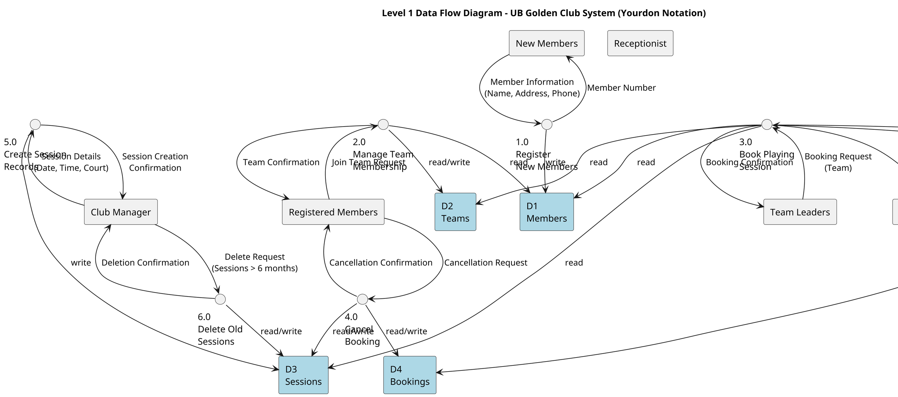

**Alternative PlantUML Level 1 DFD Code (Gane-Sarson Notation):**

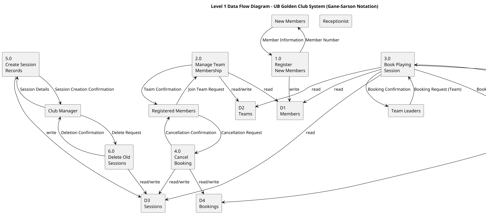

**Key Notation Corrections (Based on bus-station-management-system):**

1. **Process Notation:**
   - ✅ **Correct**: Processes shown as **circles** (Yourdon) or **rounded rectangles** (Gane-Sarson)
   - ❌ **Incorrect**: Processes shown as plain rectangles (this is incorrect notation)

2. **Data Store Notation:**
   - ✅ **Correct**: Data stores shown as **open rectangles** (two parallel horizontal lines) labeled D1, D2, D3, etc.
   - ✅ **Correct**: Data stores labeled with noun phrases (e.g., "D1 Members", "D2 Teams")
   - ❌ **Incorrect**: Using "database" keyword or closed rectangles

3. **External Entity Notation:**
   - ✅ **Correct**: External entities shown as **squares/rectangles**
   - ✅ **Correct**: Labeled with noun phrases (e.g., "New Members", "Receptionist")

4. **Data Flow Notation:**
   - ✅ **Correct**: Data flows shown as **labeled arrows** with noun phrases
   - ✅ **Correct**: All data flows must have descriptive labels
   - ✅ **Correct**: Data flows show direction (unidirectional)

5. **Level 1 DFD Requirements:**
   - ✅ Shows **multiple processes** (decomposition from context diagram)
   - ✅ Shows **data stores** (not shown in context diagram)
   - ✅ Maintains **same external entities** as context diagram
   - ✅ Processes numbered hierarchically (1.0, 2.0, 3.0, etc.)

**Marking Considerations:**
- Award full marks for correct notation (circles for processes, open rectangles for data stores)
- Deduct marks (-1 to -2) for incorrect process notation (using rectangles instead of circles)
- Deduct marks (-0.5 to -1) for incorrect data store notation
- Ensure data flows are properly labeled with noun phrases
- Verify all processes have both inputs and outputs

**PlantUML Level 0 DFD Code (Context Diagram - Gane-Sarson Notation):**

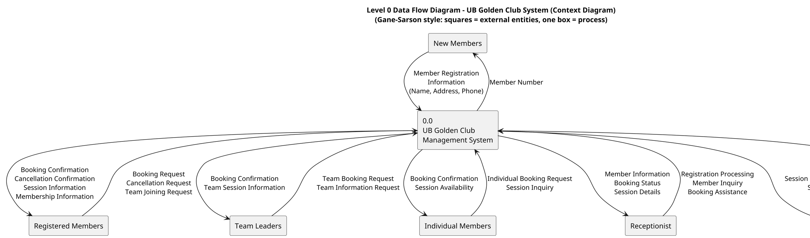

**Key Points for Level 0 DFD (Context Diagram):**
- ✅ Shows the **entire system as ONE process** (numbered 0.0)
- ✅ Shows all **external entities** that interact with the system
- ✅ Shows **data flows** between external entities and the system
- ✅ **NO data stores** shown at this level (they appear in Level 1 DFD)
- ✅ **NO internal processes** shown (system treated as black box)

**PlantUML Level 2 DFD Code - Process 3.0 Decomposition (Yourdon Notation):**

**Note:** Level 2 DFD decomposes Process 3.0 "Book Playing Session" into 3 sub-processes:

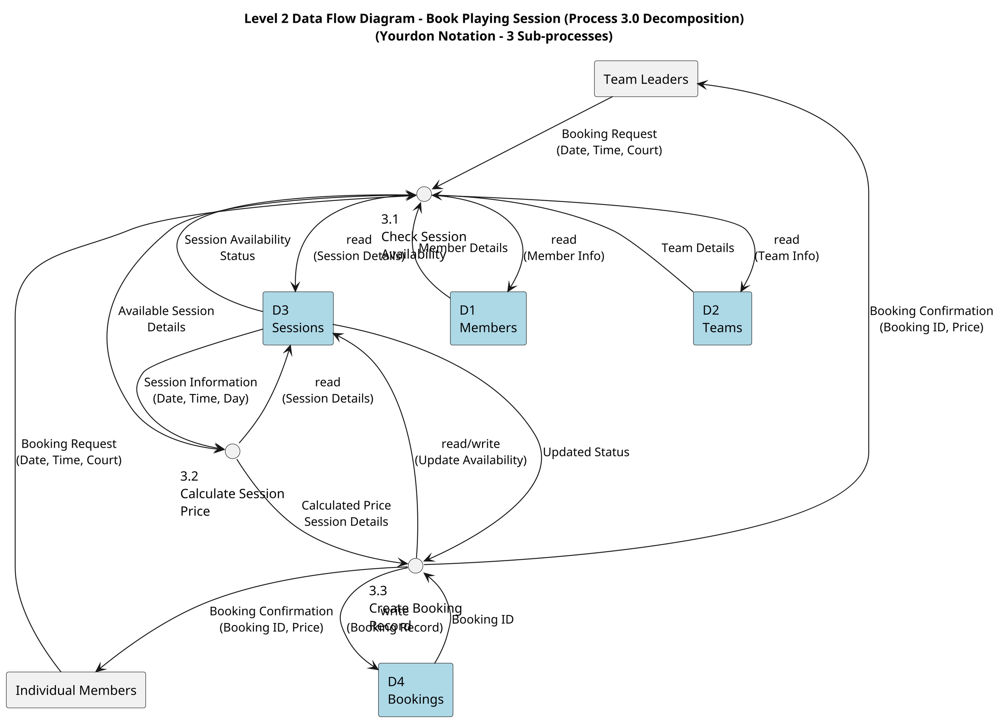

**Alternative PlantUML Level 2 DFD Code (Gane-Sarson Notation):**

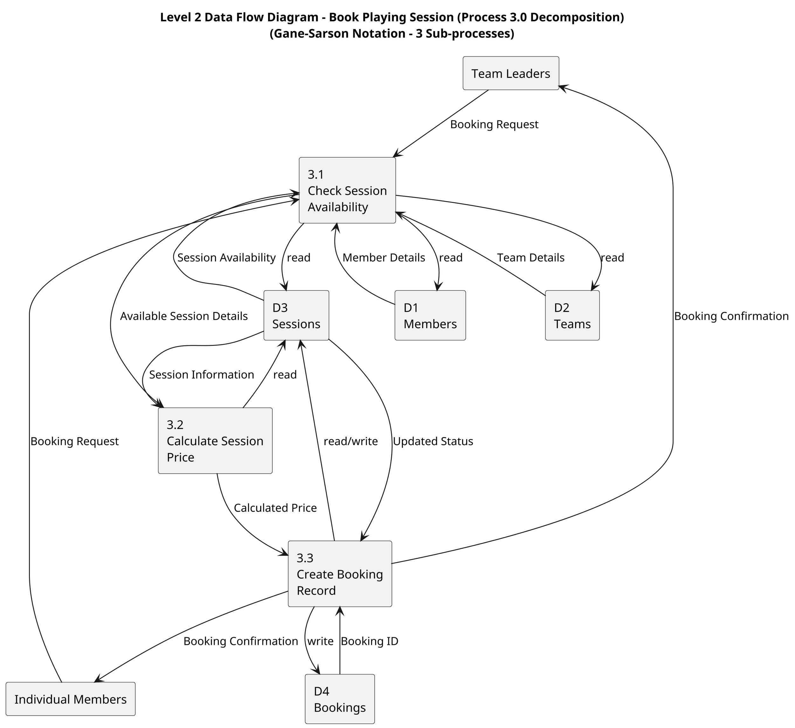

**Key Points for Level 2 DFD:**
- ✅ **Decomposes Process 3.0** "Book Playing Session" into **3 sub-processes**:
  - **3.1 Check Session Availability**: Validates session availability and member/team information
  - **3.2 Calculate Session Price**: Calculates price based on session details (date, time, day)
  - **3.3 Create Booking Record**: Creates booking record and updates session availability
- ✅ Shows **data stores** used by the sub-processes (D1, D2, D3, D4)
- ✅ Shows **data flows** between sub-processes, data stores, and external entities
- ✅ Maintains **same external entities** as Level 1 DFD (Team Leaders, Individual Members)
- ✅ Process numbering reflects hierarchy (3.1, 3.2, 3.3 are sub-processes of 3.0)
- ✅ All data flows from Level 1 DFD Process 3.0 are accounted for in Level 2 DFD

**Marking Considerations for Level 2 DFD:**
- Award marks for proper decomposition (3 sub-processes)
- Award marks for correct notation (circles for Yourdon, rounded rectangles for Gane-Sarson)
- Award marks for proper data flow balancing (all inputs/outputs from Level 1 accounted for)
- Deduct marks (-1) if sub-processes are not properly numbered (should be 3.1, 3.2, 3.3)
- Deduct marks (-0.5 to -1) for missing data flows or incorrect data store access

---

### Part 2b: Activity Diagram with Swim Lanes (9 marks)

#### Detailed Answer:

An **Activity Diagram with Swim Lanes** shows the workflow of business processes, with each lane representing a different actor or role responsible for activities. This helps visualize who does what in the system.

**Swim Lanes:**
1. **Club Manager** - Creates and manages session records
2. **Receptionist** - Handles member registration and assists with bookings
3. **Member/Team Leader** - Performs member-related activities (booking, cancellation, team joining)
4. **System** - Automated system processes

**PlantUML Activity Diagram Code:**

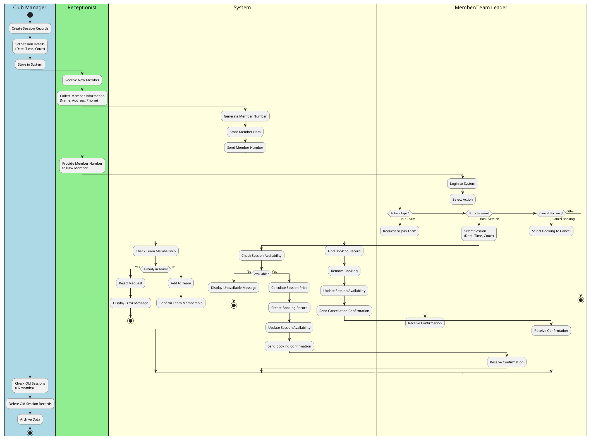

**Key Activities Covered:**

1. **Member Registration Process:**
   - Receptionist receives new member
   - Collects member information
   - System generates member number
   - Member data stored
   - Member number provided to new member

2. **Team Joining Process:**
   - Member requests to join team
   - System checks existing membership
   - If not in team, adds to team
   - Confirms team membership

3. **Session Booking Process:**
   - Member selects session
   - System checks availability
   - Calculates price
   - Creates booking record
   - Confirms booking

4. **Booking Cancellation Process:**
   - Member selects booking to cancel
   - System removes booking
   - Updates session availability
   - Confirms cancellation

5. **Session Management:**
   - Club Manager creates session records
   - System stores sessions
   - Old sessions deleted after 6 months

---

### Part 2c: Differences Between DFD and Activity Diagram (7 marks)

#### Detailed Answer:

**1. Purpose and Focus:**

**DFD (Data Flow Diagram):**
- Focuses on **data flow** through the system
- Shows **"what data"** moves between processes, stores, and entities
- Emphasizes data transformations and data dependencies
- Example from Part (a): Shows "Member Information" flowing from "New Members" entity to "Register New Members" process, then "Member Number" flowing back

**Activity Diagram:**
- Focuses on **workflow and business processes**
- Shows **"what activities"** are performed and in what order
- Emphasizes the sequence of actions and control flow
- Example from Part (b): Shows the sequence "Receive New Member" → "Collect Member Information" → "Generate Member Number" → "Store Member Data"

**2. Perspective:**

**DFD:**
- Provides a **data-oriented view** of the system
- Shows how data is transformed as it moves through processes
- Represents a **static view** of data transformations (what happens to data)
- Example: The DFD shows that "Booking Request" data flows into "Book Session" process and "Booking Confirmation" flows out

**Activity Diagram:**
- Provides a **process/behavior-oriented view** of the system
- Shows the sequence and conditions of activities
- Represents a **dynamic view** of process execution (when and how activities occur)
- Example: The Activity Diagram shows that after "Check Session Availability", if available, the system proceeds to "Calculate Price", but if not available, it stops

**3. Representation Elements:**

**DFD:**
- Shows **data stores** (where data is stored), **external entities** (sources/destinations), and **data flows** (what data moves)
- Represents processes as **data transformations** (input data → process → output data)
- Example: DFD shows "D1 Members" data store being accessed by "Register New Members" process

**Activity Diagram:**
- Shows **activities** (actions performed), **decisions** (branching points), and **swim lanes** (who performs activities)
- Represents processes as **executable activities** with control flow (sequence, parallel, conditional)
- Example: Activity Diagram shows "Generate Member Number" as an activity in the System swim lane, followed by a decision point

**4. Level of Detail:**

**DFD:**
- Can show data at **different levels of abstraction** (Context → Level 1 → Level 2, etc.)
- Each level provides more detail about data transformations
- Focuses on data decomposition

**Activity Diagram:**
- Shows **sequential and parallel activities** with control flow
- Can show concurrent activities in different swim lanes
- Focuses on temporal and logical ordering of activities

**5. Usage Context:**

**DFD:**
- Used for **system analysis** and understanding **data requirements**
- Helps identify what data the system needs, where it comes from, and where it goes
- Useful for database design and data modeling

**Activity Diagram:**
- Used for **business process modeling** and **workflow design**
- Helps understand how work is performed and who is responsible
- Useful for process improvement and system design

**Illustration with Examples:**

**From Part (a) DFD:**
- The DFD shows "Member Information" as a data flow, indicating what data moves, but doesn't show when or in what sequence registration occurs

**From Part (b) Activity Diagram:**
- The Activity Diagram shows the sequence: "Receive New Member" → "Collect Information" → "Generate Number", indicating the order of activities, but doesn't show what specific data fields are involved

---

### Part 2d: System Requirements List (9 marks)

#### Detailed Answer:

**Functional Requirements:**

Functional requirements define **what** the system must do - the specific functions and features it must provide.

**Member Management Requirements:**

1. **FR-1: Member Registration**
   - The system must allow new members to register by providing name, address, and phone number
   - The system must validate that all required information is provided
   - The system must store member information in the database
   - **Example:** A new member provides "John Doe, 123 Main St, 555-1234" and receives member number "M001"

2. **FR-2: Member Number Assignment**
   - The system must automatically assign a unique member number to each new member
   - Member numbers must be sequential and non-duplicating
   - The system must display the assigned member number to the new member
   - **Example:** First member gets "M001", second gets "M002", etc.

3. **FR-3: Member Information Maintenance**
   - The system must allow updating member information (address, phone)
   - The system must maintain historical records of member data
   - The system must allow searching for members by name or member number

**Team Management Requirements:**

4. **FR-4: Team Joining**
   - The system must allow registered members to join teams
   - The system must display available teams for selection
   - The system must confirm team membership after joining

5. **FR-5: One Team Per Member Rule**
   - The system must enforce that each member belongs to only one team at a time
   - The system must prevent members from joining multiple teams simultaneously
   - The system must require leaving current team before joining another
   - **Example:** If member M001 is in Team A, they cannot join Team B without leaving Team A first

6. **FR-6: Team Membership Tracking**
   - The system must track which members belong to which teams
   - The system must display team membership lists
   - The system must allow team leaders to view their team members

**Session Management Requirements:**

7. **FR-7: Session Booking**
   - The system must allow booking of playing sessions
   - The system must display available sessions (date, time, court)
   - The system must create booking records when sessions are booked
   - The system must update session availability after booking

8. **FR-8: Team Leader Booking**
   - The system must allow team leaders to book sessions on behalf of their teams
   - The system must identify the booking as a team booking
   - The system must notify team members of team bookings

9. **FR-9: Individual Member Booking**
   - The system must allow individual members (not in teams) to book sessions
   - The system must allow individual members to book sessions for themselves
   - The system must handle individual bookings separately from team bookings

10. **FR-10: Price Calculation**
    - The system must calculate session price based on time of day, day of week, and court type
    - The system must display calculated price before confirming booking
    - The system must store price with each booking record
    - **Example:** Weekend evening sessions cost more than weekday morning sessions

11. **FR-11: Session Cancellation**
    - The system must allow members to cancel their bookings
    - The system must remove booking records upon cancellation
    - The system must send cancellation confirmation to the member

12. **FR-12: Cancelled Session Rebooking**
    - The system must make cancelled sessions available for rebooking immediately
    - The system must update session availability status when cancellation occurs
    - The system must notify other members if a previously unavailable session becomes available

**Administrative Requirements:**

13. **FR-13: Session Record Creation**
    - The system must allow club manager to create session records in advance
    - The system must support bulk creation of sessions (e.g., all sessions for a month)
    - The system must validate session details before creation

14. **FR-14: Session Identification**
    - The system must uniquely identify each session by date, time, and court number
    - The system must prevent duplicate sessions (same date, time, court)
    - The system must display sessions in chronological order

15. **FR-15: Old Session Deletion**
    - The system must automatically identify sessions older than 6 months
    - The system must delete session records after 6 months
    - The system must archive deleted sessions before removal (optional but recommended)

**Non-Functional Requirements:**

**Performance Requirements:**

1. **NFR-1: Response Time**
   - The system must respond to booking requests within 2 seconds
   - The system must load member information within 1 second
   - The system must handle 100 concurrent users without degradation

2. **NFR-2: Throughput**
   - The system must process at least 50 bookings per minute
   - The system must support 1000 registered members

**Usability Requirements:**

3. **NFR-3: User Interface**
   - The system must be intuitive for users with basic computer skills
   - The system must provide clear error messages and help text
   - The system must be accessible via web browser

4. **NFR-4: Training**
   - New users must be able to complete registration without training
   - Staff must be able to use the system with minimal training (2 hours)

**Security Requirements:**

5. **NFR-5: Access Control**
   - The system must require authentication for member access
   - The system must restrict administrative functions to authorized staff
   - The system must encrypt sensitive member data

6. **NFR-6: Data Protection**
   - The system must protect member personal information
   - The system must comply with data protection regulations
   - The system must log all access to member data

**Reliability Requirements:**

7. **NFR-7: Availability**
   - The system must be available 99% of the time (24/7)
   - The system must have scheduled maintenance windows
   - The system must recover from failures within 1 hour

8. **NFR-8: Data Backup**
   - The system must perform daily automated backups
   - The system must allow data restoration within 4 hours
   - Backup data must be stored off-site

**Scalability Requirements:**

9. **NFR-9: Growth Support**
   - The system must handle growth from 100 to 5000 members without major changes
   - The system must support adding new courts and facilities
   - The system architecture must allow horizontal scaling

**Maintainability Requirements:**

10. **NFR-10: Code Quality**
    - The system must follow coding standards and best practices
    - The system must have comprehensive documentation
    - The system must allow easy updates and modifications

**Requirements Quality:**

- **Clear and Unambiguous:** Each requirement has one clear interpretation
- **Testable/Verifiable:** Each requirement can be tested to confirm it's met
- **Complete:** All necessary requirements are included
- **Consistent:** Requirements don't contradict each other
- **Traceable:** Requirements can be traced to business needs

---

### Part 2e: Functional vs Non-Functional Requirements (6 marks)

#### Detailed Answer:

**Functional Requirements:**

**Definition:**
Functional requirements define **WHAT** the system must do - the specific functions, features, and behaviors the system must provide. They describe the system's capabilities and how it should respond to inputs.

**Characteristics:**
- Describe **system functions** and features
- Specify **system behavior** and functionality
- Define **what actions** the system can perform
- Answer the question: "What does the system do?"

**Examples from Part (d):**

1. **"System must register new members with name, address, phone number"**
   - This describes a specific function the system must perform
   - It defines what data is collected and what action occurs

2. **"System must allow booking of playing sessions"**
   - This describes a feature the system must provide
   - It specifies a capability users can use

3. **"System must calculate session price based on time, day, court type"**
   - This describes a function that processes data
   - It specifies how the system behaves (calculates price)

4. **"System must enforce one team per member rule"**
   - This describes a business rule the system must implement
   - It specifies system behavior (enforcement of constraint)

5. **"System must allow session cancellation"**
   - This describes a function users can perform
   - It specifies system capability

**Non-Functional Requirements:**

**Definition:**
Non-functional requirements define **HOW WELL** the system performs - the qualities, characteristics, and constraints that describe the system's performance, usability, security, and other attributes. They describe system properties rather than functions.

**Characteristics:**
- Describe **system qualities**, constraints, and characteristics
- Specify **performance**, usability, security, reliability, etc.
- Define **how well** the system performs its functions
- Answer the question: "How well does the system do it?"

**Examples from Part (d):**

1. **"System must respond to booking requests within 2 seconds"**
   - This describes **performance** quality (speed)
   - It specifies how quickly the system must perform

2. **"System must be available 24/7 (99% uptime)"**
   - This describes **reliability** quality (availability)
   - It specifies system availability constraint

3. **"System must protect member personal data"**
   - This describes **security** quality
   - It specifies how data should be protected

4. **"System must support 1000 concurrent users"**
   - This describes **scalability** quality
   - It specifies capacity constraint

5. **"System must be intuitive for users with basic computer skills"**
   - This describes **usability** quality
   - It specifies how easy the system should be to use

6. **"System must perform daily automated backups"**
   - This describes **maintainability/reliability** quality
   - It specifies how the system should be maintained

**Key Differences:**

| Aspect | Functional Requirements | Non-Functional Requirements |
|--------|------------------------|---------------------------|
| **Focus** | What the system does | How well the system does it |
| **Type** | Functions, features, behaviors | Qualities, constraints, characteristics |
| **Examples** | "Register members", "Book sessions" | "Respond in 2 seconds", "99% uptime" |
| **Testing** | Test if function works | Test if quality is met |
| **Priority** | Core system capabilities | System performance and quality |

**Why Both Are Important:**

- **Functional requirements** ensure the system does what it's supposed to do
- **Non-functional requirements** ensure the system does it well (fast, secure, reliable, usable)
- Both are necessary for a successful system
- Missing non-functional requirements can lead to systems that work but are unusable, slow, or insecure

---

### Part 2f: Technique for Prioritizing Requirements (10 marks)

#### Detailed Answer:

**MoSCoW Prioritization Method:**

**Definition:**
MoSCoW is an acronym standing for **Must have, Should have, Could have, Won't have (this time)**. It's a prioritization technique used to categorize requirements based on their importance and necessity for the current release.

**Explanation of Categories:**

1. **Must Have (M) - Critical Requirements:**
   - **Definition:** Requirements that are absolutely critical for the system to function
   - **Characteristics:** System cannot be delivered without these; core functionality
   - **Examples from UB Golden Club:**
     - Register new members
     - Assign unique member numbers
     - Book playing sessions
     - Store member information
   - **Impact if Missing:** System would be unusable or fail to meet core objectives

2. **Should Have (S) - Important Requirements:**
   - **Definition:** Important requirements that add significant value but are not critical
   - **Characteristics:** High business value; system can function without them but would be less effective
   - **Examples from UB Golden Club:**
     - Calculate session price automatically
     - Send booking confirmation emails
     - Display session availability calendar
     - Search members by name
   - **Impact if Missing:** System works but lacks important features; reduced user satisfaction

3. **Could Have (C) - Desirable Requirements:**
   - **Definition:** Requirements that would be nice to have but are not essential
   - **Characteristics:** Low priority; can be deferred without major impact
   - **Examples from UB Golden Club:**
     - Mobile app version
     - Advanced reporting features
     - Member photo upload
     - Social media integration
   - **Impact if Missing:** Minimal impact; can be added in future releases

4. **Won't Have (W) - Excluded Requirements:**
   - **Definition:** Requirements explicitly excluded from the current release
   - **Characteristics:** May be included in future releases; not part of current scope
   - **Examples from UB Golden Club:**
     - Online payment integration (Phase 2)
     - Member loyalty program (Future)
     - Tournament management (Future feature)
   - **Impact:** Acknowledged but deferred; helps manage scope

**How to Apply MoSCoW:**

**Step 1: Stakeholder Consultation**
- Involve all stakeholders (members, staff, management)
- Conduct workshops or meetings to discuss requirements
- Gather input on business value and importance

**Step 2: Business Value Assessment**
- Evaluate each requirement's contribution to business objectives
- Consider user needs and expectations
- Assess impact on system success

**Step 3: Technical Feasibility Consideration**
- Evaluate technical complexity and effort required
- Consider dependencies between requirements
- Assess risks and challenges

**Step 4: Risk and Dependency Analysis**
- Identify critical dependencies (what must be done first)
- Assess risks of excluding requirements
- Consider impact on other requirements

**Step 5: Categorization and Consensus**
- Categorize each requirement into M, S, C, or W
- Reach consensus among stakeholders
- Document decisions and rationale

**Example Prioritization for UB Golden Club:**

**Must Have (M):**
- FR-1: Register new members
- FR-2: Assign unique member numbers
- FR-7: Book playing sessions
- FR-11: Cancel bookings
- FR-13: Create session records
- NFR-5: Access control/authentication

**Should Have (S):**
- FR-10: Calculate session price
- FR-4: Join teams
- FR-5: Enforce one team per member
- NFR-1: Response time < 2 seconds
- NFR-3: Intuitive user interface

**Could Have (C):**
- FR-15: Delete old sessions (can be manual initially)
- Advanced search features
- Email notifications
- Member dashboard

**Won't Have (W):**
- Online payment processing
- Mobile app
- Social media integration
- Tournament management

**Alternative Prioritization Techniques:**

**1. Priority Matrix (Business Value vs. Technical Complexity):**
- Plot requirements on a 2x2 matrix
- High value, low complexity = High priority
- Low value, high complexity = Low priority

**2. Kano Model:**
- **Basic:** Must-have features (dissatisfaction if missing)
- **Performance:** More is better (satisfaction increases)
- **Delight:** Unexpected features (high satisfaction)

**3. Value vs. Cost Analysis:**
- Calculate value-to-cost ratio for each requirement
- Prioritize high ratio requirements

**4. Voting/Ranking Methods:**
- Stakeholders vote or rank requirements
- Use techniques like dot voting or pairwise comparison

**Why Prioritization is Helpful:**

**1. Resource Management:**
- **Limited Resources:** Projects have limited time, budget, and personnel
- **Focus:** Prioritization ensures resources are allocated to high-value requirements first
- **Efficiency:** Critical functionality is delivered before nice-to-have features
- **Example:** Ensures member registration works before adding advanced reporting

**2. Risk Mitigation:**
- **Early Identification:** Critical requirements identified early reduces project failure risk
- **Dependency Management:** Understanding priorities helps manage dependencies
- **Risk Reduction:** Addressing critical requirements first reduces overall project risk
- **Example:** Ensuring core booking functionality works prevents system failure

**3. Stakeholder Alignment:**
- **Consensus:** Creates agreement on what's most important
- **Expectation Management:** Sets clear expectations about what will be delivered
- **Communication:** Provides framework for discussing trade-offs
- **Example:** All stakeholders agree that member registration is more important than mobile app

**4. Iterative Development:**
- **Agile Support:** Supports agile/iterative development approaches
- **Incremental Delivery:** Allows delivering value incrementally
- **Flexibility:** Enables adjusting priorities based on feedback
- **Example:** Release 1 has Must-haves, Release 2 adds Should-haves

**5. Change Management:**
- **Scope Control:** Provides framework for handling requirement changes
- **Decision Making:** Supports decisions about adding/removing requirements
- **Trade-offs:** Helps evaluate trade-offs when new requirements emerge
- **Example:** New requirement can be evaluated against existing priorities

**Benefits Summary:**

- **Better Planning:** Clear priorities enable better project planning
- **Reduced Scope Creep:** Helps prevent uncontrolled requirement additions
- **Improved Quality:** Focus on critical requirements improves quality
- **Faster Delivery:** Delivering critical features first provides value sooner
- **Stakeholder Satisfaction:** Meeting critical needs first improves satisfaction

---

## QUESTION 3: OPTION 2 (50 marks total)

### Part 3a: Feasibility Report Purpose and Timing (5 marks)

#### Detailed Answer:

**Purpose of Feasibility Report:**

A **Feasibility Report** is a comprehensive analysis that evaluates whether a proposed system project is viable and worth pursuing. It serves multiple critical purposes:

1. **Decision Support Tool:**
   - Provides stakeholders with objective information to make informed decisions
   - Helps determine whether to proceed with, modify, or abandon the project
   - Reduces risk of investing in unviable projects

2. **Risk Assessment:**
   - Identifies potential problems, challenges, and obstacles
   - Evaluates technical, economic, and organizational risks
   - Helps develop risk mitigation strategies

3. **Resource Evaluation:**
   - Assesses required resources: time, money, personnel, and technology
   - Determines if adequate resources are available
   - Helps in resource planning and allocation

4. **Technical Feasibility:**
   - Determines if current or available technology can support system requirements
   - Evaluates hardware, software, and infrastructure needs
   - Assesses technical complexity and implementation challenges

5. **Economic Feasibility:**
   - Evaluates cost-benefit analysis (ROI - Return on Investment)
   - Estimates development costs, operational costs, and potential savings/benefits
   - Determines if the project is financially viable

6. **Organizational Feasibility:**
   - Assesses if the organization can support the system
   - Evaluates organizational readiness, culture, and change management needs
   - Considers user acceptance and training requirements

**When in SDLC (System Development Life Cycle):**

The feasibility study is conducted **early in the project lifecycle**, specifically:

1. **After Initial Problem Identification:**
   - Once the problem or need is identified
   - After initial requirements gathering and analysis

2. **Before System Design:**
   - Conducted **before detailed system design** begins
   - Uses gathered requirements to assess feasibility
   - Part of the **planning/initiation phase**

3. **SDLC Phase Placement:**
   - **Phase 1: Planning** - Feasibility study is a key activity
   - **Phase 2: Analysis** - Requirements analysis provides input to feasibility study
   - **Phase 3: Design** - Only proceeds if feasibility study is positive

**Typical SDLC Sequence:**
```
1. Problem Identification
2. Requirements Analysis (Initial)
3. Feasibility Study ← Conducted here
4. System Design (if feasible)
5. Implementation
6. Testing
7. Deployment
8. Maintenance
```

**Why Timing Matters:**
- Conducting feasibility study **too early** (before understanding requirements) leads to inaccurate assessment
- Conducting it **too late** (after design/implementation) wastes resources on unviable projects
- **Optimal timing:** After understanding what is needed, but before committing significant resources to design and development

---

### Part 3b: Context Diagram for UB Golden Club (10 marks)

#### Detailed Answer:

A **Context Diagram** (also called Level 0 DFD) is the highest level of a Data Flow Diagram. It shows the entire system as a single process and all external entities that interact with it. **No data stores** are shown at this level.

**System Boundary:**
- The system is represented as a **single process** labeled "UB Golden Club System" or "UB Golden Club Management System"
- This represents the entire system boundary

**External Entities:**
1. **New Members** - People who want to join the club
2. **Registered Members** - Members who have completed registration
3. **Team Leaders** - Members who lead teams
4. **Individual Members** - Members not part of a team
5. **Receptionist** - Staff who interact with the system
6. **Club Manager** - Administrative staff

**Data Flows:**

**From External Entities to System:**
- Member registration information (name, address, phone)
- Booking requests (date, time, court, member/team info)
- Cancellation requests (booking ID, member info)
- Team joining requests (member ID, team ID)
- Session creation requests (date, time, court details)

**From System to External Entities:**
- Member number assignment
- Booking confirmations
- Session availability information
- Membership information
- Team membership confirmations
- Cancellation confirmations

**PlantUML Context Diagram Code (Gane-Sarson Notation):**

**Note:** Based on corrections made in the bus-station-management-system case study, proper Context Diagram (Level 0 DFD) notation requires:
- **System Process**: ONE process representing the entire system (numbered 0.0)
- **External Entities**: Squares/rectangles (sources/sinks of data, NOT processes)
- **Data Flows**: Labeled arrows with noun phrases
- **NO Data Stores**: Context diagram shows NO data stores (they appear in Level 1 DFD)


**Key Points (Based on bus-station-management-system corrections):**

1. **System Representation:**
   - ✅ **Correct**: Shows the entire system as **ONE process** (numbered 0.0)
   - ✅ **Correct**: Process labeled with system name (e.g., "UB Golden Club Management System")
   - ❌ **Incorrect**: Showing multiple processes or internal details at this level

2. **External Entities:**
   - ✅ **Correct**: External entities shown as **squares/rectangles**
   - ✅ **Correct**: Labeled with noun phrases (e.g., "New Members", "Receptionist")
   - ✅ **Correct**: Represent sources/sinks of data outside the system boundary

3. **Data Flows:**
   - ✅ **Correct**: All data flows **labeled** with descriptive noun phrases
   - ✅ **Correct**: Data flows show direction (unidirectional arrows)
   - ✅ **Correct**: Data flows connect external entities to the system process
   - ❌ **Incorrect**: Data flows without labels or between external entities directly

4. **Data Stores:**
   - ✅ **Correct**: **NO data stores** shown in context diagram
   - ❌ **Incorrect**: Including data stores at this level (they appear in Level 1 DFD)

5. **Process Decomposition:**
   - ✅ **Correct**: **NO internal processes** shown (system treated as black box)
   - ❌ **Incorrect**: Showing sub-processes or internal details at this level

**Marking Considerations:**
- Award full marks for correct notation (one process, external entities as squares, no data stores)
- Deduct marks (-1 to -2) for showing data stores in context diagram
- Deduct marks (-1) for showing multiple processes instead of one system process
- Deduct marks (-0.5 to -1) for unlabeled data flows
- Ensure all external entities are properly identified and connected

---

### Part 3c: Entity Relationship Diagram (ERD) (10 marks)

#### Detailed Answer:

An **Entity Relationship Diagram (ERD)** shows the data structure of a system, including entities (things), attributes (properties), and relationships (connections) between entities.

**Entities:**

1. **Member**
   - Represents club members
   - Attributes: MemberNumber (PK), Name, Address, Phone
   - One member can belong to one team (or none)

2. **Team**
   - Represents teams in the club
   - Attributes: TeamID (PK), TeamName, Description
   - One team has many members

3. **Session**
   - Represents playing sessions
   - Attributes: SessionID (PK), Date, Time, CourtNumber, Price, Status
   - Many members can book many sessions (Many-to-Many)

4. **Booking** (Relationship Entity)
   - Represents the booking relationship between Member and Session
   - Attributes: BookingID (PK), MemberNumber (FK), SessionID (FK), BookingDate, Status
   - Resolves the Many-to-Many relationship between Member and Session

5. **Court** (Optional)
   - Represents court facilities
   - Attributes: CourtNumber (PK), CourtType, Location
   - One court has many sessions

**Relationships:**

1. **Member → Team** (Many-to-One)
   - One member belongs to one team (or none)
   - One team has many members
   - Cardinality: Member (Many) : Team (One)
   - Participation: Partial (members can exist without teams)

2. **Member → Booking → Session** (Many-to-Many via Booking)
   - Many members can book many sessions
   - Booking entity resolves the Many-to-Many relationship
   - Cardinality: Member (Many) : Booking (Many) : Session (Many)

3. **Team → Session** (Many-to-Many, Optional)
   - If team bookings are tracked separately
   - Can be handled through Member relationships or separate TeamBooking entity

4. **Court → Session** (One-to-Many, if Court is separate entity)
   - One court hosts many sessions
   - Cardinality: Court (One) : Session (Many)

**PlantUML ERD Code:**

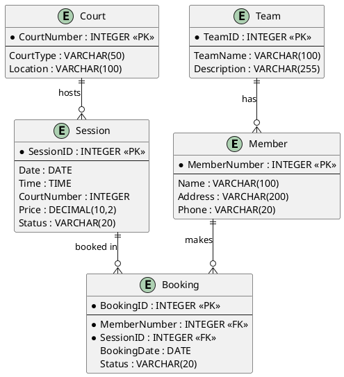

**Alternative ERD with Team Booking:**

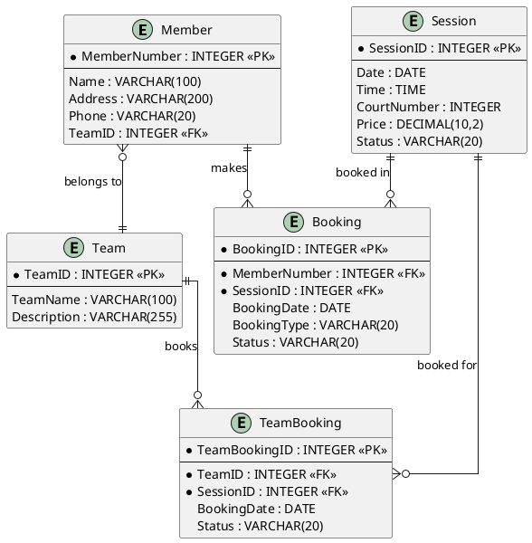

**Key Attributes Explanation:**

- **Primary Keys (PK):** Uniquely identify each entity instance
- **Foreign Keys (FK):** Reference primary keys in related entities
- **MemberNumber:** Unique identifier for members
- **SessionID:** Unique identifier for each session
- **BookingID:** Unique identifier for each booking
- **Status:** Tracks availability/booking status

---

### Part 3d: GUI Design and Error Minimization (15 marks)

#### Detailed Answer:

**GUI Design Principles:**

1. **Consistency:**
   - Same layout patterns throughout the application
   - Consistent button styles, colors, and placements
   - Uniform navigation structure

2. **Intuitive Navigation:**
   - Logical flow from one screen to another
   - Clear menu structure
   - Breadcrumbs for complex navigation

3. **Clear Labeling:**
   - Descriptive labels for all fields and buttons
   - Instructions where needed
   - Tooltips for additional help

4. **Visual Design:**
   - Appropriate color scheme (professional, accessible)
   - Readable fonts and sizes
   - Adequate spacing between elements
   - Visual hierarchy (important elements stand out)

**Registration Form Design:**

**PlantUML GUI Wireframe Code:**

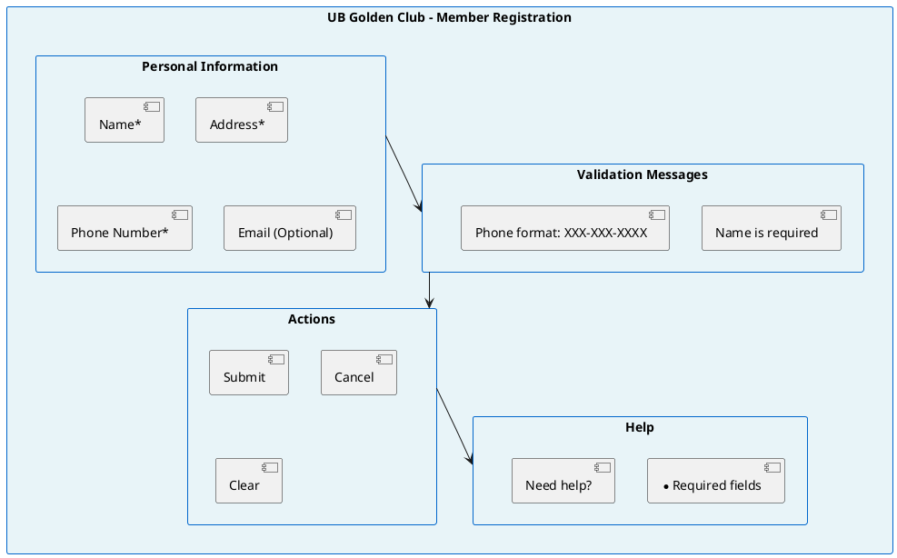

**Detailed Form Elements:**

1. **Input Fields:**
   - **Name Field:** Text input with placeholder "Enter full name"
   - **Address Field:** Multi-line text area with placeholder "Enter complete address"
   - **Phone Number Field:** Formatted input with mask (XXX-XXX-XXXX)
   - **Email Field:** Email input with format validation

2. **Visual Elements:**
   - Required field indicators (*)
   - Field labels above each input
   - Help icons next to complex fields
   - Progress indicator (if multi-step form)

3. **Buttons:**
   - **Submit Button:** Primary action, disabled until form is valid
   - **Cancel Button:** Secondary action, clears form
   - **Clear Button:** Resets all fields

**Error Minimization Techniques:**

**1. Input Validation:**

**a) Field-level Validation (Real-time):**
- Validate as user types or leaves field
- Example: Phone number format checked immediately
- Visual feedback (green checkmark for valid, red X for invalid)

**b) Format Validation:**
- Phone: Enforce XXX-XXX-XXXX format
- Email: Validate email format (contains @, valid domain)
- Name: Check for valid characters only

**c) Required Field Validation:**
- Mark required fields clearly (*)
- Prevent submission if required fields empty
- Highlight empty required fields in red

**d) Data Type Validation:**
- Phone: Numeric only (with formatting characters)
- Name: Text only, no numbers
- Address: Text and numbers allowed

**2. User Interface Design Techniques:**

**a) Dropdown Menus:**
- Use for limited options (e.g., Country, State)
- Prevents invalid entries
- Example: Country dropdown instead of free text

**b) Input Masks:**
- Phone: (XXX) XXX-XXXX format enforced
- Member ID: Format enforced automatically
- Prevents format errors

**c) Date Pickers:**
- Calendar widget for date selection
- Prevents invalid dates
- Shows available dates only

**d) Default Values:**
- Pre-fill common values where appropriate
- Example: Default country, current date
- Reduces user input effort

**3. Feedback Mechanisms:**

**a) Error Messages:**
- Display near problematic fields
- Clear, specific messages ("Phone number must be 10 digits")
- Use red color for errors
- Don't disappear until error is fixed

**b) Success Confirmations:**
- Show success message after valid submission
- Display generated member number prominently
- Confirmation email/SMS notification

**c) Help Text/Tooltips:**
- Question mark icons with explanations
- Placeholder text in fields
- "Example" text below fields

**4. Business Rule Enforcement:**

**a) Uniqueness Checking:**
- Check phone number uniqueness in real-time
- Check email uniqueness (if email required)
- Display message if duplicate found

**b) Business Logic Validation:**
- Age restrictions (if applicable)
- Membership rules enforcement
- Duplicate prevention

**5. Prevention Techniques:**

**a) Disable Submit Button:**
- Keep submit button disabled until all validations pass
- Visual indication (grayed out)
- Tooltip explaining why disabled

**b) Confirmation Dialogs:**
- For critical actions (e.g., "Are you sure you want to submit?")
- Double-check important information
- Prevent accidental submissions

**PlantUML Activity Diagram for Registration with Validation:**

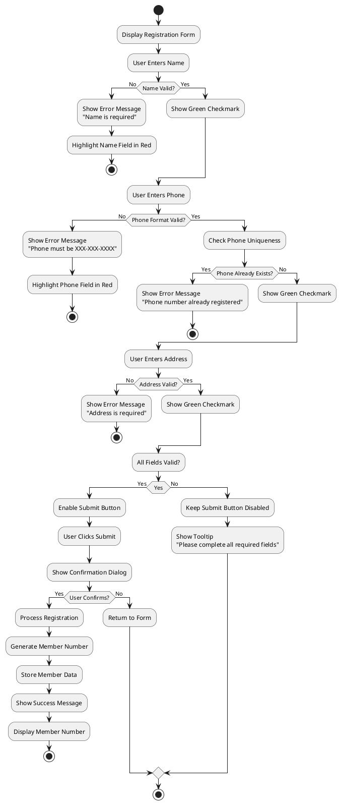

**Key Error Minimization Strategies Summary:**

1. **Prevention:** Use input masks, dropdowns, and constraints to prevent errors
2. **Detection:** Real-time validation catches errors immediately
3. **Correction:** Clear error messages guide users to fix problems
4. **Confirmation:** Success messages and confirmations ensure correct submission
5. **Guidance:** Help text and tooltips prevent confusion

---

### Part 3e: Technique for Prioritizing Requirements (10 marks)

*(Same as Question 2, Part 2f - see above for detailed marking scheme)*

**Note:** If student answered this in Question 2, ensure consistency. If answered in both places, mark both but may allow slight variation.

---

## OVERALL EXAM MARKING NOTES

### Time Management Consideration
- If student answers all questions but some are rushed/incomplete, award partial marks appropriately
- Quality over quantity - a well-argued partial answer may score higher than a rushed complete answer

### Argumentation Requirement
- Answers must be explained/argued per exam instructions
- Reduce marks by 20-30% if answers are lists only without explanation
- "Yes/No" answers should receive 0 marks unless accompanied by explanation

### Case Study Relevance
- Answers must relate to UB Golden Club scenario where applicable
- Generic answers without scenario context should be penalized by 10-20%

### Diagram Quality
- Diagrams must be clear and readable
- Reduce marks by 10-20% for very poor presentation
- Award partial marks for correct concepts even if diagram presentation is weak

### Academic Integrity
- Plagiarism or excessive similarity to other papers should be flagged
- Original work with understanding should be rewarded

---

## TOTAL MARKS DISTRIBUTION

- **Question 1:** 20 marks (Compulsory)
- **Question 2 OR Question 3:** 50 marks
- **Total:** 70 marks

**Grading Scale Recommendation:**
- 70-100%: A
- 60-69%: B
- 50-59%: C
- 40-49%: D
- Below 40%: F

---

## APPENDIX: COMMON TERMINOLOGY EXPECTATIONS

### DFD Components (Based on bus-station-management-system corrections):
- **Process:** Circle/bubble (Yourdon) or rounded rectangle (Gane-Sarson), verb phrase, transforms data
  - ❌ **Incorrect**: Plain rectangle (this is NOT correct DFD notation)
  - ✅ **Correct**: Circle (Yourdon notation) or rounded rectangle (Gane-Sarson notation)
- **Data Flow:** Arrow, noun phrase, shows data movement (must be labeled)
- **Data Store:** Open rectangle (two parallel horizontal lines), labeled D1, D2, D3, etc., noun phrase, data repository
  - ❌ **Incorrect**: Closed rectangle or "database" keyword
  - ✅ **Correct**: Open rectangle (two parallel lines) with Dn label
- **External Entity:** Square/rectangle, noun phrase, outside system boundary
- **Context Diagram (Level 0):** ONE process (the system), external entities, NO data stores

### Activity Diagram Components:
- **Activity:** Rounded rectangle, verb phrase, action performed
- **Decision:** Diamond, branching point
- **Swim Lane:** Partition showing responsibility
- **Initial/Final Node:** Start/end markers

### ERD Components:
- **Entity:** Rectangle, noun, represents person/place/thing
- **Attribute:** Oval or listed in entity box
- **Relationship:** Diamond or line, verb phrase
- **Cardinality:** 1:1, 1:Many, Many:Many

---

*End of Marking Guide*
