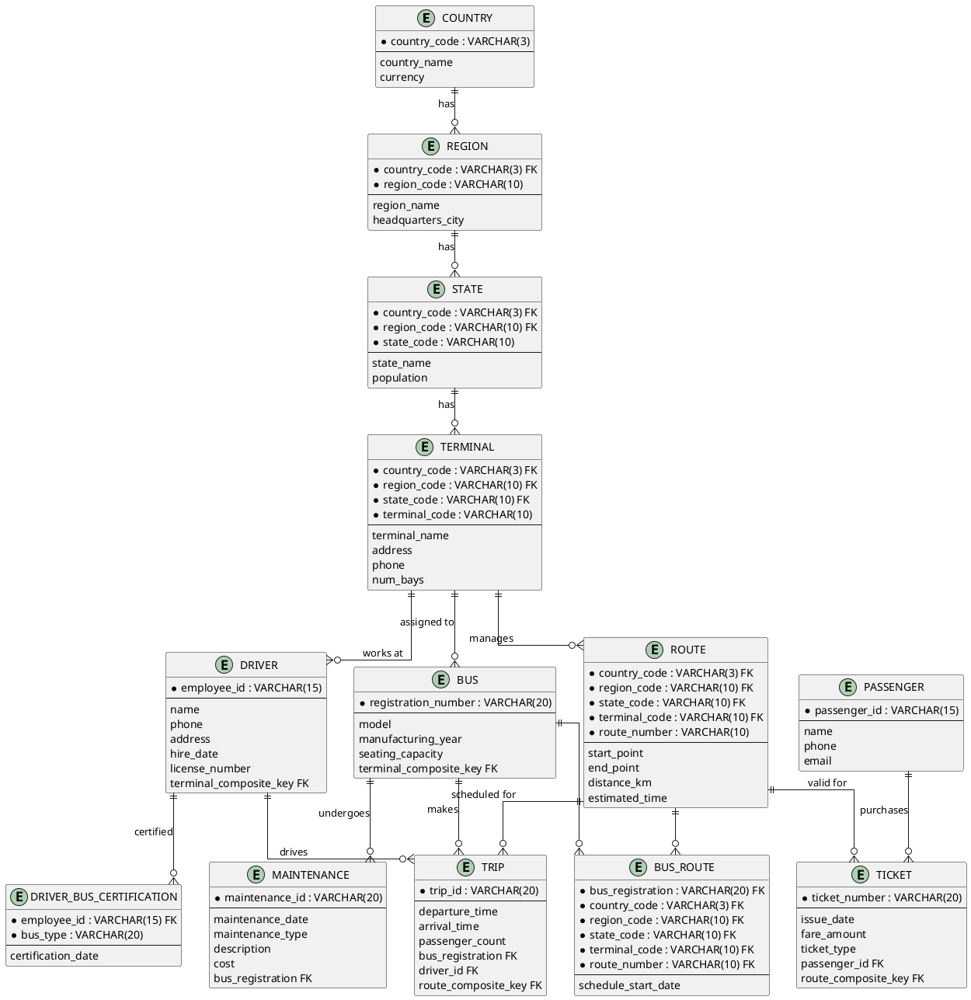
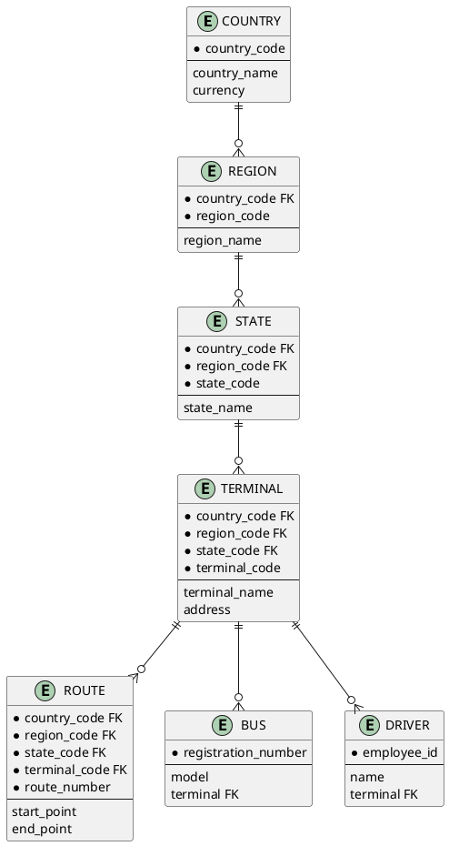
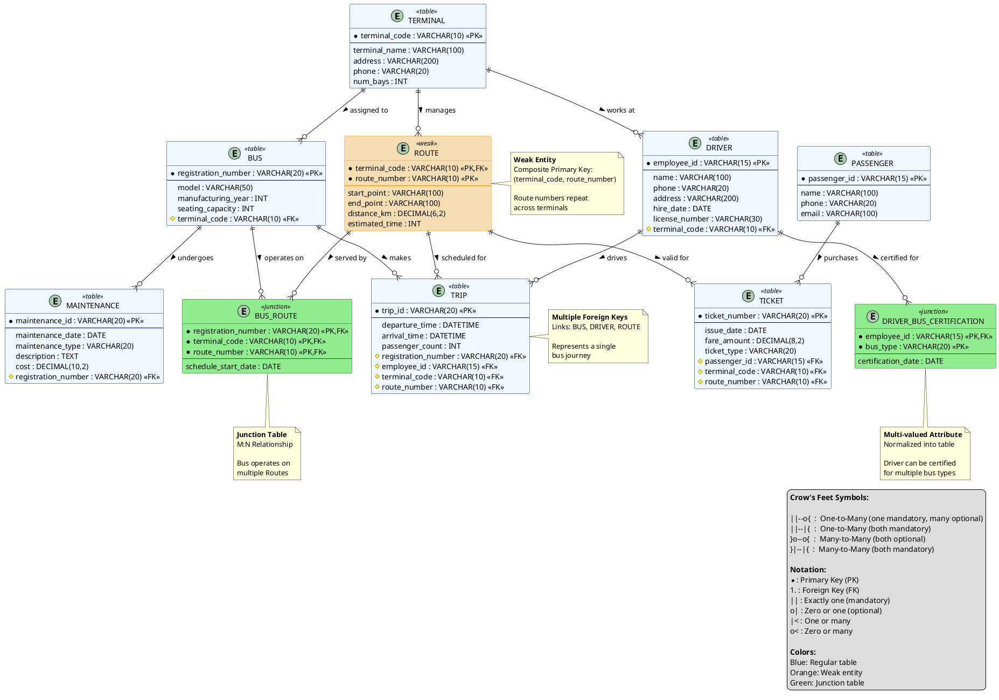
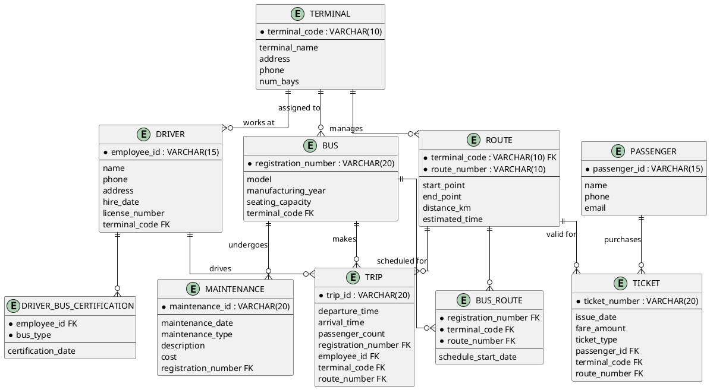
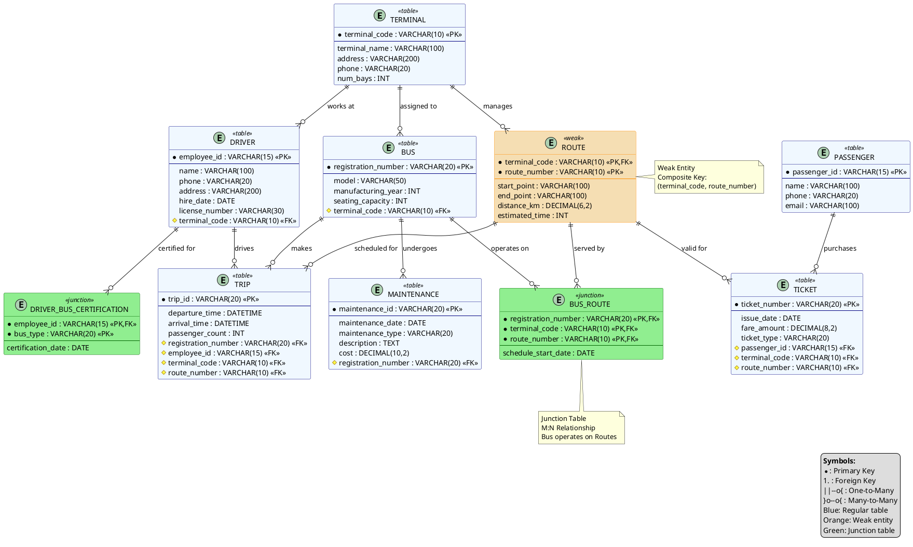
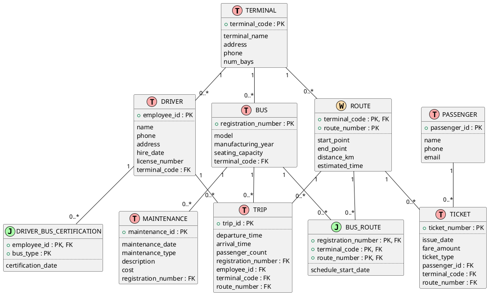

# Practice Exercise: Bus Management System
## ER Diagram Modeling and Database Design

---

## The Story: International Bus Transport Management System

**Background:**

Global Transit Corporation (GTC) is a multinational bus transportation company operating across multiple countries. They're modernizing their entire operation and need a comprehensive database to manage their international bus network. You have been hired as the database architect to design and implement this system.

**The Scenario:**

GTC operates in several countries, each divided into regions, which are further divided into states. Within each state, they have multiple bus terminals. The management wants to track everything from geographic hierarchy to bus maintenance and passenger ticketing.

Here's what the Operations Manager explained to you during the requirements gathering meeting:

---

### Requirements Narrative:

**"Good morning! Let me walk you through how our international bus system works,"** said Sarah Chen, the Global Operations Manager.

**Geographic Hierarchy:**
"We operate in multiple countries. Each country has a unique country code (like 'US', 'CA', 'MX'), a country name, and the currency used for transactions in that country.

Within each country, we have multiple regions. For example, in the United States, we have regions like 'Northeast', 'Southeast', 'Midwest', 'Southwest', and 'West'. Each region is identified by a region code (like 'NE', 'SE', 'MW'), but these codes are only unique within a country. So 'NE' in the US is different from 'NE' in Canada! Each region also has a region name and the headquarters city.

Each region is divided into states or provinces. For example, the Northeast region in the US includes states like New York, Massachusetts, and Pennsylvania. States are identified by a state code (like 'NY', 'MA', 'PA'), but again, these are only unique within a region within a country. Each state has a state name and population data."

**Terminals and Routes:**
"Within each state, we have several bus terminals. For example, in New York state, we have terminals in New York City, Buffalo, and Albany. Each terminal has a terminal code (like 'NYC01', 'BUF01'), which is unique only within that state. Every terminal has a name, address, phone number, and the number of parking bays.

Now here's where it gets interesting: Each terminal manages several bus routes. A route is identified by a route number (like 'R101', 'R202', etc.), but this route number is only unique within a terminal! So route R101 at NYC Downtown Terminal is completely different from R101 at LA Airport Terminal, even though they have the same route number. Each route has a starting point, an ending point, total distance in kilometers, and estimated travel time."

**Buses:**
"We have a large international fleet of buses. Each bus has a globally unique registration number (the license plate with country prefix), a model name (like 'Volvo B7RLE' or 'Mercedes Citaro'), manufacturing year, and seating capacity. Each bus is assigned to exactly one terminal as its home base. A terminal can have many buses assigned to it, but some newly opened terminals might not have any buses yet.

We need to track which routes each bus operates on. This is important: a bus can operate on multiple routes (not at the same time, of course!), and a route can be served by multiple buses throughout the day. For each bus-route assignment, we want to record the schedule start date when the bus started serving that route."

**Drivers:**
"We employ drivers across all our locations. Each driver has a globally unique employee ID, name, phone number, address, hire date, and license number (with country-specific format). Drivers are assigned to a specific terminal where they report for duty. A driver works at one terminal, but a terminal has many drivers. We need this information because drivers usually only drive routes from their assigned terminal.

Now, drivers can be licensed to drive multiple bus types, and we need to track this. We have different bus types: 'Standard', 'Articulated', 'Double-Decker', and 'Electric'. For each driver, we need to store which bus types they are certified to drive. Some drivers can drive all types, others only specific types."

**Trips:**
"Every day, our buses make scheduled trips. A trip is a single journey of a bus along a route. Each trip has a unique trip ID, a departure time, and an arrival time. A trip is always for one specific route and is operated by one specific bus. We also assign one driver to each trip. We need to track the actual number of passengers on each trip for our ridership statistics."

**Maintenance:**
"Bus maintenance is critical. Each bus undergoes regular maintenance. We record each maintenance session with a unique maintenance ID, the date of maintenance, the type of maintenance (routine, repair, emergency), a description of the work done, and the cost. Obviously, each maintenance record is for one specific bus, and a bus can have many maintenance records over time."

**Passengers and Tickets:**
"We have both regular passengers and occasional riders. For our frequent passengers, we maintain their information: a unique passenger ID, name, phone number, and email. These passengers can purchase monthly passes or stored-value cards.

For ticketing, each ticket has a unique ticket number, the date of issue, the fare amount, and ticket type (single, daily, weekly, monthly). A ticket is issued to a passenger. Each ticket is valid for a specific route. Passengers can buy multiple tickets, and of course, many tickets are issued for the same popular route."

---

### Your Task:

Design a complete database system for Metro City Transit Authority with the following deliverables:

**Part A: Entity-Relationship Modeling (Chen Notation)**
1. Identify all entities (strong and weak)
2. Identify all attributes (including multi-valued attributes)
3. Identify primary keys and partial keys
4. Identify all relationships with cardinalities
5. Show participation constraints (total/partial)
6. Draw the complete ER diagram using **Chen Notation**

**Part B: Entity-Relationship Modeling (Crow's Feet Notation)**
1. Redraw the same ER diagram using **Crow's Feet Notation**
2. Show all cardinalities using Crow's Feet symbols
3. Indicate mandatory/optional participation

**Part C: Relational Model Translation**
1. Translate the ER diagram to relational tables
2. Show all primary keys and foreign keys
3. Handle multi-valued attributes appropriately
4. Create complete SQL DDL scripts

**Part D: Sample Data and Queries**
1. Populate tables with realistic sample data
2. Write 10 useful SQL queries for the system

---

## Hints and Considerations:

**Weak Entities:**
- Think about which entities cannot exist independently
- Route seems to depend on Terminal (route numbers repeat across terminals)

**Multi-valued Attributes:**
- Driver can have multiple bus type certifications
- This needs to be handled properly in the relational model

**Many-to-Many Relationships:**
- Bus ↔ Route (with schedule_start_date attribute)
- These need junction tables

**Business Rules to Enforce:**
- Every bus must be assigned to exactly one terminal
- Every route must belong to exactly one terminal
- Every trip must have exactly one bus, one driver, one route
- Every ticket must be for exactly one route and one passenger
- Maintenance records must be for exactly one bus

**Data Integrity:**
- Passenger phone and email might be optional
- Some terminals might not have buses yet (new terminals)
- Ensure foreign key constraints maintain referential integrity

---

## Expected Entities (Verify your analysis):

You should identify approximately **8-10 entities** including:
- Strong entities (exist independently)
- Weak entities (depend on owner entities)
- Junction entities (for M:N relationships)

---

## Getting Started:

1. **Read the story carefully** and highlight key nouns (potential entities)
2. **Identify relationships** between entities
3. **Determine cardinalities** (1:1, 1:N, M:N)
4. **Check for weak entities** (depend on other entities for identification)
5. **Identify multi-valued attributes** (driver bus type certifications)
6. **Draw Chen notation diagram** with diamonds for relationships
7. **Redraw in Crow's Feet notation** with line notations
8. **Translate to relational model**
9. **Write SQL DDL scripts**
10. **Test with sample data**

---

## Submission Checklist:

- [ ] Complete list of entities with attributes
- [ ] Identification of primary keys
- [ ] Complete ER diagram in Chen notation
- [ ] Complete ER diagram in Crow's Feet notation
- [ ] PlantUML code for both diagrams
- [ ] Relational schema with all tables
- [ ] SQL DDL scripts (CREATE TABLE statements)
- [ ] Sample data (INSERT statements)
- [ ] 10 useful SQL queries with explanations

---

**Good luck with your practice! This exercise covers:**
- Strong and weak entities
- Multi-valued attributes
- 1:N and M:N relationships
- Participation constraints
- Composite keys
- Junction tables
- Real-world database design

**Estimated Time:** 3-4 hours for complete solution

---

**Note:** The solution to this practice exercise follows in the next section. Try to solve it yourself first before looking at the solution!

---

# SOLUTION: Bus Management System

## Part A: Entity Analysis and Chen Notation ER Diagram

### Step 1: Entity Identification

**Strong Entities:**

**1. COUNTRY**
- Attributes: `country_code` (PK), `country_name`, `currency`
- Independent entity
- Top of geographic hierarchy

**2. BUS**
- Attributes: `registration_number` (PK), `model`, `manufacturing_year`, `seating_capacity`
- Independent entity (has unique registration)

**3. DRIVER**
- Attributes: `employee_id` (PK), `name`, `phone`, `address`, `hire_date`, `license_number`
- Independent entity

**4. PASSENGER**
- Attributes: `passenger_id` (PK), `name`, `phone`, `email`
- Independent entity

**5. MAINTENANCE**
- Attributes: `maintenance_id` (PK), `maintenance_date`, `maintenance_type`, `description`, `cost`
- Independent entity (unique maintenance ID)

**6. TICKET**
- Attributes: `ticket_number` (PK), `issue_date`, `fare_amount`, `ticket_type`
- Independent entity (unique ticket number)

---

**Weak Entities (Hierarchical):**

**7. REGION**
- Partial key: `region_code`
- Full key: (`country_code`, `region_code`)
- Owner: COUNTRY
- Attributes: `region_code`, `region_name`, `headquarters_city`
- **Why weak?** Region codes are only unique within a country

**8. STATE**
- Partial key: `state_code`
- Full key: (`country_code`, `region_code`, `state_code`)
- Owner: REGION (which depends on COUNTRY)
- Attributes: `state_code`, `state_name`, `population`
- **Why weak?** State codes are only unique within a region within a country

**9. TERMINAL**
- Partial key: `terminal_code`
- Full key: (`country_code`, `region_code`, `state_code`, `terminal_code`)
- Owner: STATE (which depends on REGION, which depends on COUNTRY)
- Attributes: `terminal_code`, `terminal_name`, `address`, `phone`, `num_bays`
- **Why weak?** Terminal codes are only unique within a state

**10. ROUTE**
- Partial key: `route_number`
- Full key: (`country_code`, `region_code`, `state_code`, `terminal_code`, `route_number`)
- Owner: TERMINAL (which depends on STATE, which depends on REGION, which depends on COUNTRY)
- Attributes: `route_number`, `start_point`, `end_point`, `distance_km`, `estimated_time`
- **Why weak?** Route numbers are only unique within a terminal

**11. TRIP**
- Attributes: `trip_id` (PK), `departure_time`, `arrival_time`, `passenger_count`
- **Note:** While trip has unique trip_id, it depends on Route, Bus, and Driver
- Can be modeled as strong entity with foreign keys

---

**Multi-valued Attribute:**

**DRIVER_BUS_TYPE_CERTIFICATION**
- Driver can be certified for multiple bus types: 'Standard', 'Articulated', 'Double-Decker', 'Electric'
- Needs separate table: `driver_id`, `bus_type`

---

### Step 2: Relationship Identification

**Geographic Hierarchy Relationships:**

**1. HAS_REGION (COUNTRY ↔ REGION)**
- Type: 1:N (Identifying relationship for weak entity REGION)
- COUNTRY: (0, N) - Country can have 0 or many regions
- REGION: (1, 1) - Region must belong to exactly one country
- Total participation from REGION

**2. HAS_STATE (REGION ↔ STATE)**
- Type: 1:N (Identifying relationship for weak entity STATE)
- REGION: (0, N) - Region can have 0 or many states
- STATE: (1, 1) - State must belong to exactly one region
- Total participation from STATE

**3. HAS_TERMINAL (STATE ↔ TERMINAL)**
- Type: 1:N (Identifying relationship for weak entity TERMINAL)
- STATE: (0, N) - State can have 0 or many terminals
- TERMINAL: (1, 1) - Terminal must belong to exactly one state
- Total participation from TERMINAL

**4. MANAGES (TERMINAL ↔ ROUTE)**
- Type: 1:N (Identifying relationship for weak entity ROUTE)
- TERMINAL: (0, N) - Terminal can have 0 or many routes
- ROUTE: (1, 1) - Route must belong to exactly one terminal
- Total participation from ROUTE

**Operational Relationships:**

**5. ASSIGNED_TO (BUS ↔ TERMINAL)**
- Type: 1:N
- TERMINAL: (0, N) - Terminal can have 0 or many buses
- BUS: (1, 1) - Bus must be assigned to exactly one terminal
- Total participation from BUS

**6. WORKS_AT (DRIVER ↔ TERMINAL)**
- Type: 1:N
- TERMINAL: (0, N) - Terminal can have 0 or many drivers
- DRIVER: (1, 1) - Driver must work at exactly one terminal
- Total participation from DRIVER

**7. OPERATES_ON (BUS ↔ ROUTE)** - M:N
- Type: M:N
- BUS: (0, N) - Bus can operate on multiple routes
- ROUTE: (1, N) - Route must be served by at least one bus
- Relationship attribute: `schedule_start_date`
- Junction table needed

**8. MAKES_TRIP (BUS ↔ TRIP)**
- Type: 1:N
- BUS: (0, N) - Bus can make many trips
- TRIP: (1, 1) - Trip is operated by exactly one bus
- Total participation from TRIP

**9. DRIVES (DRIVER ↔ TRIP)**
- Type: 1:N
- DRIVER: (0, N) - Driver can drive many trips
- TRIP: (1, 1) - Trip has exactly one driver
- Total participation from TRIP

**10. SCHEDULED_FOR (ROUTE ↔ TRIP)**
- Type: 1:N
- ROUTE: (0, N) - Route can have many trips
- TRIP: (1, 1) - Trip is for exactly one route
- Total participation from TRIP

**11. UNDERGOES (BUS ↔ MAINTENANCE)**
- Type: 1:N
- BUS: (0, N) - Bus can have many maintenance records
- MAINTENANCE: (1, 1) - Maintenance is for exactly one bus
- Total participation from MAINTENANCE

**12. PURCHASES (PASSENGER ↔ TICKET)**
- Type: 1:N
- PASSENGER: (0, N) - Passenger can buy many tickets
- TICKET: (1, 1) - Ticket is bought by exactly one passenger
- Total participation from TICKET

**13. VALID_FOR (ROUTE ↔ TICKET)**
- Type: 1:N
- ROUTE: (0, N) - Route can have many tickets
- TICKET: (1, 1) - Ticket is valid for exactly one route
- Total participation from TICKET

---

### Chen Notation ER Diagram

```
┌─────────────────────────────────────────────────────────────────────────┐
│          INTERNATIONAL BUS MANAGEMENT SYSTEM - CHEN NOTATION            │
└─────────────────────────────────────────────────────────────────────────┘

                      ┌──────────────────────┐
                      │      COUNTRY         │
                      ├──────────────────────┤
                      │ country_code (PK)    │
                      │ country_name         │
                      │ currency             │
                      └──────────┬───────────┘
                                 │
                                 │ 1
                                 │
                          ┌──────▼──────┐
                          │ HAS_REGION  │
                          │    (1:N)    │
                          └──────┬──────┘
                                 ║
                                 ║ N (total)
                                 ║
                       ┌═════════▼═════════┐
                       │      REGION       │
                       │   (Weak Entity)   │
                       ├───────────────────┤
                       │ country_code (FK) │
                       │ region_code (PK)  │
                       │ region_name       │
                       │ headquarters_city │
                       └──────────┬────────┘
                                  │
                                  │ 1
                                  │
                           ┌──────▼──────┐
                           │  HAS_STATE  │
                           │    (1:N)    │
                           └──────┬──────┘
                                  ║
                                  ║ N (total)
                                  ║
                        ┌═════════▼═════════┐
                        │       STATE       │
                        │   (Weak Entity)   │
                        ├───────────────────┤
                        │ country_code (FK) │
                        │ region_code (FK)  │
                        │ state_code (PK)   │
                        │ state_name        │
                        │ population        │
                        └──────────┬────────┘
                                   │
                                   │ 1
                                   │
                            ┌──────▼────────┐
                            │ HAS_TERMINAL  │
                            │     (1:N)     │
                            └──────┬────────┘
                                   ║
                                   ║ N (total)
                                   ║
                         ┌═════════▼══════════┐
                         │     TERMINAL       │
                         │   (Weak Entity)    │
                         ├────────────────────┤
                         │ country_code (FK)  │
                         │ region_code (FK)   │
                         │ state_code (FK)    │
                         │ terminal_code (PK) │
                         │ terminal_name      │
                         │ address            │
                         │ phone              │
                         │ num_bays           │
                         └──────┬─────────────┘
                                │
            ┌───────────────────┼───────────────┬───────────────┐
            │ 1                 │ 1             │ 1             │
            │                   │               │               │
      ┌─────▼─────┐       ┌─────▼─────┐   ┌─────▼─────┐       │
      │  MANAGES  │       │ASSIGNED_TO│   │ WORKS_AT  │       │
      │  (1:N)    │       │   (1:N)   │   │   (1:N)   │       │
      └─────┬─────┘       └─────┬─────┘   └─────┬─────┘       │
            ║                   │               │               │
            ║ N (total)         │ N (total)     │ N (total)     │
            ║                   │               │               │
   ┌════════▼════════┐    ┌─────▼──────┐  ┌─────▼──────┐      │
   │     ROUTE       │    │    BUS     │  │   DRIVER   │      │
   │  (Weak Entity)  │    │            │  │            │      │
   ├─────────────────┤    ├────────────┤  ├────────────┤      │
   │country_code(FK) │    │registration│  │employee_id │      │
   │region_code (FK) │    │_number(PK) │  │   (PK)     │      │
   │state_code (FK)  │    │model       │  │name        │      │
   │terminal_code(FK)│    │manu_year   │  │phone       │      │
   │route_number(PK) │    │capacity    │  │address     │      │
   │start_point      │    │terminal(FK)│  │hire_date   │      │
   │end_point        │    └────┬───────┘  │license_num │      │
   │distance_km      │         │          │terminal(FK)│      │
   │estimated_time   │         │          │{bus_types} │◄─────┴─Multi-valued
   └────┬────────────┘         │          └─────┬──────┘
        │                      │                │
        │                 ┌────┴─────┐          │
        │                 │OPERATES  │          │
        │                 │   ON     │          │
        │                 │  (M:N)   │          │
        │                 │[schedule │          │
        │                 │  _start] │          │
        │                 └────┬─────┘          │
        │                      │                │
        │ 1                    │                │ 1
        │ N                    │                │ N
        │                      │                │
  ┌─────▼──────┐          ┌────▼────┐      ┌────▼────┐
  │SCHEDULED   │          │  MAKES  │      │ DRIVES  │
  │   FOR      │          │  TRIP   │      │         │
  │   (1:N)    │          │  (1:N)  │      │  (1:N)  │
  └─────┬──────┘          └────┬────┘      └────┬────┘
        │                      │                │
        │ 1 (total)            │ 1 (total)      │ 1 (total)
        │                      │                │
        └──────┬───────────────┴────────┬───────┘
               │                        │
          ┌────▼────────────────────────▼───┐
          │           TRIP                  │
          ├─────────────────────────────────┤
          │ trip_id (PK)                    │
          │ departure_time                  │
          │ arrival_time                    │
          │ passenger_count                 │
          │ route_id (FK - composite)       │
          │ bus_reg (FK)                    │
          │ driver_id (FK)                  │
          └─────────────────────────────────┘

   ┌──────────────┐                    ┌──────────────┐
   │     BUS      │                    │  PASSENGER   │
   │              │                    │              │
   │registration_ │                    │passenger_id  │
   │number (PK)   │                    │    (PK)      │
   └──────┬───────┘                    └──────┬───────┘
          │                                   │
          │ 1                                 │ 1
          │                                   │
     ┌────▼────┐                         ┌────▼────┐
     │UNDERGOES│                         │PURCHASES│
     │  (1:N)  │                         │  (1:N)  │
     └────┬────┘                         └────┬────┘
          │                                   │
          │ N (total)                         │ N (total)
          │                                   │
   ┌──────▼──────────┐               ┌────────▼────────┐
   │  MAINTENANCE    │               │     TICKET      │
   ├─────────────────┤               ├─────────────────┤
   │maintenance_id(PK│               │ticket_number(PK)│
   │maintenance_date │               │issue_date       │
   │maintenance_type │               │fare_amount      │
   │description      │               │ticket_type      │
   │cost             │               │passenger_id (FK)│
   │bus_reg (FK)     │               │route_id (FK-comp│
   └─────────────────┘               └────────┬────────┘
                                              │
                                              │ N (total)
                                              │
                                         ┌────▼────┐
                                         │VALID_FOR│
                                         │  (1:N)  │
                                         └────┬────┘
                                              │
                                              │ 1
                                              │
                                         ┌────▼────┐
                                         │  ROUTE  │
                                         └─────────┘

Legend:
─── = Single line (partial participation)
═══ = Double line (total participation)
◇   = Diamond (relationship)
□   = Entity
═══□═══ = Weak Entity (double border)
{x} = Multi-valued attribute

HIERARCHICAL WEAK ENTITIES:
COUNTRY (strong) → REGION (weak) → STATE (weak) → TERMINAL (weak) → ROUTE (weak)
```

---

### PlantUML Code for Chen Notation

**Copy this code to generate the Chen notation ER diagram with geographic hierarchy:**

**Version 1: Complete ER Diagram with Geographic Hierarchy (RECOMMENDED)**



**How to Use:**
1. Copy the code above
2. Go to https://www.plantuml.com/plantuml/uml/
3. Paste and click "Submit"
4. Download as PNG/SVG/PDF

---

**Version 2: Simplified Hierarchical View (Focus on Geographic Structure)**



**This simplified version shows:**
- Clear 5-level weak entity hierarchy
- Essential attributes only
- Clean visualization
- Perfect for understanding the geographic structure

**How to Use:**
1. Go to [plantuml.com](https://www.plantuml.com/plantuml/uml/)
2. Paste the code above
3. Click "Submit" to generate the diagram
4. Download as PNG, SVG, or PDF

---

## Part B: Crow's Feet Notation ER Diagram

### Crow's Feet Symbols Reference:

```
│   = Exactly one (mandatory)
○   = Zero or one (optional)
<   = Many
||  = One (mandatory)
○|  = Zero or one (optional)
|<  = One or many (mandatory many)
○<  = Zero or many (optional many)
```

### Crow's Feet ER Diagram

```
┌─────────────────────────────────────────────────────────────────────────┐
│                BUS MANAGEMENT SYSTEM - CROW'S FEET NOTATION             │
└─────────────────────────────────────────────────────────────────────────┘


┌──────────────────────┐
│     TERMINAL         │
├──────────────────────┤
│ terminal_code (PK)   │
│ terminal_name        │
│ address              │
│ phone                │
│ num_bays             │
└──────┬───────────────┘
       │
       ├────────────────┬──────────────────┬─────────────────┐
       │                │                  │                 │
       │                │                  │                 │
       ○<               ○<                 ○<                │
       │                │                  │                 │
┌──────▼─────────┐ ┌────▼──────┐    ┌─────▼──────┐         │
│    ROUTE       │ │   BUS     │    │  DRIVER    │         │
│ (Weak Entity)  │ │           │    │            │         │
├────────────────┤ ├───────────┤    ├────────────┤         │
│terminal_code(FK│ │registration    │employee_id │         │
│route_number(PK)│ │_number(PK)│    │   (PK)     │         │
│start_point     │ │model      │    │name        │         │
│end_point       │ │manu_year  │    │phone       │         │
│distance_km     │ │capacity   │    │address     │         │
│estimated_time  │ │terminal_  │    │hire_date   │         │
└────┬───────────┘ │code (FK)  │    │license_num │         │
     │             └────┬──────┘    └─────┬──────┘         │
     │                  │                 │                 │
     │                  │                 │                 │
     ├<                 ○<                ○<                │
     │                  │                 │                 │
┌────▼──────────┐  ┌────▼──────────┐ ┌───▼──────────┐     │
│BUS_ROUTE      │  │    TRIP       │ │DRIVER_BUS_   │     │
│(Junction)     │  │               │ │CERTIFICATION │     │
├───────────────┤  ├───────────────┤ ├──────────────┤     │
│bus_reg (PK,FK)│  │trip_id (PK)   │ │employee_id   │     │
│terminal_code  │  │departure_time │ │  (PK,FK)     │     │
│ (PK,FK)       │  │arrival_time   │ │bus_type (PK) │     │
│route_num(PK,FK│  │passenger_count│ └──────────────┘     │
│schedule_start │  │route_id (FK)  │                      │
└───────────────┘  │bus_reg (FK)   │                      │
                   │driver_id (FK) │                      │
                   └────┬──────────┘                      │
                        │                                 │
                        ├<                                │
                        │                                 │
                   ┌────▼──────────┐                ┌─────▼────────┐
                   │               │                │  PASSENGER   │
                   │               │                │              │
                   │               │                │passenger_id  │
                   │               │                │    (PK)      │
                   │               │                └──────┬───────┘
                   │               │                       │
                   │               │                       ○<
                   │               │                       │
                   │               │                ┌──────▼───────┐
                   │               │                │   TICKET     │
                   │               │                ├──────────────┤
                   │               │                │ticket_num(PK)│
                   │               │                │issue_date    │
                   │               │                │fare_amount   │
                   │               │                │ticket_type   │
                   │               │                │passenger_id  │
                   │               │                │  (FK)        │
                   │               │                │route_id (FK) │
                   │               │                └──────────────┘
                   │               │
             ┌─────▼────────┐      │
             │     BUS      │──────┘
             ├──────────────┤
             │registration_ │
             │number (PK)   │
             └──────┬───────┘
                    │
                    ○<
                    │
             ┌──────▼──────────┐
             │  MAINTENANCE    │
             ├─────────────────┤
             │maintenance_id(PK│
             │maintenance_date │
             │maintenance_type │
             │description      │
             │cost             │
             │bus_reg (FK)     │
             └─────────────────┘


Cardinality Legend:
||──────○<  :  One-to-Many (one mandatory, many optional)
||──────|<  :  One-to-Many (both mandatory)
○<─────○<  :  Many-to-Many (both optional)
|<─────|<  :  Many-to-Many (both mandatory)
```

---

### PlantUML Code for Crow's Feet Notation

**Copy this code to generate the Crow's Feet notation ER diagram:**



**Alternative: Entity-Relationship Syntax (Cleaner)**



**How to Use:**
1. Go to [plantuml.com](https://www.plantuml.com/plantuml/uml/)
2. Paste either code version above
3. Click "Submit" to generate the diagram
4. Download as PNG, SVG, or PDF

**Tip:** The second version (ER Syntax) is cleaner and automatically uses Crow's Feet notation!

---

## Part C: Relational Model Translation

### Complete Relational Schema

**1. TERMINAL**
```sql
TERMINAL (terminal_code, terminal_name, address, phone, num_bays)
  PK: terminal_code
```

**2. ROUTE (Weak Entity)**
```sql
ROUTE (terminal_code, route_number, start_point, end_point, 
       distance_km, estimated_time)
  PK: (terminal_code, route_number)
  FK: terminal_code → TERMINAL(terminal_code)
```

**3. BUS**
```sql
BUS (registration_number, model, manufacturing_year, seating_capacity, 
     terminal_code)
  PK: registration_number
  FK: terminal_code → TERMINAL(terminal_code)
```

**4. DRIVER**
```sql
DRIVER (employee_id, name, phone, address, hire_date, license_number, 
        terminal_code)
  PK: employee_id
  FK: terminal_code → TERMINAL(terminal_code)
```

**5. DRIVER_BUS_CERTIFICATION (Multi-valued attribute)**
```sql
DRIVER_BUS_CERTIFICATION (employee_id, bus_type)
  PK: (employee_id, bus_type)
  FK: employee_id → DRIVER(employee_id)
  CHECK: bus_type IN ('Standard', 'Articulated', 'Double-Decker', 'Electric')
```

**6. BUS_ROUTE (M:N Junction Table)**
```sql
BUS_ROUTE (registration_number, terminal_code, route_number, 
           schedule_start_date)
  PK: (registration_number, terminal_code, route_number)
  FK: registration_number → BUS(registration_number)
  FK: (terminal_code, route_number) → ROUTE(terminal_code, route_number)
```

**7. TRIP**
```sql
TRIP (trip_id, departure_time, arrival_time, passenger_count,
      registration_number, employee_id, terminal_code, route_number)
  PK: trip_id
  FK: registration_number → BUS(registration_number)
  FK: employee_id → DRIVER(employee_id)
  FK: (terminal_code, route_number) → ROUTE(terminal_code, route_number)
```

**8. MAINTENANCE**
```sql
MAINTENANCE (maintenance_id, maintenance_date, maintenance_type,
             description, cost, registration_number)
  PK: maintenance_id
  FK: registration_number → BUS(registration_number)
```

**9. PASSENGER**
```sql
PASSENGER (passenger_id, name, phone, email)
  PK: passenger_id
```

**10. TICKET**
```sql
TICKET (ticket_number, issue_date, fare_amount, ticket_type,
        passenger_id, terminal_code, route_number)
  PK: ticket_number
  FK: passenger_id → PASSENGER(passenger_id)
  FK: (terminal_code, route_number) → ROUTE(terminal_code, route_number)
```

---

## Part C: SQL DDL Scripts

```sql
-- =====================================================
-- BUS MANAGEMENT SYSTEM - DATABASE CREATION
-- =====================================================

-- Create database
CREATE DATABASE BusManagementSystem;
USE BusManagementSystem;

-- =====================================================
-- TABLE 1: TERMINAL (Strong Entity)
-- =====================================================
CREATE TABLE TERMINAL (
    terminal_code VARCHAR(10) PRIMARY KEY,
    terminal_name VARCHAR(100) NOT NULL UNIQUE,
    address VARCHAR(200),
    phone VARCHAR(20),
    num_bays INT CHECK (num_bays >= 0)
);

-- =====================================================
-- TABLE 2: ROUTE (Weak Entity - owned by TERMINAL)
-- =====================================================
CREATE TABLE ROUTE (
    terminal_code VARCHAR(10),
    route_number VARCHAR(10),
    start_point VARCHAR(100) NOT NULL,
    end_point VARCHAR(100) NOT NULL,
    distance_km DECIMAL(6, 2) CHECK (distance_km > 0),
    estimated_time INT CHECK (estimated_time > 0), -- in minutes
    PRIMARY KEY (terminal_code, route_number),
    FOREIGN KEY (terminal_code) REFERENCES TERMINAL(terminal_code)
        ON DELETE CASCADE
        ON UPDATE CASCADE
);

-- =====================================================
-- TABLE 3: BUS (Strong Entity)
-- =====================================================
CREATE TABLE BUS (
    registration_number VARCHAR(20) PRIMARY KEY,
    model VARCHAR(50) NOT NULL,
    manufacturing_year INT CHECK (manufacturing_year >= 1990 
        AND manufacturing_year <= YEAR(CURDATE())),
    seating_capacity INT CHECK (seating_capacity > 0),
    terminal_code VARCHAR(10) NOT NULL,
    FOREIGN KEY (terminal_code) REFERENCES TERMINAL(terminal_code)
        ON DELETE RESTRICT
        ON UPDATE CASCADE
);

-- =====================================================
-- TABLE 4: DRIVER (Strong Entity)
-- =====================================================
CREATE TABLE DRIVER (
    employee_id VARCHAR(15) PRIMARY KEY,
    name VARCHAR(100) NOT NULL,
    phone VARCHAR(20),
    address VARCHAR(200),
    hire_date DATE NOT NULL,
    license_number VARCHAR(30) NOT NULL UNIQUE,
    terminal_code VARCHAR(10) NOT NULL,
    FOREIGN KEY (terminal_code) REFERENCES TERMINAL(terminal_code)
        ON DELETE RESTRICT
        ON UPDATE CASCADE
);

-- =====================================================
-- TABLE 5: DRIVER_BUS_CERTIFICATION (Multi-valued)
-- =====================================================
CREATE TABLE DRIVER_BUS_CERTIFICATION (
    employee_id VARCHAR(15),
    bus_type VARCHAR(20),
    certification_date DATE,
    PRIMARY KEY (employee_id, bus_type),
    FOREIGN KEY (employee_id) REFERENCES DRIVER(employee_id)
        ON DELETE CASCADE
        ON UPDATE CASCADE,
    CHECK (bus_type IN ('Standard', 'Articulated', 
                        'Double-Decker', 'Electric'))
);

-- =====================================================
-- TABLE 6: BUS_ROUTE (M:N Junction Table)
-- =====================================================
CREATE TABLE BUS_ROUTE (
    registration_number VARCHAR(20),
    terminal_code VARCHAR(10),
    route_number VARCHAR(10),
    schedule_start_date DATE NOT NULL,
    PRIMARY KEY (registration_number, terminal_code, route_number),
    FOREIGN KEY (registration_number) REFERENCES BUS(registration_number)
        ON DELETE CASCADE
        ON UPDATE CASCADE,
    FOREIGN KEY (terminal_code, route_number) 
        REFERENCES ROUTE(terminal_code, route_number)
        ON DELETE CASCADE
        ON UPDATE CASCADE
);

-- =====================================================
-- TABLE 7: PASSENGER (Strong Entity)
-- =====================================================
CREATE TABLE PASSENGER (
    passenger_id VARCHAR(15) PRIMARY KEY,
    name VARCHAR(100) NOT NULL,
    phone VARCHAR(20),
    email VARCHAR(100) UNIQUE
);

-- =====================================================
-- TABLE 8: TRIP (Strong Entity with multiple FKs)
-- =====================================================
CREATE TABLE TRIP (
    trip_id VARCHAR(20) PRIMARY KEY,
    departure_time DATETIME NOT NULL,
    arrival_time DATETIME NOT NULL,
    passenger_count INT DEFAULT 0 CHECK (passenger_count >= 0),
    registration_number VARCHAR(20) NOT NULL,
    employee_id VARCHAR(15) NOT NULL,
    terminal_code VARCHAR(10) NOT NULL,
    route_number VARCHAR(10) NOT NULL,
    FOREIGN KEY (registration_number) REFERENCES BUS(registration_number)
        ON DELETE RESTRICT
        ON UPDATE CASCADE,
    FOREIGN KEY (employee_id) REFERENCES DRIVER(employee_id)
        ON DELETE RESTRICT
        ON UPDATE CASCADE,
    FOREIGN KEY (terminal_code, route_number) 
        REFERENCES ROUTE(terminal_code, route_number)
        ON DELETE RESTRICT
        ON UPDATE CASCADE,
    CHECK (arrival_time > departure_time)
);

-- =====================================================
-- TABLE 9: MAINTENANCE (Strong Entity)
-- =====================================================
CREATE TABLE MAINTENANCE (
    maintenance_id VARCHAR(20) PRIMARY KEY,
    maintenance_date DATE NOT NULL,
    maintenance_type VARCHAR(20) NOT NULL 
        CHECK (maintenance_type IN ('Routine', 'Repair', 'Emergency')),
    description TEXT,
    cost DECIMAL(10, 2) CHECK (cost >= 0),
    registration_number VARCHAR(20) NOT NULL,
    FOREIGN KEY (registration_number) REFERENCES BUS(registration_number)
        ON DELETE CASCADE
        ON UPDATE CASCADE
);

-- =====================================================
-- TABLE 10: TICKET (Strong Entity)
-- =====================================================
CREATE TABLE TICKET (
    ticket_number VARCHAR(20) PRIMARY KEY,
    issue_date DATE NOT NULL,
    fare_amount DECIMAL(8, 2) NOT NULL CHECK (fare_amount > 0),
    ticket_type VARCHAR(20) NOT NULL 
        CHECK (ticket_type IN ('Single', 'Daily', 'Weekly', 'Monthly')),
    passenger_id VARCHAR(15) NOT NULL,
    terminal_code VARCHAR(10) NOT NULL,
    route_number VARCHAR(10) NOT NULL,
    FOREIGN KEY (passenger_id) REFERENCES PASSENGER(passenger_id)
        ON DELETE RESTRICT
        ON UPDATE CASCADE,
    FOREIGN KEY (terminal_code, route_number) 
        REFERENCES ROUTE(terminal_code, route_number)
        ON DELETE RESTRICT
        ON UPDATE CASCADE
);

-- =====================================================
-- INDEXES for Performance
-- =====================================================
CREATE INDEX idx_bus_terminal ON BUS(terminal_code);
CREATE INDEX idx_driver_terminal ON DRIVER(terminal_code);
CREATE INDEX idx_trip_date ON TRIP(departure_time);
CREATE INDEX idx_maintenance_date ON MAINTENANCE(maintenance_date);
CREATE INDEX idx_ticket_date ON TICKET(issue_date);
CREATE INDEX idx_route_terminal ON ROUTE(terminal_code);

```

---

## Part D: Sample Data

```sql
-- =====================================================
-- SAMPLE DATA INSERTION
-- =====================================================

-- Insert Terminals
INSERT INTO TERMINAL VALUES 
    ('DT01', 'Downtown Terminal', '123 Main Street, Metro City', '555-0101', 25),
    ('AP02', 'Airport Terminal', '456 Airport Road, Metro City', '555-0202', 30),
    ('SH03', 'Suburban Hub', '789 Suburb Lane, Metro City', '555-0303', 15),
    ('US04', 'University Station', '321 Campus Drive, Metro City', '555-0404', 20);

-- Insert Routes (Weak Entity)
INSERT INTO ROUTE VALUES 
    -- Downtown Terminal routes
    ('DT01', 'R101', 'Downtown', 'Airport', 25.5, 45),
    ('DT01', 'R102', 'Downtown', 'Suburbs', 18.3, 35),
    ('DT01', 'R103', 'Downtown', 'University', 12.7, 25),
    -- Airport Terminal routes
    ('AP02', 'R101', 'Airport', 'Downtown', 25.5, 45),
    ('AP02', 'R201', 'Airport', 'North District', 30.2, 50),
    -- Suburban Hub routes
    ('SH03', 'R301', 'Suburbs', 'Shopping Mall', 8.5, 20),
    ('SH03', 'R302', 'Suburbs', 'Industrial Area', 15.0, 30),
    -- University Station routes
    ('US04', 'R401', 'University', 'City Center', 10.5, 22),
    ('US04', 'R402', 'University', 'Research Park', 7.8, 18);

-- Insert Buses
INSERT INTO BUS VALUES 
    ('MC-BUS-001', 'Volvo B7RLE', 2020, 45, 'DT01'),
    ('MC-BUS-002', 'Mercedes Citaro', 2021, 50, 'DT01'),
    ('MC-BUS-003', 'MAN Lion City', 2019, 42, 'DT01'),
    ('MC-BUS-004', 'Volvo B7RLE', 2022, 45, 'AP02'),
    ('MC-BUS-005', 'Mercedes eCitaro', 2023, 38, 'AP02'),
    ('MC-BUS-006', 'BYD K9', 2022, 40, 'SH03'),
    ('MC-BUS-007', 'Volvo B7RLE', 2020, 45, 'SH03'),
    ('MC-BUS-008', 'Mercedes Citaro', 2021, 50, 'US04'),
    ('MC-BUS-009', 'MAN Lion City', 2023, 42, 'US04');

-- Insert Drivers
INSERT INTO DRIVER VALUES 
    ('EMP001', 'John Smith', '555-1001', '10 Oak Street', '2018-03-15', 'DL-12345', 'DT01'),
    ('EMP002', 'Sarah Johnson', '555-1002', '20 Pine Avenue', '2019-06-20', 'DL-23456', 'DT01'),
    ('EMP003', 'Michael Brown', '555-1003', '30 Elm Road', '2020-01-10', 'DL-34567', 'DT01'),
    ('EMP004', 'Emily Davis', '555-1004', '40 Maple Drive', '2019-09-05', 'DL-45678', 'AP02'),
    ('EMP005', 'David Wilson', '555-1005', '50 Cedar Lane', '2021-02-14', 'DL-56789', 'AP02'),
    ('EMP006', 'Lisa Anderson', '555-1006', '60 Birch Street', '2020-07-22', 'DL-67890', 'SH03'),
    ('EMP007', 'Robert Taylor', '555-1007', '70 Spruce Avenue', '2018-11-30', 'DL-78901', 'SH03'),
    ('EMP008', 'Jennifer Martinez', '555-1008', '80 Willow Road', '2022-04-18', 'DL-89012', 'US04');

-- Insert Driver Bus Type Certifications
INSERT INTO DRIVER_BUS_CERTIFICATION VALUES 
    ('EMP001', 'Standard', '2018-03-20'),
    ('EMP001', 'Articulated', '2019-05-10'),
    ('EMP002', 'Standard', '2019-06-25'),
    ('EMP002', 'Double-Decker', '2020-08-15'),
    ('EMP003', 'Standard', '2020-01-15'),
    ('EMP003', 'Electric', '2022-03-20'),
    ('EMP004', 'Standard', '2019-09-10'),
    ('EMP005', 'Standard', '2021-02-20'),
    ('EMP005', 'Electric', '2021-06-15'),
    ('EMP006', 'Standard', '2020-07-27'),
    ('EMP007', 'Standard', '2018-12-05'),
    ('EMP007', 'Articulated', '2019-10-20'),
    ('EMP008', 'Standard', '2022-04-23'),
    ('EMP008', 'Electric', '2022-08-10');

-- Insert Bus-Route Assignments
INSERT INTO BUS_ROUTE VALUES 
    ('MC-BUS-001', 'DT01', 'R101', '2024-01-01'),
    ('MC-BUS-001', 'DT01', 'R102', '2024-01-01'),
    ('MC-BUS-002', 'DT01', 'R102', '2024-01-15'),
    ('MC-BUS-002', 'DT01', 'R103', '2024-01-15'),
    ('MC-BUS-003', 'DT01', 'R103', '2024-02-01'),
    ('MC-BUS-004', 'AP02', 'R101', '2024-01-01'),
    ('MC-BUS-004', 'AP02', 'R201', '2024-01-01'),
    ('MC-BUS-005', 'AP02', 'R201', '2024-01-10'),
    ('MC-BUS-006', 'SH03', 'R301', '2024-01-05'),
    ('MC-BUS-007', 'SH03', 'R302', '2024-01-05'),
    ('MC-BUS-008', 'US04', 'R401', '2024-01-01'),
    ('MC-BUS-009', 'US04', 'R402', '2024-01-01');

-- Insert Passengers
INSERT INTO PASSENGER VALUES 
    ('P0001', 'Alice Cooper', '555-2001', 'alice@email.com'),
    ('P0002', 'Bob Martin', '555-2002', 'bob@email.com'),
    ('P0003', 'Carol White', '555-2003', 'carol@email.com'),
    ('P0004', 'Daniel Green', '555-2004', NULL),
    ('P0005', 'Emma Black', '555-2005', 'emma@email.com'),
    ('P0006', 'Frank Blue', NULL, 'frank@email.com'),
    ('P0007', 'Grace Yellow', '555-2007', NULL),
    ('P0008', 'Henry Purple', '555-2008', 'henry@email.com');

-- Insert Trips
INSERT INTO TRIP VALUES 
    ('T001', '2024-01-20 08:00:00', '2024-01-20 08:45:00', 32, 'MC-BUS-001', 'EMP001', 'DT01', 'R101'),
    ('T002', '2024-01-20 09:00:00', '2024-01-20 09:35:00', 28, 'MC-BUS-002', 'EMP002', 'DT01', 'R102'),
    ('T003', '2024-01-20 10:00:00', '2024-01-20 10:25:00', 35, 'MC-BUS-002', 'EMP003', 'DT01', 'R103'),
    ('T004', '2024-01-20 11:00:00', '2024-01-20 11:45:00', 40, 'MC-BUS-004', 'EMP004', 'AP02', 'R101'),
    ('T005', '2024-01-20 12:00:00', '2024-01-20 12:50:00', 25, 'MC-BUS-005', 'EMP005', 'AP02', 'R201'),
    ('T006', '2024-01-20 13:00:00', '2024-01-20 13:20:00', 18, 'MC-BUS-006', 'EMP006', 'SH03', 'R301'),
    ('T007', '2024-01-20 14:00:00', '2024-01-20 14:30:00', 22, 'MC-BUS-007', 'EMP007', 'SH03', 'R302'),
    ('T008', '2024-01-20 15:00:00', '2024-01-20 15:22:00', 30, 'MC-BUS-008', 'EMP008', 'US04', 'R401');

-- Insert Maintenance Records
INSERT INTO MAINTENANCE VALUES 
    ('M001', '2024-01-05', 'Routine', 'Regular service check - oil change, filters', 250.00, 'MC-BUS-001'),
    ('M002', '2024-01-08', 'Repair', 'Brake pad replacement', 450.00, 'MC-BUS-002'),
    ('M003', '2024-01-10', 'Routine', 'Monthly inspection', 180.00, 'MC-BUS-003'),
    ('M004', '2024-01-12', 'Emergency', 'Engine overheating - cooling system repair', 850.00, 'MC-BUS-004'),
    ('M005', '2024-01-15', 'Routine', 'Battery check and tire rotation', 200.00, 'MC-BUS-005'),
    ('M006', '2024-01-18', 'Repair', 'Transmission fluid leak repair', 650.00, 'MC-BUS-006');

-- Insert Tickets
INSERT INTO TICKET VALUES 
    ('TKT001', '2024-01-20', 5.50, 'Single', 'P0001', 'DT01', 'R101'),
    ('TKT002', '2024-01-20', 5.00, 'Single', 'P0002', 'DT01', 'R102'),
    ('TKT003', '2024-01-20', 4.50, 'Single', 'P0003', 'DT01', 'R103'),
    ('TKT004', '2024-01-20', 15.00, 'Daily', 'P0001', 'AP02', 'R101'),
    ('TKT005', '2024-01-19', 75.00, 'Weekly', 'P0004', 'AP02', 'R201'),
    ('TKT006', '2024-01-15', 250.00, 'Monthly', 'P0005', 'SH03', 'R301'),
    ('TKT007', '2024-01-20', 3.50, 'Single', 'P0006', 'SH03', 'R302'),
    ('TKT008', '2024-01-20', 4.00, 'Single', 'P0007', 'US04', 'R401'),
    ('TKT009', '2024-01-18', 70.00, 'Weekly', 'P0008', 'US04', 'R402');

```

---

## Part D: 10 Useful SQL Queries

### Query 1: List all routes from a specific terminal

```sql
-- Find all routes operated from Downtown Terminal
SELECT 
    r.route_number,
    r.start_point,
    r.end_point,
    r.distance_km,
    r.estimated_time
FROM ROUTE r
WHERE r.terminal_code = 'DT01'
ORDER BY r.route_number;
```

**Purpose:** View all available routes from a terminal

---

### Query 2: Find all buses assigned to a terminal with their details

```sql
-- List all buses at Airport Terminal
SELECT 
    b.registration_number,
    b.model,
    b.manufacturing_year,
    b.seating_capacity,
    t.terminal_name
FROM BUS b
JOIN TERMINAL t ON b.terminal_code = t.terminal_code
WHERE b.terminal_code = 'AP02'
ORDER BY b.model;
```

**Purpose:** Inventory management for terminal

---

### Query 3: Find which routes a specific bus operates on

```sql
-- Show all routes for bus MC-BUS-001
SELECT 
    b.registration_number,
    b.model,
    r.route_number,
    r.start_point,
    r.end_point,
    br.schedule_start_date
FROM BUS b
JOIN BUS_ROUTE br ON b.registration_number = br.registration_number
JOIN ROUTE r ON br.terminal_code = r.terminal_code 
            AND br.route_number = r.route_number
WHERE b.registration_number = 'MC-BUS-001'
ORDER BY br.schedule_start_date;
```

**Purpose:** Track bus route assignments

---

### Query 4: List all trips for a specific route on a date

```sql
-- Find all trips for route R101 on January 20, 2024
SELECT 
    t.trip_id,
    t.departure_time,
    t.arrival_time,
    t.passenger_count,
    b.registration_number,
    b.model,
    d.name AS driver_name
FROM TRIP t
JOIN BUS b ON t.registration_number = b.registration_number
JOIN DRIVER d ON t.employee_id = d.employee_id
WHERE t.terminal_code = 'DT01' 
  AND t.route_number = 'R101'
  AND DATE(t.departure_time) = '2024-01-20'
ORDER BY t.departure_time;
```

**Purpose:** Daily route scheduling and monitoring

---

### Query 5: Find drivers and their bus type certifications

```sql
-- List drivers with all their certifications
SELECT 
    d.employee_id,
    d.name,
    d.license_number,
    GROUP_CONCAT(dbc.bus_type ORDER BY dbc.bus_type SEPARATOR ', ') AS certifications,
    t.terminal_name
FROM DRIVER d
JOIN DRIVER_BUS_CERTIFICATION dbc ON d.employee_id = dbc.employee_id
JOIN TERMINAL t ON d.terminal_code = t.terminal_code
GROUP BY d.employee_id, d.name, d.license_number, t.terminal_name
ORDER BY d.name;
```

**Purpose:** Driver qualification tracking

---

### Query 6: Calculate total maintenance cost per bus

```sql
-- Total maintenance cost for each bus
SELECT 
    b.registration_number,
    b.model,
    COUNT(m.maintenance_id) AS total_services,
    SUM(m.cost) AS total_cost,
    AVG(m.cost) AS avg_cost_per_service
FROM BUS b
LEFT JOIN MAINTENANCE m ON b.registration_number = m.registration_number
GROUP BY b.registration_number, b.model
ORDER BY total_cost DESC;
```

**Purpose:** Maintenance budget analysis

---

### Query 7: Find most popular routes by ticket sales

```sql
-- Routes with highest ticket sales
SELECT 
    t.terminal_code,
    t.route_number,
    r.start_point,
    r.end_point,
    COUNT(tk.ticket_number) AS tickets_sold,
    SUM(tk.fare_amount) AS total_revenue
FROM ROUTE r
JOIN TICKET tk ON r.terminal_code = tk.terminal_code 
              AND r.route_number = tk.route_number
GROUP BY t.terminal_code, t.route_number, r.start_point, r.end_point
ORDER BY total_revenue DESC
LIMIT 5;
```

**Purpose:** Revenue analysis and route optimization

---

### Query 8: List passengers with monthly passes

```sql
-- Find all passengers with monthly tickets
SELECT 
    p.passenger_id,
    p.name,
    p.phone,
    p.email,
    tk.ticket_number,
    tk.issue_date,
    tk.fare_amount,
    r.route_number,
    r.start_point,
    r.end_point
FROM PASSENGER p
JOIN TICKET tk ON p.passenger_id = tk.passenger_id
JOIN ROUTE r ON tk.terminal_code = r.terminal_code 
            AND tk.route_number = r.route_number
WHERE tk.ticket_type = 'Monthly'
ORDER BY tk.issue_date DESC;
```

**Purpose:** Customer loyalty program management

---

### Query 9: Average passenger count per route

```sql
-- Calculate average ridership for each route
SELECT 
    r.terminal_code,
    r.route_number,
    r.start_point,
    r.end_point,
    COUNT(t.trip_id) AS total_trips,
    AVG(t.passenger_count) AS avg_passengers,
    MAX(t.passenger_count) AS max_passengers,
    MIN(t.passenger_count) AS min_passengers
FROM ROUTE r
JOIN TRIP t ON r.terminal_code = t.terminal_code 
           AND r.route_number = t.route_number
GROUP BY r.terminal_code, r.route_number, r.start_point, r.end_point
ORDER BY avg_passengers DESC;
```

**Purpose:** Capacity planning and route optimization

---

### Query 10: Drivers who drove the most trips

```sql
-- Top 5 drivers by number of trips driven
SELECT 
    d.employee_id,
    d.name,
    d.license_number,
    t.terminal_name,
    COUNT(tr.trip_id) AS trips_driven,
    SUM(tr.passenger_count) AS total_passengers_transported
FROM DRIVER d
JOIN TERMINAL t ON d.terminal_code = t.terminal_code
JOIN TRIP tr ON d.employee_id = tr.employee_id
GROUP BY d.employee_id, d.name, d.license_number, t.terminal_name
ORDER BY trips_driven DESC
LIMIT 5;
```

**Purpose:** Performance tracking and driver recognition

---

## Summary and Key Concepts

### Note: PlantUML Code Location

**All working PlantUML code is provided earlier in this document:**
- **Chen Notation PlantUML**: Located after Part A (Chen notation diagram)
- **Crow's Feet PlantUML**: Located after Part B (Crow's Feet diagram)

Both include the complete geographic hierarchy (COUNTRY → REGION → STATE → TERMINAL → ROUTE) and use error-free `entity` syntax.

---

## OLD PLANTUML CODE BELOW (Deprecated - Do Not Use)

**NOTE: The PlantUML code below is OLD and contains errors. Use the updated code earlier in the document.**

<details>
<summary>Old Chen Notation PlantUML (HAS ERRORS - Click to expand)</summary>

```plantuml
@startuml Bus_Management_OLD

!define ENTITY class
!define WEAK_ENTITY class
!define RELATIONSHIP diamond

skinparam class {
    BackgroundColor<<entity>> LightYellow
    BorderColor<<entity>> Black
    BackgroundColor<<weak>> Wheat
    BorderColor<<weak>> DarkOrange
    BackgroundColor<<relationship>> LightBlue
    BorderColor<<relationship>> Navy
}

' Strong Entities
class "TERMINAL" <<entity>> {
    **terminal_code** (PK)
    --
    terminal_name
    address
    phone
    num_bays
}

class "BUS" <<entity>> {
    **registration_number** (PK)
    --
    model
    manufacturing_year
    seating_capacity
}

class "DRIVER" <<entity>> {
    **employee_id** (PK)
    --
    name
    phone
    address
    hire_date
    license_number
    {bus_types}
}

class "PASSENGER" <<entity>> {
    **passenger_id** (PK)
    --
    name
    phone
    email
}

class "MAINTENANCE" <<entity>> {
    **maintenance_id** (PK)
    --
    maintenance_date
    maintenance_type
    description
    cost
}

class "TICKET" <<entity>> {
    **ticket_number** (PK)
    --
    issue_date
    fare_amount
    ticket_type
}

class "TRIP" <<entity>> {
    **trip_id** (PK)
    --
    departure_time
    arrival_time
    passenger_count
}

' Weak Entity
class "ROUTE" <<weak>> {
    terminal_code (PK,FK)
    **route_number** (PK)
    --
    start_point
    end_point
    distance_km
    estimated_time
}

' Relationships
diamond "MANAGES" <<relationship>> {
    1:N
}

diamond "ASSIGNED_TO" <<relationship>> {
    1:N
}

diamond "WORKS_AT" <<relationship>> {
    1:N
}

diamond "OPERATES_ON" <<relationship>> {
    M:N
    schedule_start_date
}

diamond "UNDERGOES" <<relationship>> {
    1:N
}

diamond "PURCHASES" <<relationship>> {
    1:N
}

diamond "VALID_FOR" <<relationship>> {
    1:N
}

diamond "MAKES_TRIP" <<relationship>> {
    1:N
}

diamond "DRIVES" <<relationship>> {
    1:N
}

diamond "SCHEDULED_FOR" <<relationship>> {
    1:N
}

' Connections
TERMINAL "1" -- MANAGES
MANAGES -- "N" ROUTE : "total"

TERMINAL "1" -- ASSIGNED_TO
ASSIGNED_TO -- "N" BUS : "total"

TERMINAL "1" -- WORKS_AT
WORKS_AT -- "N" DRIVER : "total"

BUS "M" -- OPERATES_ON
OPERATES_ON -- "N" ROUTE

BUS "1" -- MAKES_TRIP
MAKES_TRIP -- "N" TRIP : "total"

DRIVER "1" -- DRIVES
DRIVES -- "N" TRIP : "total"

ROUTE "1" -- SCHEDULED_FOR
SCHEDULED_FOR -- "N" TRIP : "total"

BUS "1" -- UNDERGOES
UNDERGOES -- "N" MAINTENANCE : "total"

PASSENGER "1" -- PURCHASES
PURCHASES -- "N" TICKET : "total"

ROUTE "1" -- VALID_FOR
VALID_FOR -- "N" TICKET : "total"

note right of ROUTE
    Weak Entity
    Route number only unique
    within a terminal
end note

note bottom of DRIVER
    Multi-valued attribute:
    {bus_types}
    Stored in separate table
end note

legend right
    **Chen Notation Legend:**
    Rectangle: Entity
    Double Rectangle: Weak Entity
    Diamond: Relationship
    **Bold**: Primary Key
    Single line: Partial participation
    Double line: Total participation
endlegend

@enduml
```

---

### Crow's Feet Notation PlantUML



---

### Relational Schema PlantUML



</details>

**⚠️ DO NOT USE THE CODE ABOVE - It has errors and is outdated!**

**✅ USE THE UPDATED PLANTUML CODE PROVIDED EARLIER IN THIS DOCUMENT**

---

## Summary and Key Concepts - UPDATED

### Entities Identified: 13 tables total

**Strong Entities (4):**
1. **COUNTRY** - Top of geographic hierarchy
2. **BUS** - Fleet vehicles
3. **DRIVER** - Employees
4. **PASSENGER** - Customers
5. **MAINTENANCE** - Service records  
6. **TICKET** - Fare purchases
7. **TRIP** - Journey records

**Weak Entities (Hierarchical - 4 levels):**
8. **REGION** (Level 1) - Depends on COUNTRY
9. **STATE** (Level 2) - Depends on REGION
10. **TERMINAL** (Level 3) - Depends on STATE
11. **ROUTE** (Level 4) - Depends on TERMINAL

**Junction Tables (2):**
12. **BUS_ROUTE** - M:N between BUS and ROUTE (with schedule_start_date)
13. **DRIVER_BUS_CERTIFICATION** - Multi-valued attribute (bus types)

---

### Geographic Hierarchy (5 Levels):

```
COUNTRY (strong)
   ↓ HAS_REGION (1:N, identifying)
REGION (weak - level 1)
   ↓ HAS_STATE (1:N, identifying)
STATE (weak - level 2)
   ↓ HAS_TERMINAL (1:N, identifying)
TERMINAL (weak - level 3)
   ↓ MANAGES (1:N, identifying)
ROUTE (weak - level 4)
```

**Composite Keys:**
- REGION: (country_code, region_code)
- STATE: (country_code, region_code, state_code)
- TERMINAL: (country_code, region_code, state_code, terminal_code)
- ROUTE: (country_code, region_code, state_code, terminal_code, route_number)

---

### Relationships: 13 total

**Geographic Hierarchy (4 identifying relationships):**
1. HAS_REGION (COUNTRY → REGION) - 1:N
2. HAS_STATE (REGION → STATE) - 1:N
3. HAS_TERMINAL (STATE → TERMINAL) - 1:N
4. MANAGES (TERMINAL → ROUTE) - 1:N

**Operational Relationships (9 relationships):**
5. ASSIGNED_TO (TERMINAL → BUS) - 1:N
6. WORKS_AT (TERMINAL → DRIVER) - 1:N
7. OPERATES_ON (BUS ↔ ROUTE) - M:N with attribute
8. MAKES_TRIP (BUS → TRIP) - 1:N
9. DRIVES (DRIVER → TRIP) - 1:N
10. SCHEDULED_FOR (ROUTE → TRIP) - 1:N
11. UNDERGOES (BUS → MAINTENANCE) - 1:N
12. PURCHASES (PASSENGER → TICKET) - 1:N
13. VALID_FOR (ROUTE → TICKET) - 1:N

---

### Design Patterns Demonstrated:

✓ **Hierarchical weak entities** (4-level cascade)
✓ **Composite primary keys** (increasing complexity at each level)
✓ **Identifying relationships** (geographic hierarchy)
✓ **Multi-valued attribute normalization** (driver bus types)
✓ **M:N relationship with attribute** (bus-route with schedule date)
✓ **Entity with multiple foreign keys** (TRIP links 3 entities)
✓ **Total vs partial participation** constraints
✓ **Referential integrity** with CASCADE/RESTRICT options
✓ **Check constraints** for data validation
✓ **Composite foreign keys** (referencing composite PKs)
✓ **Performance indexes** on frequently queried columns

---

### Key Learning Points:

**1. Weak Entity Cascade:**
- Each level depends on its parent
- Composite keys grow with each level
- Deleting a parent cascades through all children
- Example: Delete USA → deletes all its regions, states, terminals, routes

**2. Composite Key Management:**
- Complex join conditions in queries
- Foreign keys must reference complete composite keys
- Indexing composite keys improves performance

**3. Global vs Local Uniqueness:**
- Region codes unique within country
- State codes unique within region
- Terminal codes unique within state
- Route numbers unique within terminal
- But all globally identifiable via composite key

**4. Real-World Application:**
- Models international operations realistically
- Handles code reuse across locations
- Maintains data integrity across hierarchy
- Supports complex queries

---

**Congratulations! You've completed an ADVANCED database design exercise covering:**
- Hierarchical weak entity design
- Multi-level composite keys
- Geographic data modeling
- International system architecture

This is significantly more complex than typical ER modeling exercises!

---

**End of Practice Exercise**
