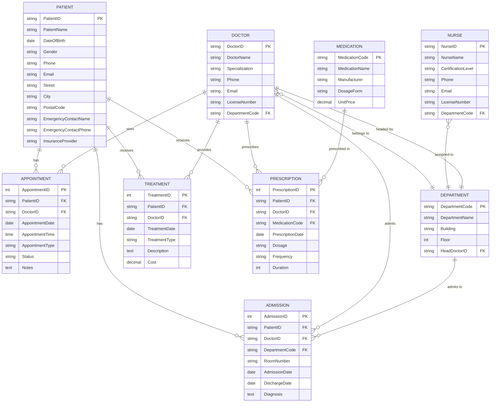
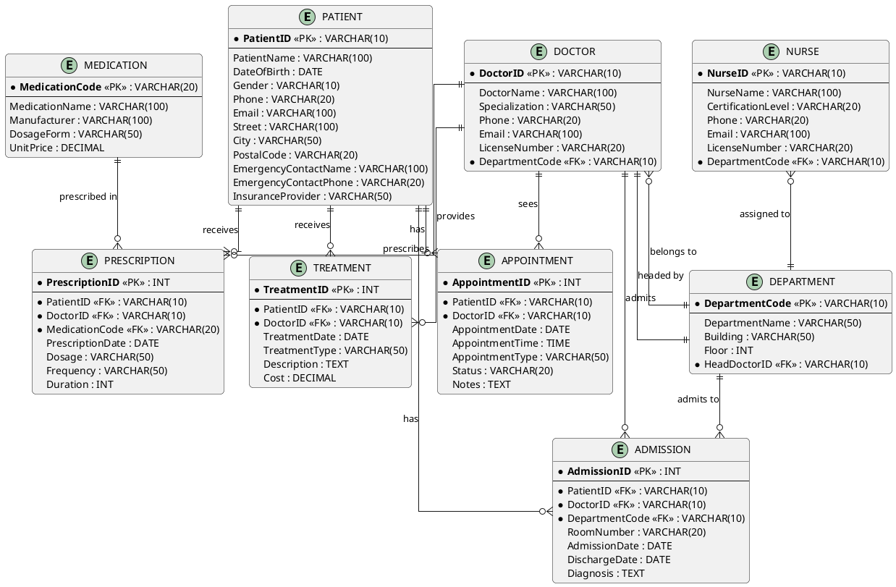

# Entity-Relationship Diagram - Hospital Management

## Textual ER Diagram

```
PATIENT                    DOCTOR                    DEPARTMENT
┌──────────────┐          ┌──────────────┐          ┌──────────────┐
│ PatientID PK │          │ DoctorID PK  │          │ DeptCode PK  │
│ PatientName  │          │ DoctorName   │          │ DeptName     │
│ DOB          │          │ Specialization│         │ Building     │
│ Gender       │          │ Phone         │          │ Floor        │
│ Phone        │          │ Email         │          │ HeadDocID FK │
│ Email        │          │ LicenseNum    │          └──────┬───────┘
│ Address...   │          │ DeptCode FK  │                 │
│ Emergency... │          └──────┬───────┘                 │
│ Insurance    │                 │                          │
└──────┬───────┘                 │                          │
       │                         │                          │
       │ (M)                     │ (M)                     │ (1)
       │                         │                          │
       │    has                  │ belongs to               │ has head
       │                         │                          │
       ▼                         ▼                          │
┌──────────────────┐    ┌──────────────────┐               │
│   APPOINTMENT    │    │   ADMISSION      │◄──────────────┘
├──────────────────┤    ├──────────────────┤
│ AppointmentID PK │    │ AdmissionID PK   │
│ PatientID FK     │    │ PatientID FK     │
│ DoctorID FK      │    │ DoctorID FK      │
│ ApptDate         │    │ DeptCode FK      │
│ ApptTime         │    │ RoomNumber       │
│ ApptType         │    │ AdmissionDate    │
│ Status           │    │ DischargeDate    │
│ Notes            │    │ Diagnosis        │
└──────────────────┘    └──────────────────┘

NURSE                    TREATMENT                  PRESCRIPTION
┌──────────────┐        ┌──────────────────┐      ┌──────────────────┐
│ NurseID PK   │        │ TreatmentID PK   │      │ PrescriptionID PK│
│ NurseName    │        │ PatientID FK     │      │ PatientID FK     │
│ CertLevel    │        │ DoctorID FK      │      │ DoctorID FK      │
│ Phone        │        │ TreatmentDate    │      │ MedicationCode FK│
│ Email        │        │ TreatmentType    │      │ PrescriptionDate  │
│ LicenseNum   │        │ Description      │      │ Dosage           │
│ DeptCode FK  │        │ Cost             │      │ Frequency        │
└──────┬───────┘        └──────────────────┘      │ Duration         │
       │                                            └──────────────────┘
       │ (M)
       │ assigned to
       │
       ▼
   DEPARTMENT

MEDICATION
┌──────────────┐
│ MedCode PK   │
│ MedName      │
│ Manufacturer │
│ DosageForm   │
│ UnitPrice    │
└──────┬───────┘
       │
       │ (M)
       │ prescribed in
       │
       ▼
   PRESCRIPTION
```

## Mermaid ER Diagram



## PlantUML ER Diagram


