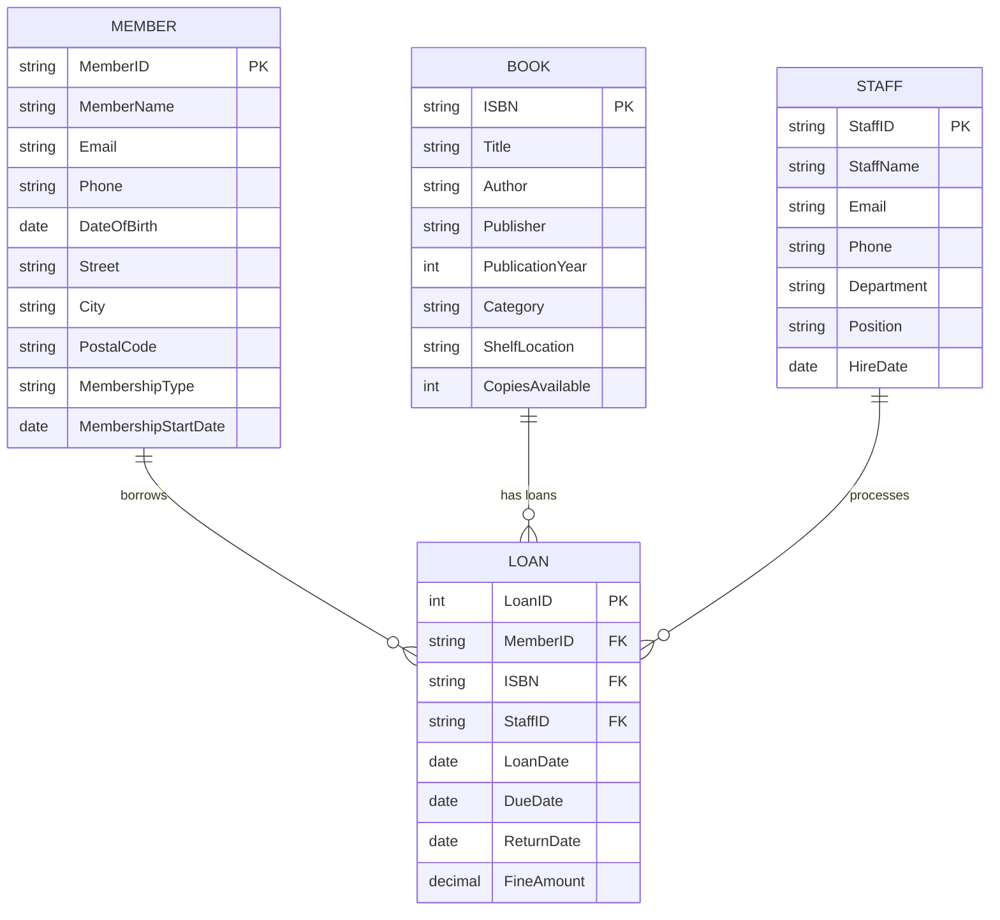
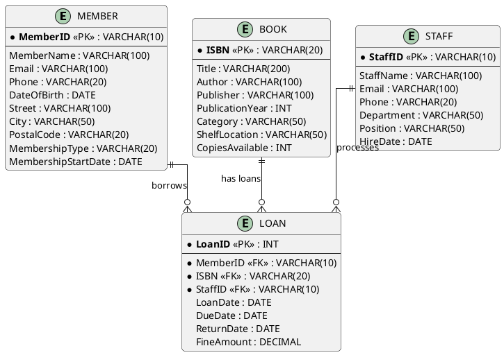

# Entity-Relationship Diagram - Library Management

## Textual ER Diagram

```
MEMBER                    BOOK                      STAFF
┌──────────────┐        ┌──────────────┐          ┌──────────────┐
│ MemberID PK  │        │ ISBN PK      │          │ StaffID PK   │
│ MemberName   │        │ Title        │          │ StaffName    │
│ Email        │        │ Author       │          │ Email        │
│ Phone        │        │ Publisher    │          │ Phone        │
│ DateOfBirth  │        │ PubYear      │          │ Department   │
│ Street       │        │ Category     │          │ Position     │
│ City         │        │ ShelfLocation│          │ HireDate     │
│ PostalCode   │        │ CopiesAvail  │          └──────┬───────┘
│ MemberType   │        └──────┬───────┘                 │
│ MemberStart  │               │                         │
└──────┬───────┘               │                         │
       │                       │                         │
       │ (1)                   │ (M)                     │ (1)
       │                       │                         │
       │    borrows            │         processes       │
       └───────────────────────┼─────────────────────────┘
                               │
                               ▼
                    ┌──────────────────┐
                    │      LOAN        │
                    ├──────────────────┤
                    │ LoanID PK        │
                    │ MemberID FK      │
                    │ ISBN FK          │
                    │ StaffID FK       │
                    │ LoanDate         │
                    │ DueDate          │
                    │ ReturnDate       │
                    │ FineAmount       │
                    └──────────────────┘
```

## Mermaid ER Diagram



## PlantUML ER Diagram


