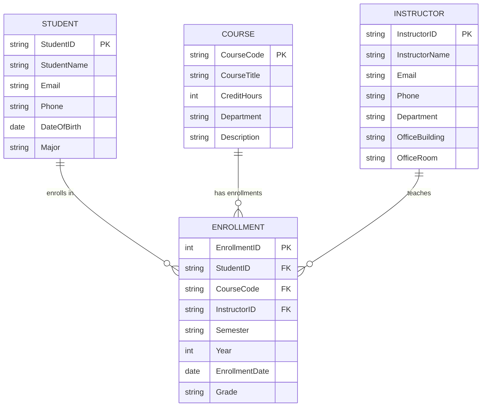
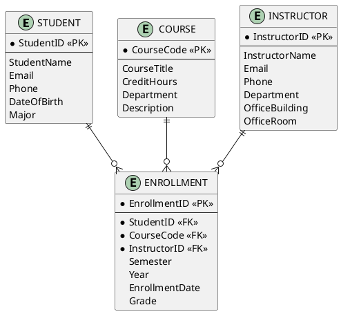

# Entity-Relationship (ER) Diagram

## Textual ER Diagram Description

```
┌─────────────────┐
│    STUDENT      │
├─────────────────┤
│ StudentID (PK)  │
│ StudentName     │
│ Email           │
│ Phone           │
│ DateOfBirth     │
│ Major           │
└────────┬────────┘
         │
         │ (1)
         │
         │ (enrolls in)
         │
         │ (M)
         ▼
┌─────────────────┐
│   ENROLLMENT    │
├─────────────────┤
│ EnrollmentID(PK)│
│ StudentID (FK)  │──┐
│ CourseCode (FK) │  │
│ InstructorID(FK)│  │
│ Semester        │  │
│ Year            │  │
│ EnrollmentDate  │  │
│ Grade           │  │
└────────┬────────┘  │
         │           │
         │ (M)       │
         │           │
         │ (1)       │
         ▼           │
┌─────────────────┐  │
│     COURSE      │  │
├─────────────────┤  │
│ CourseCode (PK)│◄─┘
│ CourseTitle     │
│ CreditHours     │
│ Department      │
│ Description     │
└─────────────────┘

┌─────────────────┐
│   INSTRUCTOR    │
├─────────────────┤
│ InstructorID(PK)│
│ InstructorName  │
│ Email           │
│ Phone           │
│ Department      │
│ OfficeBuilding  │
│ OfficeRoom      │
└─────────────────┘

Note: INSTRUCTOR and COURSE are connected through ENROLLMENT
(no direct relationship - instructor assignment is per enrollment/semester)
```

## Mermaid ER Diagram



## PlantUML ER Diagram

```plantuml
@startuml University Course Management ER Diagram

!define PK_COLOR #FFE6E6
!define FK_COLOR #E6F3FF
!define ATTRIBUTE_COLOR #F0F0F0

skinparam linetype ortho
skinparam roundcorner 10
skinparam shadowing false

entity "STUDENT" as student {
  * **StudentID** <<PK>> : VARCHAR(10)
  --
  StudentName : VARCHAR(100)
  Email : VARCHAR(100)
  Phone : VARCHAR(20)
  DateOfBirth : DATE
  Major : VARCHAR(50)
}

entity "ENROLLMENT" as enrollment {
  * **EnrollmentID** <<PK>> : INT
  --
  * StudentID <<FK>> : VARCHAR(10)
  * CourseCode <<FK>> : VARCHAR(10)
  * InstructorID <<FK>> : VARCHAR(10)
  Semester : VARCHAR(20)
  Year : INT
  EnrollmentDate : DATE
  Grade : VARCHAR(2)
}

entity "COURSE" as course {
  * **CourseCode** <<PK>> : VARCHAR(10)
  --
  CourseTitle : VARCHAR(200)
  CreditHours : INT
  Department : VARCHAR(50)
  Description : TEXT
}

entity "INSTRUCTOR" as instructor {
  * **InstructorID** <<PK>> : VARCHAR(10)
  --
  InstructorName : VARCHAR(100)
  Email : VARCHAR(100)
  Phone : VARCHAR(20)
  Department : VARCHAR(50)
  OfficeBuilding : VARCHAR(50)
  OfficeRoom : VARCHAR(20)
}

' Relationships
student ||--o{ enrollment : "enrolls in"
course ||--o{ enrollment : "has enrollments"
instructor ||--o{ enrollment : "teaches"

' Styling
student PK_COLOR
course PK_COLOR
instructor PK_COLOR
enrollment PK_COLOR

@enduml
```

### PlantUML Usage Instructions

1. **Online:** Copy the PlantUML code above and paste it at [http://www.plantuml.com/plantuml/uml/](http://www.plantuml.com/plantuml/uml/)

2. **VS Code:** Install the "PlantUML" extension, create a `.puml` file, paste the code, and preview

3. **Command Line:** Install PlantUML and run:
   ```bash
   plantuml er_diagram.puml
   ```

4. **IntelliJ IDEA:** Install PlantUML plugin, create `.puml` file, and preview

### Alternative PlantUML Format (Simpler)



## Relationship Cardinalities

1. **STUDENT ↔ ENROLLMENT**
   - One STUDENT can have many ENROLLMENTs (1:M)
   - Each ENROLLMENT belongs to exactly one STUDENT

2. **COURSE ↔ ENROLLMENT**
   - One COURSE can have many ENROLLMENTs (1:M)
   - Each ENROLLMENT is for exactly one COURSE

3. **INSTRUCTOR ↔ ENROLLMENT**
   - One INSTRUCTOR can have many ENROLLMENTs (1:M)
   - Each ENROLLMENT is taught by exactly one INSTRUCTOR

**Note:** There is NO direct relationship between INSTRUCTOR and COURSE. The relationship is through ENROLLMENT because:
- The same course can be taught by different instructors in different semesters
- An instructor is assigned per enrollment (per semester), not per course permanently
- This design allows flexibility: CS101 might be taught by Dr. Johnson in Fall 2024 but by Dr. Lee in Spring 2025

## Notes

- **Primary Keys (PK):** Uniquely identify each entity instance
- **Foreign Keys (FK):** Reference primary keys in related entities
- **Cardinality:** Shows how many instances of one entity relate to instances of another entity
- The ENROLLMENT entity is a **junction/associative entity** that connects STUDENT, COURSE, and INSTRUCTOR

## Important Design Decision: Why No Direct INSTRUCTOR-COURSE Relationship?

**Question:** Why doesn't COURSE have an InstructorID foreign key?

**Answer:** In this design, the instructor assignment is **per enrollment (per semester)**, not per course permanently. This allows:

1. **Same course, different instructors:** CS101 can be taught by Dr. Johnson in Fall 2024 and Dr. Lee in Spring 2025
2. **Flexibility:** Courses can be reassigned to different instructors each semester
3. **Historical accuracy:** We can track which instructor taught which course in which semester
4. **Multiple sections:** The same course can have multiple sections with different instructors in the same semester

**Alternative Design (Not Used):**
If we had `COURSE (CourseCode, ..., InstructorID)`, it would imply:
- Each course has ONE permanent instructor
- Cannot change instructors per semester
- Cannot have multiple sections with different instructors

**Our Design:**
- `ENROLLMENT (..., CourseCode, InstructorID, Semester, Year)`
- Instructor assignment is part of the enrollment context
- More flexible and realistic for university course management
