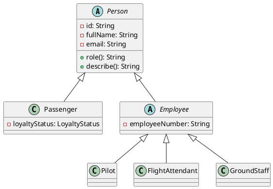
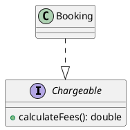
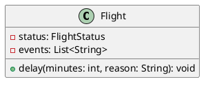

# IST603 Exam Prep - Airport Management (Answers + PlantUML)

This document answers the questions in `07_practice_questions.md`. PlantUML snippets are included inline as requested.

## Design / UML-to-code

### 1) Inheritance

**Hierarchy (PlantUML):**



**Fields placement (and why):**
- **In `Person`**: `id`, `fullName`, `email` (common identity/contact data shared by *every* person type).
- **In `Employee`**: `employeeNumber` (only employees have it; passengers don’t).
- **In subclasses**:
  - `Passenger.loyaltyStatus` (only passengers).
  - `Pilot.licenseType`, `GroundStaff.jobTitle`, `FlightAttendant.level` (role-specific details).

---

### 2) Abstraction

**Why `Aircraft` should be abstract:**
- You never want a “generic aircraft” instance; you want a concrete aircraft type with specific operational rules.
- It enforces that subclasses implement the varying behavior (e.g., baggage rules, category, service level).

**Common properties/methods (shared):**
- `tailNumber` (unique identifier)
- `capacity` (seat capacity)
- (also common: `model`)

**Vary by subclass (example):**
- `maxBaggageKgPerPassenger()` differs between `NarrowBodyAircraft` and `WideBodyAircraft` (polymorphism).

---

### 3) Interfaces

**Interface (PlantUML):**



**Who should implement it (and why):**
- **`Booking`**: it’s the object that naturally *knows* fare class, bag count, and discounts, so it can compute a total fee.
- Optionally: `BaggageCharge`, `Ticket` (if you model those separately), but in this simplified system `Booking` is enough.

---

### 4) Encapsulation

**Three fields that should not be publicly mutable:**
- **`Person.id`**: identity must remain stable.
- **`Aircraft.capacity`**: changing capacity after bookings exist breaks invariants.
- **`Booking.bookingId`** (and often `Booking.flight`): stable identity and relationship.

**Validation examples**

Java (constructor validation + private fields):

```java
class Aircraft {
  private final String tailNumber;
  private final int capacity;

  protected Aircraft(String tailNumber, int capacity) {
    if (tailNumber == null || tailNumber.isBlank()) throw new DomainException("tailNumber blank");
    if (capacity <= 0) throw new DomainException("capacity must be > 0");
    this.tailNumber = tailNumber;
    this.capacity = capacity;
  }
}
```

Python (properties + validation):

```python
class Person:
    def __init__(self, person_id: str, full_name: str, email: str) -> None:
        self._id = _require_non_blank(person_id, "person_id")  # not exposed as settable
        self.full_name = full_name
        self.email = email

    @property
    def full_name(self) -> str:
        return self._full_name

    @full_name.setter
    def full_name(self, value: str) -> None:
        self._full_name = _require_non_blank(value, "full_name")
```

## Polymorphism (explain output)

### 5) `List<Person>` calling `describe()`

**Which implementation runs?**
- The runtime type controls the call:
  - If the object is a `Passenger`, its `role()` runs (and `describe()` uses that).
  - If the object is a `Pilot`, its `role()` runs, etc.

**Dynamic dispatch (what it means):**
- The method call is resolved **at runtime**, based on the *actual object type*, not the reference type (`Person`).

---

### 6) `Aircraft` references calling `maxBaggageKgPerPassenger()`

**Why different results?**
- `maxBaggageKgPerPassenger()` is overridden in each subclass.
- When called on an `Aircraft` reference, Java/Python dispatches to the subclass implementation (runtime polymorphism).

## Exception handling

### 7) When to throw/raise each exception

- **`BookingException/BookingError`**:
  - booking a cancelled flight
  - booking without an assigned aircraft
  - overbooking (bookings exceed capacity)
  - invalid seat format or duplicate seat
  - negative bag count

- **`GateAssignmentException/GateAssignmentError`**:
  - requested gate code doesn’t exist in the airport structure
  - (optionally) gate already assigned/occupied in the same time window

- **`FlightStateException/FlightStateError`**:
  - invalid state transitions (e.g., cancel after departed/landed)
  - (optionally) board when cancelled, land before depart, etc.

---

### 8) try/catch and capacity exceeded behavior

Java:

```java
try {
  Booking b = Booking.create("B007", passenger, flight, "12A", FareClass.ECONOMY, 1);
  flight.addBooking(b);
} catch (BookingException ex) {
  // expected behavior: show message, keep program running, do not add booking
  System.out.println("Booking failed: " + ex.getMessage());
}
```

Python:

```python
try:
    b = Booking("B007", passenger, flight, "12A", FareClass.ECONOMY, 1)
    flight.add_booking(b)
except BookingError as ex:
    print(f"Booking failed: {ex}")
```

**When capacity is exceeded** the program should:
- reject the new booking
- report the error (message/log)
- keep the system consistent (no partial state changes)

## Nested classes

### 9) Why model `Terminal` and `Gate` as nested classes in `Airport`?

**Benefits:**
- **Stronger encapsulation of the domain**: `Gate` is a concept that only makes sense inside an `Airport`/`Terminal`.
- **Namespacing**: avoids polluting the package/module with many tiny types (`Airport.Terminal.Gate` is self-describing).

**Downside:**
- Can reduce reuse and complicate testing/mocking if you later want gates/terminals shared across contexts or packages.

---

### 10) Static nested vs inner class (Java)

- **Static nested class**:
  - does **not** hold an implicit reference to an outer instance
  - can be instantiated without an outer object (e.g., `new Airport.Terminal("A")`)

- **Inner class**:
  - **does** hold an implicit reference to the outer instance
  - instantiated with an outer instance (e.g., `terminal.new Gate("A1")`), and can access outer fields directly

In this project design:
- `Airport.Terminal` is typically a **static nested** class (terminals can be created independently then attached).
- `Terminal.Gate` is typically an **inner** class (a gate belongs to a specific terminal instance).

## Debugging / code tracing

### 11) “Third booking fails even though there are 200 seats”

Two likely causes:
- **Aircraft capacity is not actually 200** at runtime (wrong aircraft assigned, capacity set to 2 in sample, or default capacity).
- **Seat uniqueness logic is failing**:
  - same seat code reused accidentally (e.g., always “1A”)
  - seat validation rejects the third seat format

Other common cause:
- the flight is in a state that rejects booking (e.g., cancelled).

---

### 12) Seat validation rejects `01A`

With the rule “row number + letter” and regex `^[1-9][0-9]*[A-F]$`, **rejecting `01A` is correct** because the row cannot start with `0`.

To allow leading zeros, change to:
- `^[0-9]+[A-F]$` (allows `0A`, `01A`, `00A`)
- or `^0*[1-9][0-9]*[A-F]$` (allows leading zeros but still disallows row 0)

Example (allow leading zeros, disallow 0 row):

```text
^0*[1-9][0-9]*[A-F]$
```

---

### 13) Seat `12A` added twice without error

**Bug location:**
- Seat uniqueness is not being tracked (or the tracking set is not updated / not shared).

**Correct structure to track uniqueness:**
- A `Set<String>` (Java) / `set[str]` (Python) in a single place responsible for the manifest, e.g. `Flight.Manifest`.

## Small coding prompts

### 14) Add `SecurityOfficer`

**Java sketch:**
- Create `class SecurityOfficer extends Employee`
- Implement `role()` and `assignTo(Flight flight)` (or inherit the same behavior used by other employees)
- Ensure it can be stored in `List<Person>` and `describe()` still works polymorphically.

**Python sketch:**
- Create `class SecurityOfficer(Employee)`
- Implement `role()` and `assign_to()`

---

### 15) Add `PREMIUM_ECONOMY`

- Add enum value `PREMIUM_ECONOMY`
- In `calculateFees()`, add a base price, e.g.:
  - Economy: 120
  - Premium Economy: 170
  - Business: 250

**Java sketch:**

```java
double base = switch (fareClass) {
  case ECONOMY -> 120.0;
  case PREMIUM_ECONOMY -> 170.0;
  case BUSINESS -> 250.0;
};
```

---

### 16) Add `delay(minutes)`

Expected behavior:
- updates status to `DELAYED` when currently `SCHEDULED` or `BOARDING`
- disallow delay if `CANCELLED`, `DEPARTED`, or `LANDED` (throw `FlightStateException`)
- record reason/time in a simple log list (e.g., `List<String> events`)

**PlantUML (additions):**



# IST603 Exam Prep - Airport Management (Answers + PlantUML)

This document answers the questions in `07_practice_questions.md`. PlantUML snippets are included inline as requested.

## Design / UML-to-code

### 1) Inheritance

**Hierarchy (PlantUML):**


**Fields placement (and why):**
- **In `Person`**: `id`, `fullName`, `email` (common identity/contact data shared by *every* person type).
- **In `Employee`**: `employeeNumber` (only employees have it; passengers don’t).
- **In subclasses**:
  - `Passenger.loyaltyStatus` (only passengers).
  - `Pilot.licenseType`, `GroundStaff.jobTitle`, `FlightAttendant.level` (role-specific details).

---

### 2) Abstraction

**Why `Aircraft` should be abstract:**
- You never want a “generic aircraft” instance; you want a concrete aircraft type with specific operational rules.
- It enforces that subclasses implement the varying behavior (e.g., baggage rules, category, service level).

**Common properties/methods (shared):**
- `tailNumber` (unique identifier)
- `capacity` (seat capacity)
- (also common: `model`)

**Vary by subclass (example):**
- `maxBaggageKgPerPassenger()` differs between `NarrowBodyAircraft` and `WideBodyAircraft` (polymorphism).

---

### 3) Interfaces

**Interface (PlantUML):**


**Who should implement it (and why):**
- **`Booking`**: it’s the object that naturally *knows* fare class, bag count, and discounts, so it can compute a total fee.
- Optionally: `BaggageCharge`, `Ticket` (if you model those separately), but in this simplified system `Booking` is enough.

---

### 4) Encapsulation

**Three fields that should not be publicly mutable:**
- **`Person.id`**: identity must remain stable.
- **`Aircraft.capacity`**: changing capacity after bookings exist breaks invariants.
- **`Booking.bookingId`** (and often `Booking.flight`): stable identity and relationship.

**Validation examples**

Java (constructor validation + private fields):

```java
class Aircraft {
  private final String tailNumber;
  private final int capacity;

  protected Aircraft(String tailNumber, int capacity) {
    if (tailNumber == null || tailNumber.isBlank()) throw new DomainException("tailNumber blank");
    if (capacity <= 0) throw new DomainException("capacity must be > 0");
    this.tailNumber = tailNumber;
    this.capacity = capacity;
  }
}
```

Python (properties + validation):

```python
class Person:
    def __init__(self, person_id: str, full_name: str, email: str) -> None:
        self._id = _require_non_blank(person_id, "person_id")  # not exposed as settable
        self.full_name = full_name
        self.email = email

    @property
    def full_name(self) -> str:
        return self._full_name

    @full_name.setter
    def full_name(self, value: str) -> None:
        self._full_name = _require_non_blank(value, "full_name")
```

## Polymorphism (explain output)

### 5) `List<Person>` calling `describe()`

**Which implementation runs?**
- The runtime type controls the call:
  - If the object is a `Passenger`, its `role()` runs (and `describe()` uses that).
  - If the object is a `Pilot`, its `role()` runs, etc.

**Dynamic dispatch (what it means):**
- The method call is resolved **at runtime**, based on the *actual object type*, not the reference type (`Person`).

---

### 6) `Aircraft` references calling `maxBaggageKgPerPassenger()`

**Why different results?**
- `maxBaggageKgPerPassenger()` is overridden in each subclass.
- When called on an `Aircraft` reference, Java/Python dispatches to the subclass implementation (runtime polymorphism).

## Exception handling

### 7) When to throw/raise each exception

- **`BookingException/BookingError`**:
  - booking a cancelled flight
  - booking without an assigned aircraft
  - overbooking (bookings exceed capacity)
  - invalid seat format or duplicate seat
  - negative bag count

- **`GateAssignmentException/GateAssignmentError`**:
  - requested gate code doesn’t exist in the airport structure
  - (optionally) gate already assigned/occupied in the same time window

- **`FlightStateException/FlightStateError`**:
  - invalid state transitions (e.g., cancel after departed/landed)
  - (optionally) board when cancelled, land before depart, etc.

---

### 8) try/catch and capacity exceeded behavior

Java:

```java
try {
  Booking b = Booking.create("B007", passenger, flight, "12A", FareClass.ECONOMY, 1);
  flight.addBooking(b);
} catch (BookingException ex) {
  // expected behavior: show message, keep program running, do not add booking
  System.out.println("Booking failed: " + ex.getMessage());
}
```

Python:

```python
try:
    b = Booking("B007", passenger, flight, "12A", FareClass.ECONOMY, 1)
    flight.add_booking(b)
except BookingError as ex:
    print(f"Booking failed: {ex}")
```

**When capacity is exceeded** the program should:
- reject the new booking
- report the error (message/log)
- keep the system consistent (no partial state changes)

## Nested classes

### 9) Why model `Terminal` and `Gate` as nested classes in `Airport`?

**Benefits:**
- **Stronger encapsulation of the domain**: `Gate` is a concept that only makes sense inside an `Airport`/`Terminal`.
- **Namespacing**: avoids polluting the package/module with many tiny types (`Airport.Terminal.Gate` is self-describing).

**Downside:**
- Can reduce reuse and complicate testing/mocking if you later want gates/terminals shared across contexts or packages.

---

### 10) Static nested vs inner class (Java)

- **Static nested class**:
  - does **not** hold an implicit reference to an outer instance
  - can be instantiated without an outer object (e.g., `new Airport.Terminal("A")`)

- **Inner class**:
  - **does** hold an implicit reference to the outer instance
  - instantiated with an outer instance (e.g., `terminal.new Gate("A1")`), and can access outer fields directly

In this project design:
- `Airport.Terminal` is typically a **static nested** class (terminals can be created independently then attached).
- `Terminal.Gate` is typically an **inner** class (a gate belongs to a specific terminal instance).

## Debugging / code tracing

### 11) “Third booking fails even though there are 200 seats”

Two likely causes:
- **Aircraft capacity is not actually 200** at runtime (wrong aircraft assigned, capacity set to 2 in sample, or default capacity).
- **Seat uniqueness logic is failing**:
  - same seat code reused accidentally (e.g., always “1A”)
  - seat validation rejects the third seat format

Other common cause:
- the flight is in a state that rejects booking (e.g., cancelled).

---

### 12) Seat validation rejects `01A`

With the rule “row number + letter” and regex `^[1-9][0-9]*[A-F]$`, **rejecting `01A` is correct** because the row cannot start with `0`.

To allow leading zeros, change to:
- `^[0-9]+[A-F]$` (allows `0A`, `01A`, `00A`)
- or `^0*[1-9][0-9]*[A-F]$` (allows leading zeros but still disallows row 0)

Example (allow leading zeros, disallow 0 row):

```text
^0*[1-9][0-9]*[A-F]$
```

---

### 13) Seat `12A` added twice without error

**Bug location:**
- Seat uniqueness is not being tracked (or the tracking set is not updated / not shared).

**Correct structure to track uniqueness:**
- A `Set<String>` (Java) / `set[str]` (Python) in a single place responsible for the manifest, e.g. `Flight.Manifest`.

## Small coding prompts

### 14) Add `SecurityOfficer`

**Java sketch:**
- Create `class SecurityOfficer extends Employee`
- Implement `role()` and `assignTo(Flight flight)` (or inherit the same behavior used by other employees)
- Ensure it can be stored in `List<Person>` and `describe()` still works polymorphically.

**Python sketch:**
- Create `class SecurityOfficer(Employee)`
- Implement `role()` and `assign_to()`

---

### 15) Add `PREMIUM_ECONOMY`

- Add enum value `PREMIUM_ECONOMY`
- In `calculateFees()`, add a base price, e.g.:
  - Economy: 120
  - Premium Economy: 170
  - Business: 250

**Java sketch:**

```java
double base = switch (fareClass) {
  case ECONOMY -> 120.0;
  case PREMIUM_ECONOMY -> 170.0;
  case BUSINESS -> 250.0;
};
```

---

### 16) Add `delay(minutes)`

Expected behavior:
- updates status to `DELAYED` when currently `SCHEDULED` or `BOARDING`
- disallow delay if `CANCELLED`, `DEPARTED`, or `LANDED` (throw `FlightStateException`)
- record reason/time in a simple log list (e.g., `List<String> events`)

**PlantUML (additions):**


